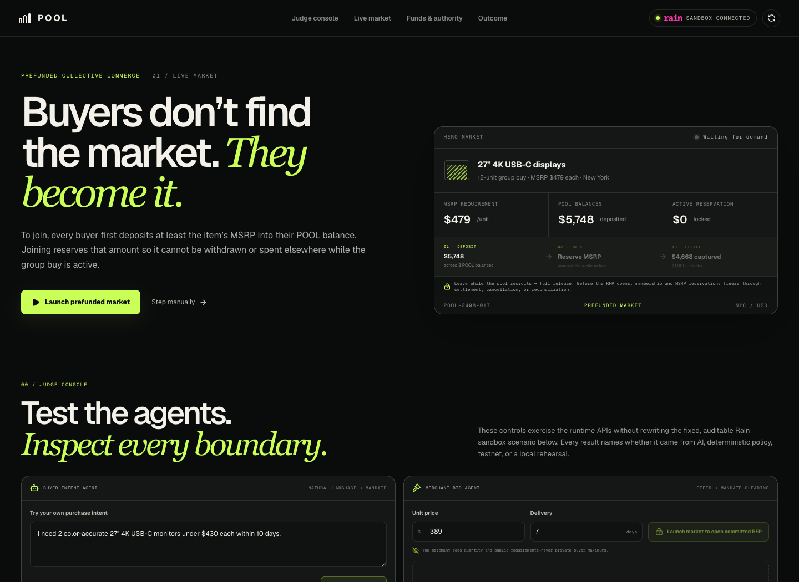

# POOL

**Autonomous collective purchasing for the agentic economy.**

[](https://github.com/inevident/Pool/actions/workflows/ci.yml)



POOL turns prefunded buying intents into a temporary demand coalition. Buyer agents reserve the full MSRP before joining, discover compatible requirements, make sellers compete for the combined order, and spend only the negotiated amount after deterministic policy verifies the deal.

This repository is the deterministic 2–3 minute hero demo for the Raingentic Commerce Hackathon NYC.

## The demo

Three fictional businesses independently request 27-inch 4K USB-C development displays:

| Buyer | Quantity | Delivery requirement | Private mandate |
| --- | ---: | ---: | --- |
| Harbor Labs | 3 | 10 days | sealed |
| Patchwork AI | 4 | 8 days | sealed |
| Kernel Works | 5 | 12 days | sealed |

A fourth ultrawide OLED request is deliberately kept out because its hard form factor does not match. POOL forms a 12-unit coalition, opens a market to three simulated merchants with coherent private floors and quantity tiers, and negotiates the public price from **$479 to $389 per unit**.

- Independent baseline: **$5,748**
- MSRP reserved before joining: **$5,748**
- POOL total: **$4,668**
- Savings released back to available balances: **$1,080 / 18.8%**
- Human negotiation: **none**

The UI can replay this market automatically or advance one event at a time. Resetting the UI never triggers a financial operation.

## Prefunded commitment model

Participation requires cleared funds before a buyer can affect the pool:

1. Deposit at least `MSRP × quantity` into the buyer’s POOL balance.
2. Joining atomically moves that amount from `available` to `reserved`.
3. Reserved funds cannot be withdrawn or reused for another purchase.
4. Leaving before the commitment cutoff releases the full reservation back to `available`.
5. At settlement, POOL captures only `negotiated price × quantity` and releases the difference back to `available` as savings.

For the hero market, the buyers reserve $1,437, $1,916, and $2,395. Settlement captures $1,167, $1,556, and $1,945, releasing $270, $360, and $450 respectively. Every balance change uses integer cents, a stable idempotency key, and a fail-closed state transition.

The repository implements and tests this as POOL’s deterministic domain ledger. It is not represented as a real custodial account: production deposits and withdrawals require an authenticated, durable ledger backed by an appropriate regulated custody or banking partner.

## What is real

The Rain path uses the event’s live sandbox at `https://api-dev.raincards.xyz/v1`:

1. Fund team-level sandbox rail collateral with an idempotency key. This never credits a buyer balance or satisfies POOL’s deposit requirement.
2. Issue one scoped card for each buyer allocation under the provisioned hackathon cardholder.
3. Request each card for its negotiated allocation, electronics MCC `5732`, and a short expiration. Rain applies its documented 1.2× lifetime authorization buffer; POOL still admits only the exact agreed charges in deterministic preflight.
4. Attempt an off-list MCC `7995` authorization and require Rain to return a decline.
5. Authorize all three legitimate allocations.
6. Settle the three authorization records and return their real Rain sandbox IDs to the UI.

Rain’s hackathon sandbox provisions one test cardholder for the team, so the three POOL personas map to three separate scoped cards under that one sandbox user. The product discloses this instead of pretending the sandbox contains three independently verified identities.

The POOL balance ledger, fictional merchants, and offers are deterministic simulations. Rain is the real sandbox execution rail, not the system of record for each persona’s deposited balance. Rehearsal receipts are always labeled **REHEARSAL · SIMULATED** and are never substituted for a failed Rain response.

## Architecture

```text
Cleared POOL balance
  └─ atomic MSRP reservation
       └─ eligible buying intent
            └─ deterministic compatibility engine
                 └─ freeze funded coalition membership
                      └─ finalized Monad commitment (terms + funding root)
                           └─ merchant offer commitments registered on Monad
                                └─ merchant quantity-tier economics
                                     └─ structured negotiation offers
                                          └─ buyer policy + offer integrity checks
                                               └─ server-only Rain adapter
                                                    ├─ scoped cards at negotiated amount
                                                    ├─ enforced MCC decline
                                                    └─ authorization + settlement
                                                         └─ finalized Monad Rain attestation
                                                              └─ capture deal + release savings
```

- `app/page.tsx` — cinematic market replay and explicit live/rehearsal states
- `lib/funding/` — prefunded balance, reservation, release, capture, withdrawal, and idempotency invariants
- `lib/market/` — typed compatibility, negotiation, policy, state, integrity, and idempotency engine
- `lib/rain/client.ts` — server-only Rain sandbox adapter with schema validation, timeouts, and safe retries
- `app/api/rain/execute/route.ts` — same-origin, server-authoritative demo execution
- `contracts/PoolCommitmentRegistry.sol` — pre-bid funding-root commitment, offer-hash registry, and post-Rain attestation
- `lib/monad/` — privacy-preserving hashes, testnet client, finalized-state reads, and causal workflow
- `app/api/monad/prepare/route.ts` — protected server-authoritative pre-bid testnet sequence
- `tests/` and `test/` — market, funding, agent, Monad hash, and Solidity state-machine checks

All money is represented as integer cents. The client never supplies a settlement amount. Rain credentials, private buyer mandates, merchant floors, PAN, and CVC never cross into the browser bundle.

## Run locally

Requirements: Node.js 22.13 or newer.

```bash
npm install
cp .env.example .env.local
npm run dev
```

Open `http://localhost:3000`.

Run `npm run demo:preflight` before presenting. It reports which integrations are live without printing any secret values. The complete 2:30 judge flow and honest fallback order are in [`DEMO.md`](./DEMO.md).

To enable the real sandbox button, fill the Rain values issued at the workshop and set:

```dotenv
RAIN_LIVE_EXECUTION_ENABLED=true
```

Keep that flag disabled unless the environment passes `npm run demo:preflight`. With the flag absent or false, the product remains fully demoable in clearly labeled rehearsal mode.

Production live actions require a random `POOL_DEMO_ACCESS_TOKEN` of at least 24 characters. The server exchanges that one-time judge code for a short-lived, HttpOnly, SameSite session. A loopback URL bypasses this gate only in non-production development and only when no access token value was supplied. A production build with live execution disabled remains a no-secret, fully labeled rehearsal.

Production with `RAIN_LIVE_EXECUTION_ENABLED=true` also requires a complete Monad Testnet write configuration before Rain can be reported ready or execute. Set `MONAD_LIVE_REQUIRED=true` to enforce the identical competition gate during a local rehearsal. A fully absent Monad configuration is allowed only when no live production action is enabled, as an explicitly labeled `rain-only-development` path locally or a rehearsal-only public build; partial, malformed, wrong-chain, missing-bytecode, and wrong-registry-operator configurations fail closed instead of silently downgrading.

## Validate

```bash
npm test
npm run lint
```

`npm test` runs the deployment build before exercising rendered output and market invariants.

## Monad Testnet

Monad is causal, not decorative: POOL waits for finalized Monad state before exposing the RFP to seller agents. The registry then accepts only merchant offer commitments under that funding-root commitment. After Rain settles every buyer allocation, POOL hashes the complete Rain transaction-ID set and attests it against the registered winning offer. Buyer ceilings and merchant prices are not posted onchain in plaintext.

The trust boundary is explicit: the contract timestamps and makes POOL's claims tamper-evident; it cannot independently inspect POOL bank balances or authenticate Rain's API. An observer can verify those claims when the corresponding reservation proofs and Rain receipts are disclosed and reconciled against the onchain roots and digests. This demo builds the root and receipt digest but does not ship a third-party disclosure portal. Offer hashes in this public deterministic fixture are commitments, not a promise that low-entropy prices cannot be guessed.

The repository ships a testnet-only Hardhat target; there is intentionally no mainnet deployment configuration.

```bash
npm run monad:compile
npm run test:contracts
npm run monad:deploy:testnet
```

The deploy command loads the ignored `.env.local`, so add a fresh, funded, testnet-only `MONAD_PRIVATE_KEY` there first. After deployment, set `MONAD_REGISTRY_ADDRESS` beside it and provide both values only as server-side secrets for the protected hosted demo. The configured key must control the registry's finalized `operator()` address; POOL verifies that relationship before any Rain side effect. `/api/monad/status` reports either finalized testnet state or an explicit `not-onchain` local proof—it never invents a transaction or address.

## Financial safety decisions

- Private mandates and seller floors are not part of the public market projection.
- A buyer cannot join unless its available cleared balance covers the full MSRP reservation.
- Reserved funds cannot be withdrawn or double-committed; leaving before cutoff releases them exactly once.
- Settlement cannot capture more than the reservation and releases the full MSRP-to-deal difference.
- A failed external attempt keeps the reservation locked for a safe retry; any partial settlement freezes it for reconciliation instead of claiming a refund.
- Compatibility can interpret non-identical requirements, but hard product constraints cannot be negotiated away.
- The accepted offer is versioned and fingerprinted before payment authorization.
- Stale, tampered, over-budget, duplicate, and idempotency-conflict requests are rejected deterministically.
- Every Rain mutation uses a stable operation-specific `Idempotency-Key` (maximum 64 characters).
- 5xx/429 responses retry only when the operation is safe to retry with that key.
- A partial buyer-authorization failure reverses open prior authorizations before any settlement begins.
- Decrypted card credentials are never requested, stored, logged, or returned.
- Browser responses receive `nosniff`, clickjacking, referrer, permissions, and opener isolation headers.

## Official Rain references

- [Hackathon quickstart](https://rain-sandbox-trial.mintlify.site/docs/quickstart)
- [Scoped cards](https://rain-sandbox-trial.mintlify.site/docs/scoped-cards)
- [Create scoped card](https://rain-sandbox-trial.mintlify.site/reference/cards/create-a-scoped-card-for-a-user)
- [Simulate authorization](https://rain-sandbox-trial.mintlify.site/reference/simulate/simulate-a-card-authorization)
- [Idempotency](https://rain-sandbox-trial.mintlify.site/reference/idempotency)

## Official Monad references

- [Testnet network information](https://docs.monad.xyz/developer-essentials/testnet)
- [Hardhat deployment guide](https://docs.monad.xyz/guides/deploy-smart-contract/hardhat)
- [Wallet finality guidance](https://docs.monad.xyz/developer-essentials/wallet-developers)

## Stack

Next.js 16 / React 19 / TypeScript / vinext / Cloudflare Workers / Rain sandbox / Monad Testnet / Solidity / Hardhat / viem.
