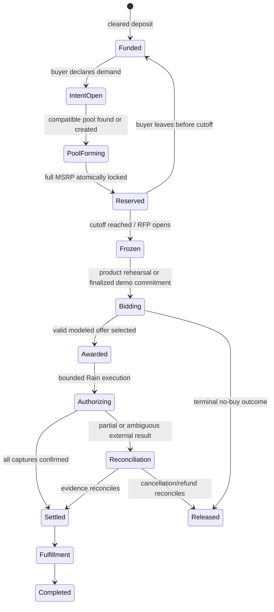
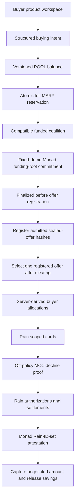

# POOL — comprehensive product, engineering, hackathon, and operations handoff

- **Last materially verified:** 2026-08-09, America/New_York
- **Repository:** [inevident/Pool](https://github.com/inevident/Pool)
- **Default branch:** `main`
- **Last verified public deployment baseline:** `main@9b12002`
- **Active improvement branch:** `overnight@246d81a` (source execution commit; not yet redeployed or verified at a new Vercel URL)
- **Primary product route:** `/`
- **Technical proof route:** `/demo`

This is the canonical orientation document for any engineer, product agent, designer, demo operator, or reviewer taking over POOL. Read it before changing the product. It records not only what exists, but why it exists, what is real, what is simulated, what must never be claimed, which failure modes are intentional, and what remains between the current repository and a real public product.

The shorter documents remain useful:

- [`README.md`](./README.md) is the public repository overview and setup guide.
- [`PRODUCT.md`](./PRODUCT.md) is the product promise, buyer journey, trust boundary, and production-gap brief.
- [`POOL_PITCH.pptx`](./POOL_PITCH.pptx) is the editable six-slide presentation; [`PITCH.md`](./PITCH.md) is its verbatim 90-second talk track, proof by track, and adversarial Q&A.
- [`public/evidence/rain-monad-testnet-2026-08-09.png`](./public/evidence/rain-monad-testnet-2026-08-09.png) and its [sanitized outcome record](./public/evidence/rain-monad-testnet-2026-08-09.json) are the current source-bound evidence for `overnight@246d81a`. They combine the same three Rain sandbox records, returned as same-day idempotent replays, with finalized Monad Testnet ordering on chain `10143`. They prove only the bounded claims named in the record; no real money moved. The earlier `rain-sandbox-2026-08-09.*` pair remains an immutable Rain-only archive whose Monad state was local-only.
- [`DEMO.md`](./DEMO.md) is the exact 90-second operator runbook and fallback order.
- This file is the comprehensive handoff and should explain enough context to make safe decisions without reconstructing the entire project history.

---

## 0. Read this first

### The one-sentence product

POOL turns patient, full-MSRP-reserved buying intent into collective bargaining power: compatible buyers form aggregate demand, merchants compete for the order, and the intended product captures the winning price while releasing the difference as savings. The current product workspace stops at a modeled quote plus explicit full local release; only the protected fixed `/demo` contains the complete provider flow.

### The deeper thesis

Most commerce is supply-first. Sellers list products and prices; isolated buyers search the available supply. Agents make demand programmable: persistent, structured, matchable, and financially executable. POOL is infrastructure for a demand-first market in which independent buyer agents can discover compatible demand, form a temporary economic coalition, negotiate with seller agents, transact within private mandates, and dissolve after the order resolves.

The memorable formulation is:

> We did not build AI that shops. We built a market where demand organizes itself.

### The most important product rule

A buyer cannot join a pool merely by clicking “interested.” The account must have at least `MSRP × quantity` available. Joining atomically moves that amount from `available` to `reserved`. Reserved money is unavailable for withdrawal or another commitment. Before the published cutoff, leaving releases the exact reservation. After the pool freezes, the current product keeps that reservation untouched through its terminal quote/no-buy rehearsal outcome, then requires the buyer to release it explicitly in full; the intended provider-backed lifecycle would instead remain locked through settlement, cancellation, or reconciliation.

This full-MSRP reservation rule is the bridge between consumer interest and seller-actionable demand. In the current repository it is enforced in a browser-local fixture ledger, not by custody or a bank account.

### What works today

The default website is a functioning, repeat-use **product sandbox**:

- Add local test funds.
- Run a catalog-aware buyer agent that returns an inspectable decision receipt; interpretation requests no financial authorization, saves nothing, and moves `$0`.
- Explicitly save structured buying intents only after reviewing the receipt.
- Browse seeded product pools.
- Join only with full MSRP coverage.
- Move the exact commitment from available to reserved.
- Reject insufficient funds and duplicate commitments.
- Leave before cutoff and release the exact reservation once.
- Keep the market unavailable until the two-week cutoff, then enforce an exact one-hour bid window.
- Validate a strict membership envelope and saved buyer mandate against the server-owned fixture catalog.
- After cutoff, run a deterministic mandate-aware merchant rehearsal that returns a modeled quote while leaving the reservation untouched and placing no aggregate order.
- Explicitly release the full local reservation after a modeled quote, below-minimum, no-acceptable-offer, or expired-window outcome exactly once using a stable server-derived operation ID.
- Inspect active commitments, balance activity, and future order states.
- Persist versioned workspace state in browser `localStorage`.
- Reset the local sandbox without calling Rain, Monad, a bank, or a merchant.
- Inspect the public, sanitized `/evidence` registry for the current source-bound Rain + Monad record.
- Inspect and dry-run the `/merchant` Seller Pilot Sandbox against one blinded fixture RFP, with zero live retailers, zero external writes, and no traction claim.

Product commit and settle routes categorically import no Rain or Monad client and cannot mutate either provider in any environment. The separate protected `/demo` route is the only complete three-allocation technical proof of compatible-demand formation, private merchant competition, and the Rain/Monad execution design. It creates Rain sandbox or Monad Testnet evidence only when the UI renders the corresponding provider IDs or finalized explorer links; otherwise it is an explicitly labeled rehearsal/local proof.

### What does not work today

The repository is not a production financial product. It does not currently provide:

- real buyer authentication;
- a durable server-side or double-entry buyer ledger;
- a real bank account, virtual account, stablecoin wallet, deposit, withdrawal, or custody product;
- real KYC/KYB, sanctions, age, fraud, or jurisdiction screening;
- live merchant inventory or binding merchant offers;
- production order routing, fulfillment, shipment, returns, refunds, or disputes;
- production Rain issuance or production buyer identities;
- a mainnet Monad deployment or an independent oracle proving offchain funds;
- a deployed build of the current `overnight` branch.

Do not blur these boundaries. Product credibility depends on being exact about them.

### Current external blockers and warnings

1. **`overnight` is not verified as deployed.** The last checked public Vercel Production alias served `main@9b12002`; do not present it as evidence for this branch until a new deployment URL and commit are checked directly.
2. **Vercel Git integration is not connected.** A Git push does not imply a deployment. Link or deploy explicitly, then verify the resulting Production alias in an incognito session.
3. **Preview has only `OPENAI_API_KEY`.** No Rain or Monad configuration is present in the Vercel Preview environment, so it must remain rehearsal/unavailable for those rails. Do not infer other environment values or Production settings without a fresh check.
4. **The Monad Testnet proof is finalized; future-write gas is not asserted.** Registry [`0xE1b7…b217`](https://testnet.monadscan.com/address/0xE1b75A905Cab4005623AA8912AF4a67b9c29b217) deployed on chain `10143`, the coalition commitment finalized before six offer registrations, and the post-Rain attestation finalized at block `52198437`. The prior underfunded-signer snapshot is obsolete. Re-run `npm run demo:preflight` before any new write; never record or share the private key.
5. **Treat credentials shared in chat or images as exposed.** Never copy them into this document, a commit, a log, a screenshot, a client bundle, or a ticket. Rotate or re-provision before use.
6. **Hosted CI state is not asserted here.** Run the local gate and inspect the current GitHub Actions run directly before citing CI in a submission.
7. **No production funds.** This repository is intentionally testnet/sandbox-only. Never add a mainnet-funded private key.

---

## 1. Hackathon context

### Event

POOL was built for the [Raingentic Commerce Hackathon NYC](https://luma.com/encode-2gj9), presented by Encode Club and co-hosted by Rain and Monad Foundation. The organizer listing describes a two-day, in-person, senior-engineer-oriented hackathon in New York on August 8–9, 2026, focused on what becomes possible when intelligent agents can transact through modern financial infrastructure.

The official challenge tracks are:

1. **Best use of Rain** — use Rain payment infrastructure to let an agent transact autonomously.
2. **General track** — build an agent that actually initiates or completes money movement, using Rain, Monad, or other relevant infrastructure.
3. **Monad** — best implementation of Monad for an agentic-commerce use case using Rain.

The listing advertises a Rain-founder dinner and hiring opportunities, plus an optional Monad bounty of a Mac Mini and six months of access to The Studio by Monad Foundation. Treat prize details as event-page state, not a permanent product fact.

The organizer agenda was:

- Saturday: opening remarks, Rain keynote, Rain workshop, Monad workshop, then hacking.
- Sunday: final build time, noon submission deadline, judging, final demos, and prize-giving.

The event explicitly targets experienced engineers and gives direct access to the Rain and Monad teams. That means a polished visual alone is insufficient: judges are likely to probe transaction ordering, safety, idempotency, failure recovery, privacy, and the honesty of integration claims.

### Why POOL fits the challenge

POOL is not a conventional LLM layer attached to a checkout flow. It demonstrates a new market behavior enabled by agents plus programmable financial authority:

1. Independent buyers express different natural-language requirements.
2. Agents normalize those requests into typed intents.
3. Compatibility logic finds shared demand without erasing hard constraints.
4. Buyers fully reserve funds, converting soft interest into credible demand.
5. The fixed demo constructs/exposes its aggregate RFP only after the fixture freezes; this is application behavior, not an onchain proof of what a seller saw.
6. Sellers compete without seeing private buyer ceilings or one another's sealed economics.
7. Deterministic policy chooses an acceptable agreement.
8. Rain receives only bounded execution authority after POOL has cleared the deal.
9. In the fixed competition flow, Monad establishes tamper-evident ordering of POOL’s recorded claims: funding commitment first, admitted offer hashes registered second, and a post-Rain attestation naming the selected registered offer plus receipt digest last.

Rain is structural because autonomous negotiation has no commercial consequence unless the agent can execute a deal safely. Monad is structural in the fixed competition configuration because it makes POOL’s recorded commitment/offer/receipt chronology tamper-evident. It does not prove when an offchain bid first existed or what a seller saw.

### Original brief and non-negotiable design intent

The original build brief asked for a memorable, technically credible, product-minded prototype rather than a generic procurement dashboard or “AI shopping” demo. Its core phrase was:

> Autonomous agents discover compatible demand and form temporary economic coalitions.

The brief emphasized:

- buying intents rather than shopping carts;
- compatibility across non-identical requests;
- private buyer maximums and merchant floors;
- merchant competition with real economic consequence;
- deterministic code for money, deadlines, constraints, and authority;
- AI for interpretation, matching judgment, and strategy;
- an explicit blocked transaction or invalid deal;
- real Rain sandbox participation where enabled;
- honest labeling of simulated merchants and fallback evidence;
- a deterministic two-to-three-minute replay;
- a credible financial-terminal aesthetic rather than generic “AI slop” or a crypto explorer;
- technical quality that senior engineers can inspect.

### Mentor conversation and resulting product decisions

The mentor discussion introduced several product-level insights that shaped the repository:

1. **Require full MSRP before participation.** A buyer can join only after depositing at least the item's MSRP. Choosing to participate locks that amount as a necessary expense.
2. **Patient demand is the target behavior.** The intended buyer does not need the product immediately and accepts a waiting period in exchange for a lower price.
3. **Merchants should bid for funded volume.** POOL should tell a merchant, in effect, “45 funded buyers will purchase if your bid wins,” while preventing merchants from seeing competing quotes.
4. **Full-MSRP reservation is intended to solve buyer default at award.** The edge case “the user committed but never wired funds” should be removed before the merchant RFP, not handled after a seller wins. The current fixture ledger models this rule; it does not prove a real wire or deposit.
5. **On-ramp and virtual-account flows are a product extension.** A future flow could issue a virtual account, receive ACH or wire deposits, convert them onchain, and credit the user's POOL ledger. The mentors considered this valuable product thinking but outside the core hackathon scope.
6. **Volume-for-margin is the merchant exchange.** A merchant may give up several percentage points of margin to secure a larger guaranteed order and reduce acquisition uncertainty.
7. **Youth-oriented positioning requires care.** Early conversation mentioned ages 16–26/28, but the current product brief correctly targets adults 18+ because financial participation, custody, identity, and contract rules make minors a separate legal and product problem.

These decisions explain why the default product now begins with account balance and commitment, while the cinematic demo remains a separate technical proof.

### Internal win-readiness assessment

This is an internal estimate, not a guarantee of judging outcome:

| Dimension | Current code/product evidence | Remaining risk |
| --- | --- | --- |
| Concept originality | Strong: demand-first autonomous coalition is memorable | Must be explained within 10 seconds |
| Rain relevance | Strong in the protected fixed demo when verified sandbox execution is enabled | Product market actions are deliberately rehearsal-only; sponsor proof depends on the fixed evidence flow |
| Monad relevance | Finalized Testnet registry, commitment, six offer registrations, and post-Rain attestation with explorer evidence | Operator-attested chronology is not custody, independent Rain verification, or proof of offchain seller visibility |
| Financial reasoning | Strong invariants, integer cents, idempotency, freeze/reconcile behavior | Buyer workspace is still browser-local |
| Product quality | Strong repeat-use sandbox and clear information architecture | No auth, durable backend, real supply, or fulfillment |
| Demo resilience | Strong deterministic replay, public evidence registry, first-frame proof summary, and honest fallback | `overnight@246d81a` still needs a verified deployment and timed run |
| Technical inspection | Strong test coverage and explicit trust boundaries | Hosted CI must be checked at the exact submitted commit before it is cited |

The last verified public `main@9b12002` baseline was accessible, but it is not evidence for unshipped `overnight@246d81a` changes. Readiness must be scored against the exact deployed commit. The current branch contains a source-bound, sanitized Rain sandbox + finalized Monad Testnet record and exposes it through `/evidence`; the record is still operator-attested and does not prove real money, custody, independent Rain verification, or merchant demand. Maximum sponsor credibility still requires a verified deployment of the exact presented branch and two timed rehearsals; code paths alone are not transaction evidence.

### What judges should remember

The ideal “holy-shit” moment is not a chatbot response. It is this sequence:

> In the protected fixed proof, three strangers' agents discover compatible demand, model full commitment, exclude an incompatible request, make simulated sellers compete, reduce the price, keep every private maximum hidden, block an off-policy Rain sandbox payment, execute three exact sandbox settlements when provider IDs render, and make the fixture savings available again.

---

## 2. Product definition

### Product promise

POOL gives patient buyers a credible way to ask for a better price together.

> Buyers trade urgency for leverage. Merchants trade margin for a larger, guaranteed order.

The initial consumer wedge is standardized, considered, non-urgent purchases where aggregate volume can change merchant economics: electronics, appliances, furniture, travel gear, home products, and similar goods. The long-term infrastructure opportunity extends to SMB procurement, GPUs/compute, SaaS contracts, office equipment, manufacturing supplies, logistics, cloud commitments, ad inventory, creator purchasing, corporate travel, and other fragmented demand.

### Product principles

1. **Funded demand over waitlists.** An unfunded “join” count is marketing, not purchasing power.
2. **Patience is the buyer's contribution.** The buyer gives POOL time to aggregate and negotiate.
3. **Privacy preserves negotiation.** Buyer ceilings and merchant floors remain private.
4. **Hard constraints stay hard.** Compatibility logic may generalize descriptions, never silently substitute product requirements.
5. **AI interprets; code authorizes.** No model controls arithmetic, reservations, payment amount, cutoff, or settlement.
6. **Failure is a first-class state.** Partial execution freezes the ledger for reconciliation rather than inventing a refund.
7. **Every claim names its evidence.** Local, rehearsal, Rain sandbox, and Monad Testnet states are visibly distinct.
8. **Product first, proof second.** The default experience must feel useful beyond a hackathon presentation.

### Primary personas

#### Patient buyer

- Wants a known product but does not need it today.
- Can reserve the full retail amount.
- Has a private maximum, product constraints, and patience window.
- Wants a transparent lock, leave, failed-pool, settlement, and savings policy.

#### Merchant or seller agent

- Values a funded, time-bounded bulk order over anonymous traffic.
- Has private inventory, quantity tiers, delivery capacity, target margin, and floor.
- Should see normalized public requirements and aggregate quantity, not buyer ceilings or competitors' bids.

#### POOL market operator

- Normalizes demand, enforces compatibility, freezes membership, runs the sealed market, selects a valid offer, executes bounded settlement, and owns reconciliation.
- Must not use discretion to bypass published rules after bids arrive.

#### Demo operator or judge

- Needs deterministic reset, explicit live/rehearsal labels, visible blocked behavior, and enough evidence to distinguish a real sandbox response from a mock.

### Core domain vocabulary

| Term | Meaning |
| --- | --- |
| Buying intent | Structured demand: product, quantity, private price limit, required features, geography/timing, and expiry |
| Available | Cleared balance that may still be withdrawn or committed |
| Reserved | Balance locked behind an active or frozen group-buy commitment |
| Captured/spent | The final negotiated amount consumed at settlement |
| Released savings | Reservation minus captured amount, returned to available balance |
| Pool | A temporary coalition of compatible buying intents |
| Commitment cutoff | Last moment a buyer may join or leave before demand freezes |
| Frozen coalition | Membership, quantity, public terms, and reservations fixed for seller bidding |
| RFP | An anonymized request for the aggregate order sent to eligible merchants |
| Sealed offer | Merchant price and fulfillment terms evaluated privately and committed by hash |
| Reconciliation | Manual/system recovery state when external and internal money states may disagree |
| Scoped card | Rain virtual card with purpose-specific spending bounds |
| Funding root | Hash commitment over the frozen reservation set; not proof of bank funds by itself |

### End-to-end intended lifecycle



The buyer workspace exercises joining and deterministic mandate-aware merchant clearing, but returns only a modeled quote. Its commit/settle market path leaves the reservation untouched until the buyer explicitly releases it in full, never places an aggregate order, and never contacts Rain/Monad. A separate session-gated server balance read may label an execution ceiling. The protected `/demo` remains the only complete fixed monitor provider proof. Neither surface is a durable production backend.

### Sony example: the product in plain language

The featured consumer example is a Sony WH-1000XM6 group buy:

1. The listed MSRP is `$449.99`.
2. The buyer adds at least `$449.99` of test funds.
3. They create an intent for one unit with a target price and patience window.
4. Joining moves exactly `$449.99` from available to reserved.
5. The pool accepts every funded commitment for exactly 14 days.
6. Ten funded units is the viability minimum, not a target or cap; the final coalition is however many funded units exist at the cutoff.
7. Before cutoff, the buyer may leave and restore the full `$449.99`.
8. At close, the current product runs a deterministic local merchant rehearsal against the actual fixture quantity.
9. If the modeled winner were `$379.00`, the product would display that quote, create no order/payment, keep the full `$449.99` reservation untouched, and let the buyer explicitly release all `$449.99` locally.

After cutoff, the buyer workspace can run its deterministic mandate-aware merchant rehearsal. Its commit and settle routes never call Rain or Monad. The protected fixed `/demo` is the only route that may create sandbox/Testnet provider evidence when explicitly configured and unlocked.

### Buyer-facing rules that must remain visible

- The eventual production user must be at least 18 and eligible for the payment/custody program.
- Joining reserves full MSRP, not the estimated discounted price.
- Available balance cannot be withdrawn below active reservations.
- Leaving is permitted only before the stated cutoff while a pool is forming.
- Product pools remain open for a fixed 14-day commitment window. The 10-unit minimum is only an eligibility floor; it is never displayed or enforced as a target or enrollment cap.
- A pool may fail to find an acceptable offer; full reservations then release after cancellation reconciles.
- Merchant bids are private during competition.
- Fees, tax, shipping, delivery, return, warranty, and lock terms require explicit production disclosures.
- A partial provider failure does not mean an immediate refund; it enters reconciliation.
- A browser-local sandbox credit is not a bank deposit, stored value, stablecoin, or insured balance.

### Seeded product fixtures

All current product listings and pools are deterministic fixtures, not live merchant inventory.

| Product ID | Product | MSRP | Pool ID | Current funded units | Minimum | Window | Estimated unit price |
| --- | --- | ---: | --- | ---: | ---: | --- | ---: |
| `product-sony-wh1000xm6` | Sony WH-1000XM6 | `$449.99` | `pool-sony-xm6-august` | 34 | 10 | 14 days | `$379.00` |
| `product-steam-deck-oled-512` | Steam Deck OLED 512GB | `$549.00` | `pool-steam-deck-oled-august` | 18 | 10 | 14 days | `$494.00` |
| `product-macbook-air-m4-13` | MacBook Air 13-inch M4 | `$999.00` | `pool-macbook-air-campus` | 11 | 10 | 14 days | `$899.00` |
| `product-dyson-airwrap-id` | Dyson Airwrap i.d. | `$599.99` | `pool-dyson-airwrap-fall` | 27 | 10 | 14 days | `$525.00` |

The default owner fixture is `buyer-demo`, displayed as `Alex Morgan`. The workspace ID is `workspace-pool-marketplace`. The schema version is `3`, and the seed version is `2026.08.08-fixed-window`.

### Current routes and their jobs

| Route | Current job | What is interactive |
| --- | --- | --- |
| `/` | Buyer home | Run the catalog-aware buyer agent, inspect its decision receipt and `$0` boundary, explicitly save intent, add funds, and view balance, commitments, suggested pools, and activity |
| `/explore` | Discovery | Filter/sort seeded pools, inspect actual funded demand, minimum eligibility, two-week timing, and terms |
| `/pools/[poolId]` | Pool detail | Review the full-MSRP rule, actual funded units, minimum, two-week cutoff, and join/leave state |
| `/wallet` | Sandbox account | Add test funds, view available/reserved totals, audit activity, reset workspace |
| `/orders` | Commitments and lifecycle | Review active commitments and the disclosed future fulfillment path |
| `/evidence` | Public evidence registry | Inspect the sanitized source-bound Rain sandbox + finalized Monad Testnet record, explorer links, reconciliation, and explicit claim limits |
| `/merchant` | Seller Pilot Sandbox | Download one blinded fixture RFP and dry-run non-binding terms with zero live retailers and zero external writes; not merchant traction |
| `/demo` | Protected fixed Rain + Monad technical proof | Run/step/reset market, test intent and merchant APIs, execute the complete three-allocation provider flow only when configured, or use the labeled rehearsal |

The navigation is responsive and has distinct desktop/mobile structures. Dialogs use semantic `role="dialog"`, `aria-modal`, labels, close controls, and keyboard-friendly form controls.

### Browser persistence

The product workspace is stored under `pool-product-workspace-v1` in `localStorage`.

On load:

1. The UI parses the stored JSON.
2. It checks schema and seed compatibility.
3. It runs `assertProductWorkspaceInvariant`.
4. Invalid or stale state is discarded and re-seeded with the current time.

Every mutation creates a new immutable workspace revision and an append-only activity record. This is useful demo behavior, not durable audit storage: the user can delete or edit browser storage, use another device, or reset the sandbox.

### Exact buyer-workspace input bounds and conveniences

The current UI behavior is more specific than the underlying product thesis:

- Test-fund input accepts `$0.01` through `$100,000.00` and offers `$250`, `$500`, `$1,000`, and `$2,500` presets.
- Structured intent quantity is `1..20`.
- Patience choices are 7, 14, 30, or 60 days.
- The buyer agent extracts a natural-language product, quantity, maximum price, and patience window, then matches only against the four seeded catalog items. It reports whether OpenAI extraction or the deterministic catalog parser was used.
- Its decision receipt shows the catalog match, private mandate, deterministic checks, and full-MSRP coverage required only if the buyer later joins. Interpretation sets `financialAuthorization: not_requested`, saves nothing, reserves nothing, and moves `$0`.
- Only **Save buying intent** creates browser-local intent state; joining and reservation remain separate later actions.
- Creating an intent never commits money by itself.
- A join uses the most recent open matching intent. If none exists, the UI creates a one-unit default intent using the pool estimate and a 30-day expiry.
- When the account is short, **Add exact shortage** creates only the missing local test credit, then the buyer can confirm the reservation.
- Explore supports text search, the four seeded categories, and sorts for actual funded demand, potential savings, or cutoff.
- Potential savings are estimates derived from the seeded target; they are not realized or binding savings.
- Modal Escape/backdrop dismissal works and controls are labeled, but the current dialogs do not implement a complete focus trap and focus restoration cycle.

The homepage buyer agent is catalog-aware and separate from the fixed `/demo` buyer console. Both may use protected OpenAI extraction with deterministic fallback, but neither model receives payment authority. The `/demo` console remains bounded to the fixed monitor proof.

---

## 3. Exact status: real, simulated, local, and future

Never describe the project using a single word such as “live.” Use the following matrix.

| Capability | Current implementation | Evidence level | Not claimed |
| --- | --- | --- | --- |
| Buyer funds | Browser-local credits, capped by a labeled local ceiling or a synced Rain sandbox `spendingPower` ceiling | Local ledger; provider ceiling only when the UI labels a successful sync | Real money, custody, bank or crypto balance |
| Buyer reservation | Pure domain transition with exact accounting | Local, tested | Legal escrow or provider hold |
| Product catalog | Four seeded products | Fixture | Live retailer catalog or inventory |
| Product pools | Four seeded pools | Fixture | Real participant or merchant commitments |
| Buyer decision receipt | Catalog-aware extraction, match, mandate checks, required later MSRP coverage, and explicit Save boundary | Real OpenAI Responses extraction when configured; deterministic parser fallback otherwise | Model authorization, automatic save, reservation, or money movement |
| Buying intent UI | Explicitly saved local structured state | Interactive sandbox | Authenticated cross-device mandate |
| Natural-language intent | Optional OpenAI Responses extraction with deterministic catalog-aware fallback | Real API when configured; otherwise local | Live retailer search, model authorization, or money movement |
| Demand compatibility | Deterministic typed market fixture | Local, tested | Broad production semantic matching |
| Merchant competition | Three coherent fictional merchants, consumer and B2B | Deterministic simulation | Real retailers or binding bids |
| Seller Pilot Sandbox | Blinded fixture RFP, public contract, and deterministic zero-write bid dry run | Inspectable product integration artifact | Live retailer, merchant traction, binding bid, inventory, order, payout, or provider write |
| Product commitment/settlement | Strict, mandate-aware post-cutoff rehearsal; modeled quote followed by explicit full local release | Browser-local fixture evidence only | Capture, aggregate order, payment, Rain mutation, or Monad mutation |
| Fixed-demo funding commitment | Current source-bound record finalized commitment `0x12f3…543f` on chain `10143` before six offer registrations | Finalized Testnet evidence with explorer links; local proof remains a labeled fallback for other runs | Onchain proof that a bank deposit exists |
| Fixed-demo Rain execution | Three scoped cards, decline, authorizations, settlements when enabled | Real Rain event-sandbox records only when provider IDs render | Product-page settlement, production card program, or real funds |
| Fixed-demo Monad attestation | Current record finalized a post-Rain digest naming one of the six registered offers | Finalized Monad Testnet state with explorer evidence | Chain-native settlement, seller-visibility proof, or independent Rain oracle |
| Public evidence registry | Sanitized static record bound to `overnight@246d81a`, with exact Rain/Monad identifiers and explicit limitations | Public disclosure of one bounded run | Independent audit, custody, merchant demand, or product-market fit |
| Orders/fulfillment | Product pools can clear only as local rehearsal; fulfillment is copy | Rehearsal fixture | Real order placement, shipping, returns, disputes |
| Identity | Fictional personas / one Rain team cardholder | Demo fixture | KYC/KYB or distinct verified customers |

Honest language examples:

- Correct: “POOL reserved `$5,748` in its deterministic demo ledger.”
- Incorrect: “Rain held `$5,748` for the buyers.”
- Correct: “Rain sandbox created real transaction records without moving real funds.”
- Incorrect: “The buyers paid real merchants.”
- Correct: “Monad finalized POOL's funding commitment before POOL registered the admitted offer hashes.”
- Incorrect: “Monad proved the bank funds existed.”
- Correct: “The merchants are fictional agents with coherent economics.”
- Incorrect: “Keystone, Northstar, and Signal are live retailers.”

---

## 4. The deterministic technical proof at `/demo`

### Purpose

The product workspace proves that POOL can be used as a product. The demo proves that its market and settlement architecture is more than a collection of screens.

It deliberately uses a fixed B2B monitor scenario rather than the broader consumer catalog. Keeping the evidence fixture fixed makes arithmetic, hashes, policies, and external sandbox calls repeatable.

### Scenario

Three fictional businesses need compatible 27-inch, 4K, USB-C development monitors:

| Buyer | Quantity | MSRP reservation | Negotiated capture | Released savings |
| --- | ---: | ---: | ---: | ---: |
| Harbor Labs | 3 | `$1,437` | `$1,167` | `$270` |
| Patchwork AI | 4 | `$1,916` | `$1,556` | `$360` |
| Kernel Works | 5 | `$2,395` | `$1,945` | `$450` |
| **Total** | **12** | **`$5,748`** | **`$4,668`** | **`$1,080`** |

A fourth intent asks for an ultrawide and is excluded because form factor is a hard incompatibility.

The supported demo SKU is `DISPLAY-27-4K-IPS-USBC`. MSRP is `$479` per unit. The winning price is `$389` per unit. Total savings are `$1,080`, or approximately `18.8%` versus the independent baseline.

### Fictional merchants

`Keystone Office`, `Northstar Systems`, and `Signal Supply Co.` are simulated merchants with coherent inventory, quantity tiers, delivery, warranty, target, and private floor constraints. They are not presented as real companies. Their final fixture offers are `$395`, `$397`, and `$389` per unit respectively; Signal wins with seven-day delivery and a 36-month warranty. Their competition changes actual offer terms in the deterministic market engine; it is not a chatbot transcript.

### Demo stages

| Stage | Visible event | Invariant being proved |
| ---: | --- | --- |
| 0 | Waiting for demand | No market exists before commitment |
| 1 | Harbor reserves `$1,437` | Full MSRP required |
| 2 | Patchwork reserves `$1,916` | Reserved funds become unavailable |
| 3 | Kernel reserves `$2,395` | Different hard constraints can coexist |
| 4 | Ultrawide isolated | Semantic matching cannot erase hard incompatibility |
| 5 | 12 units / `$5,748` fixture freeze | Application opens the simulated seller market only after reservation |
| 6 | Funding terms committed | Monad ordering is causal when configured |
| 7 | Three merchants receive RFP | No pre-commit bid access |
| 8 | Price compresses | Negotiation has economic consequence |
| 9 | Signal clears at `$389` | Winning terms become fixed |
| 10 | All buyer mandates pass | Deterministic aggregate policy controls award |
| 11 | Rain receives bounded authority | Payment begins only after clearing |
| 12 | Settlement outcome | `$4,668` captured; `$1,080` released |

The demo supports autoplay, manual stepping, reset, a buyer-intent console, and a merchant-bid console. The interactive consoles exercise runtime APIs but do not rewrite the fixed 12-unit Rain evidence run.

### Visible safety proof

The Rain execution path issues cards restricted to electronics MCC `5732`, then deliberately attempts an authorization at MCC `7995`. The run must receive the exact provider reason `scoped_card_mcc_not_allowed`; a generic or ambiguous decline fails closed. If Rain unexpectedly authorizes the off-list transaction, POOL reverses the authorization and fails the run with `guardrail_not_applied` rather than continuing.

This is a central judge moment: a bounded agent is defined as much by what it cannot do as by what it can do.

### Reset behavior

- Resetting the buyer product only re-seeds browser state.
- Resetting `/demo` only rewinds UI state and the deterministic timeline.
- Neither reset endpoint triggers a Rain mutation or Monad transaction.
- Rain idempotency keys are stable per UTC run/day; repeated live attempts may return cached provider responses rather than duplicate side effects.

### Honest fallback order

1. **Rain unavailable:** use the visibly labeled `REHEARSAL · SIMULATED` outcome. Never display fabricated provider IDs as Rain receipts.
2. **OpenAI unavailable:** use `deterministic_fallback`; financial policy is unchanged.
3. **Monad unavailable:** public/competition mode remains rehearsal. Local development may use the explicitly labeled Rain-only development path only when Monad is not required.
4. **Network unavailable:** use the fixed evidence replay and contract/domain tests, while naming every simulated boundary.

---

## 5. System architecture

### High-level flow



The first four boxes exist as an interactive local product sandbox; the product then runs a mandate-aware rehearsal and local modeled accounting only. The entire diagram exists only in the protected fixed `/demo` proof, where the provider steps require corresponding rendered evidence. A production product would connect them through authenticated, durable services and a reconciled external ledger.

### Runtime stack

- Node.js `22.x` (`22.13.0` in CI configuration).
- Next.js `16.3` App Router and React `19.2.6`.
- TypeScript `5.9`.
- Vinext/Vite/Cloudflare Worker as the default local/deployable build target.
- Native Next build target for Vercel.
- Zod for strict request/provider schema validation.
- Viem for Monad/EVM clients and hashing.
- Solidity `0.8.28`, Hardhat `3`, and Hardhat Ignition.
- Optional OpenAI Responses API for bounded intent extraction.
- Rain event sandbox for scoped cards and transaction simulation.

### Layer boundaries

#### UI layer

`app/_components/product-workspace.tsx` owns the product sandbox UI and local persistence. `app/demo/demo-experience.tsx` owns the cinematic proof. The two should remain conceptually separate: product changes should not silently alter the fixed proof scenario.

#### Product domain

`lib/product/` defines the seeded buyer workspace and four pure actions. It is intentionally independent of React and external providers.

#### Funding domain

`lib/funding/` is the richer transaction-integrity model used by the hero proof. It models deposits, withdrawals, reservations, freeze, leave, settlement, and reconciliation with idempotency.

#### Market domain

`lib/market/` contains product compatibility, coalition discovery, pool state transitions, merchant economics, negotiation, policy evaluation, offer fingerprinting, settlement ledger logic, and outcome metrics.

#### Agent layer

`lib/agent/` uses AI only for typed extraction and deterministic code for decisions. Merchant bid admission is gated by finalized Monad state when configured.

#### Provider adapters

`lib/rain/client.ts` and `lib/monad/` are server-only adapters. Secrets and private keys must never cross into a client component or JSON response.

#### HTTP/security boundary

API routes enforce content type, size, origin/action headers, rate limits, access sessions, no-store responses, and strict Zod schemas before calling domain or provider code.

### Product rehearsal versus fixed provider proof

The buyer workspace is no longer a dead end, but its outcome is deliberately a quote rather than a purchase. A pool a user joined can freeze, run a sealed simulated merchant market, and select a modeled offer against the saved maximum price and delivery deadline while leaving the reservation untouched:

- `lib/market/consumer.ts` is the deterministic consumer market: three merchants, private floors, volume tiers, and a policy that awards the cheapest offer beating the pool's published target.
- `POST /api/pool/settle` receives a strict membership envelope plus saved intent, then re-derives MSRP, aggregate demand, timing, quote, and delivery from the **server's own fixture catalog**. A qualifying result is `modeled_quote`, reports `aggregateOrderPlaced: false`, and never consumes the reservation.
- `pool/release_after_outcome` explicitly releases the full reservation after a modeled quote or terminal no-buy outcome exactly once by stable operation ID.
- The older `pool/settle` reducer transition remains a tested domain primitive, but the current product route/UI does not call it; product rehearsal creates no capture or order.
- Neither `/api/pool/commit` nor `/api/pool/settle` imports a Rain or Monad client. This no-provider posture is invariant across environments.

A historical 2026-08-08 development run exercised a Sony-shaped single-allocation Rain path, but that is not a supported product-page capability in this release and must not be presented as current product behavior. The current reproducible artifact is `public/evidence/rain-monad-testnet-2026-08-09.*`, bound to source commit `246d81a`: it records the same three Rain sandbox settlements as same-day idempotent replays, the exact MCC `7995` decline, and finalized Monad Testnet commitment/offer/attestation ordering. The earlier `rain-sandbox-2026-08-09.*` pair remains a truthful Rain-only archive; do not rewrite it to imply a Testnet state that was absent from that run.

### Remaining seam

Two domain surfaces still exist, and this is now the largest engineering gap:

1. `lib/product/` powers the buyer workspace: deposit, intent, join, leave, modeled quote display, and full release after a terminal rehearsal outcome. Its state is browser-local and provider-free.
2. `lib/funding/` plus `lib/market/index.ts` power the fixed monitor proof at `/demo` with the richer freeze/reconciliation model.

They share merchant identities and settlement discipline but not one durable aggregate. Do not add a third parallel state machine. Establish one canonical authenticated server-side aggregate for buyer balance, mandate, membership, pool, RFP, offer, award, settlement, order, and reconciliation before reconnecting product pages to providers; preserve `/demo` as a fixed evidence fixture.

### Next.js-specific contributor rule

`AGENTS.md` warns that this Next.js version contains breaking conventions. Before editing Next routes, configuration, rendering, or framework APIs, read the relevant material under `node_modules/next/dist/docs/`. Do not rely on remembered Next.js behavior.

---

## 6. Domain models and invariants

### `lib/product/`: repeat-use buyer workspace

Public API:

```ts
createSeededProductWorkspace({ now?, workspaceId?, workspaceName?, owner? })
reduceProductWorkspace(state, action)
assertProductWorkspaceInvariant(state)
evaluateProductPoolFunding({ pool, aggregateFundedUnitCount })
hasProductPoolMetMinimum(pool)
```

`PRODUCT_POOL_COMMITMENT_WINDOW_DAYS` is `14`. Every seeded pool uses a
`minimumCommittedUnitCount` of `10`. That value is an eligibility floor only:
actual funded demand remains exact above it and joining stays open until cutoff.

`lib/product/execution.ts` is the structural-validation bridge between
browser-held product state and server-side rehearsal. Its guarantees are
deliberately narrow and testable:

- `poolMembershipEnvelopeSchema` requires the complete immutable membership
  envelope and rejects unknown fields.
- `validateProductExecutionMembership` checks pool, seeded workspace owner,
  active status, pre-cutoff join time, and exact server-catalog
  `MSRP × quantity`; it derives aggregate units and reservation totals itself.
- `validateProductExecutionIntent` checks that the saved intent matches the
  membership and product, then carries the browser-originated maximum unit price
  and delivery deadline into deterministic offer filtering.
- `evaluateProductExecutionWindow` rejects before cutoff, opens exactly at
  cutoff, and closes exactly one hour later. Both `/api/pool/commit` and
  `/api/pool/settle` run this gate before local market construction.
- `deriveSettlementOperationId` produces a stable server-derived operation ID
  for terminal rehearsal outcomes. It is used to make local no-buy release
  idempotent; it is not a provider exactly-once guarantee.

This is structural consistency for a sandbox request. The browser membership
and mandate are not signed, authenticated, durable, or custodial. The maximum
price and deadline enter the browser bundle and request body, although they are
withheld from merchant responses. None of this can replace a server database,
transactional lock, double-entry ledger, or provider reconciliation.

Actions:

| Action | Required fields | Effect |
| --- | --- | --- |
| `sandbox/deposit` | `activityId`, `at`, `buyerId`, `amountCents` | Increases total deposited and available cents |
| `intent/create` | IDs, timestamps, buyer/product, quantity, target, expiry | Creates an open intent and activity entry |
| `pool/join` | IDs, time, pool, intent, buyer | Reserves `MSRP × quantity`, joins intent, increments pool units |
| `pool/leave` | activity/time, membership, buyer | Releases exact reservation before cutoff and decrements pool units |
| `pool/release_after_outcome` | activity/time, membership, buyer, terminal reason, server operation ID | Releases the full browser-local reservation exactly once after a modeled quote, below-minimum, no-offer, or expired-window rehearsal |
| `treasury/sync` | source, provider balance figures, activity/time | Records the labeled Rain or local execution ceiling |
| `pool/settle` | membership/buyer, capture, merchant, evidence | Tested legacy/local domain transition; not called by the current product rehearsal route or UI |

Key rejection codes include invalid identifiers/timestamps/money/quantity, duplicates, missing entities, buyer or product mismatch, expired/non-open intent, non-forming pool, cutoff passed, insufficient available balance, and inactive membership.

The reducer does not mutate its input. Every successful action increments `revision`, appends one activity event, and preserves the accounting invariant:

```text
total deposited = available + reserved + captured
```

for the current browser-local workspace.

The assertion also checks that every pool has a positive minimum, nonnegative committed units, and a cutoff after creation; active memberships sum exactly to `reserved`; referenced products/pools/intents exist and agree; membership ownership is correct; pool funded-unit counts reconcile; activity IDs are unique; activity revisions are monotonic; and the latest activity revision equals the workspace revision. Activity entries and metadata are frozen at creation.

### `lib/funding/`: financial lifecycle proof

Account fields:

- `depositedCents`
- `availableCents`
- `reservedCents`
- `capturedCents`
- `withdrawnCents`

Reservation states:

- `active`
- `frozen`
- `settled`
- `released`
- `reconciliation_required`

Account reconciliation invariant:

```text
deposited = available + reserved + captured + withdrawn
```

Open reservation invariant:

```text
account.reserved = sum(active, frozen, reconciliation_required reservations)
```

Every mutation accepts an operation-specific idempotency key of at most 64 characters. Repeating the same key and fingerprint returns the prior result. Reusing the key for different input throws `IDEMPOTENCY_CONFLICT`.

Important transition behavior:

- Deposits increase deposited and available.
- Withdrawals may consume only available.
- Joining creates one reservation per pool/intent and moves exact MSRP into reserved.
- The same intent cannot back multiple open reservations.
- Freeze is required before settlement.
- Leave is allowed only while active, never after freeze.
- Settlement cannot capture more than reserved.
- Settlement moves the capture to `capturedCents` and the difference back to `availableCents`.
- Ambiguous partial external execution moves a frozen reservation to `reconciliation_required` while retaining the full internal lock.

### `lib/market/`: market state and policy

The market layer models:

- catalog products and hard specifications;
- buyers, public intents, and private mandates;
- merchants, public identities, private pricing, inventory, and quantity tiers;
- compatibility reason codes and excluded intents;
- coalition and pool-state transitions;
- offer versions, expiry, supersession, and status;
- negotiation events and counterprices;
- buyer-by-buyer allocations;
- policy rules and aggregate evaluation;
- immutable deal agreements and fingerprints;
- settlement decision codes and idempotent settlement ledger;
- buyer outcomes and aggregate savings metrics.

Compatibility may accept varied descriptions of the same flat-panel 4K USB-C requirement. It excludes the ultrawide request. Public projections never contain private reservation values.

The accepted offer is versioned and fingerprinted. Settlement checks the expected offer ID and fingerprint, current validity window, exact arithmetic, committed quantity, every buyer ceiling, required product features, delivery terms, seller capability, and payment-rail cap.

### Pool-state intent

The technical market's strict primary progression is:

```text
collecting → matched → committed → market_open → negotiating
→ policy_review → authorized → settling → settled → dissolved
```

Every non-terminal stage can move into `blocked`; illegal jumps throw. The generic product pool type separately names `forming`, `locked`, `bidding`, `ordered`, `completed`, and `cancelled`, but its current reducer only mutates forming pools. Do not directly assign a state in new code without passing the domain transition function.

### AI authority boundary

AI may:

- interpret natural-language buying intent;
- normalize product descriptions;
- suggest compatibility;
- explain a decision;
- support negotiation strategy.

AI may not:

- claim funds exist;
- move or reserve funds;
- choose a browser-supplied settlement amount;
- bypass a hard feature, budget, quantity, expiry, or delivery rule;
- select a merchant outside deterministic policy;
- call Rain or Monad through an unrestricted tool.

The OpenAI path exposes exactly one strict function tool, `submit_purchase_intent`, whose description explicitly says it never authorizes, reserves, or moves money. The response uses `store: false`, a low reasoning effort, a short timeout, bounded output, one forced tool call, and strict schema validation. Any refusal, malformed response, unsafe relabeling, or service error falls back to the deterministic parser.

### Current intent-agent limitations

The live agent endpoint is intentionally bounded to the monitor proof catalog, not the four-product consumer UI. It recognizes 27-inch 4K USB-C monitor requests, quantity up to 50 at extraction, a demo policy quantity bound of 10, price ceiling, deadline, selected features, and timing. Unsupported products or missing price/deadline constraints return clarification rather than joining a pool.

This mismatch is deliberate isolation for the hackathon proof, but a production follow-up must unify the catalog and intent pipeline.

---

## 7. Rain integration

### Official sandbox capability

The official [Rain hackathon quickstart](https://rain-sandbox-trial.mintlify.site/docs/quickstart) states that every call runs in sandbox and moves no real money. The flow supports simulated collateral funding, scoped-card issuance, card authorization, settlement, refunds/reversals, transaction retrieval, and payment routes between fiat and onchain destinations.

The official [scoped-card guide](https://rain-sandbox-trial.mintlify.site/docs/scoped-cards) describes cards bounded by an amount, optional expiry, and an MCC allowlist. Rain applies a documented 1.2× lifetime authorization ceiling over `amountInUSDCents` to accommodate holds. POOL therefore performs its own exact deterministic amount check before Rain and does not interpret the provider buffer as buyer permission to overspend.

The official [idempotency guide](https://rain-sandbox-trial.mintlify.site/reference/idempotency) says mutation keys are at most 64 characters, successful/client-error responses are cached for 24 hours, `5xx` is not cached, and concurrent identical keys may return `429`. The fixed-demo adapter mirrors those rules with stable operation keys and bounded same-key retries. This repository has no durable exactly-once store, provider-webhook ledger, or automatic retry worker across processes or beyond Rain’s cache window.

### Provisioned Rain identifiers

The event provides four sensitive values:

- team API key;
- team ID;
- test cardholder/user ID;
- collateral contract ID.

Only their environment-variable names belong in documentation. The actual values must remain in ignored secret storage. Because a key was previously shared through a conversation screenshot, provision a replacement when possible.

### Code path

`lib/rain/client.ts`:

1. Imports `server-only` and validates required configuration.
2. Uses `Api-Key` only on the server.
3. Validates Rain responses with Zod.
4. Applies a 12-second request timeout and at most three attempts.
5. Retries GETs and idempotent mutations only, reusing the same stable key.
6. Retries network errors, `429`, and `5xx` with bounded 250ms/500ms backoff.
7. Reads Rain's `Idempotency-Cached` response header.
8. Creates the encrypted session ID required for scoped-card issuance, then ignores rather than decrypting or using any returned card credentials.
9. Exposes only card ID, last four, transaction ID/status, and cache metadata needed by the UI.
10. Never decrypts, stores, logs, or returns PAN or CVC.

The protected fixed `/api/rain/execute` sequence is the only Rain mutation path in this release:

1. Require `RAIN_LIVE_EXECUTION_ENABLED=true`.
2. Require same-origin action header `x-pool-demo-action: execute-sandbox`.
3. Require the protected demo session in production.
4. Apply request size, strict body, stale-scenario, and rapid-repeat checks.
5. Require the Monad gate if configured/required.
6. Verify the fixed market agreement still reconciles.
7. Simulate `$5,000` team collateral funding with a stable idempotency key.
8. Issue three scoped cards under the one provisioned Rain user, one per buyer allocation.
9. Request each card with `amountInUSDCents` derived from its intended allocation, electronics MCC `5732`, and short UTC expiry. Rain applies its documented 1.2× lifetime authorization ceiling; POOL's deterministic preflight still admits only the exact agreed charge.
10. Attempt an MCC `7995` authorization and require the exact `scoped_card_mcc_not_allowed` decline; fail closed on a generic/ambiguous decline or unexpected authorization.
11. Authorize each valid allocation.
12. If one authorization fails, reverse previously open authorizations before settlement begins.
13. Settle each authorized allocation.
14. Return real Rain sandbox card/transaction metadata and label the shared cardholder limitation.
15. If configured, attest the exact Rain transaction-ID set on Monad while naming one previously registered offer as accepted.

Product-page `/api/pool/commit` and `/api/pool/settle` never call this route or import the Rain client. Their results are deterministic rehearsal evidence only.

### Rain is an execution rail, not the buyer ledger

The `$5,000` simulated collateral funding call is team-level rail setup. It does not credit a POOL buyer balance and does not satisfy the product's full-MSRP deposit rule. The three fixed-demo reservations exist only in POOL's deterministic fixture ledger. Rain begins only after the fixed market clears.

This distinction must remain visible in code, UI, pitch, and documentation.

### Shared sandbox cardholder limitation

The event sandbox supplies one test cardholder/user ID. The three buyer personas therefore receive separate scoped cards under one Rain user. This proves bounded per-allocation execution, not three independently verified customer identities.

### Failure behavior

- Before any fixed-demo settlement: keep all fixture reservations frozen until the operator can retry with the same defined keys or reconcile provider evidence.
- Authorization failure: reverse prior open authorizations when possible.
- Partial settlement: report `partial`, retain internal locks, and require reconciliation.
- Monad attestation failure after successful Rain settlement: Rain remains final; return `attestation_pending` and do not claim onchain completion. The attestation is idempotent, but no automatic retry worker exists; an operator must retry/reconcile deliberately.
- Rain failure: never substitute a rehearsal receipt in the same response.
- Product terminal rehearsal outcomes, including a modeled quote, are different: because product commit/settle cannot contact a provider, the full browser-local reservation may release exactly once using the server outcome operation ID.

### Future on-ramp / virtual-account design

Rain payment routes make the mentor's future product idea plausible:

1. Create an authenticated buyer and compliant account relationship.
2. Issue a payment route or virtual account for ACH/wire deposits.
3. Route fiat to an approved stablecoin destination or custody account.
4. Ingest provider webhooks and wait for final/cleared state.
5. Credit the POOL double-entry ledger only after reconciliation.
6. Permit reservation only from cleared available balance.

This is not implemented. Never add a fake routing/account number or describe the local “Add funds” button as an on-ramp.

---

## 8. Monad integration

### Why Monad exists in POOL

A decorative transaction hash would make the product weaker. The fixed competition flow uses Monad to make three recorded claims causally ordered and tamper-evident:

1. A specific aggregate demand/funding commitment finalized before POOL registered the admitted sealed-offer hashes.
2. A specific set of offer hashes was registered under that commitment before Rain execution.
3. A post-Rain attestation named one registered offer as accepted and bound the Rain settlement-ID set to it.

Monad does not store private buyer ceilings or merchant prices in plaintext. It stores collision-resistant commitments, aggregate unit/reservation data, and timestamps.

### Network posture

- Network: Monad Testnet only.
- Chain ID: `10143`.
- Default RPC: `https://testnet-rpc.monad.xyz`.
- Solidity target: `0.8.28`, EVM `prague`.
- There is intentionally no mainnet network or deploy script.
- Use a fresh, funded, disposable testnet-only operator key.

### Commitment construction

`lib/monad/commitment.ts` domain-separates hashes for:

- public pool terms;
- individual funding leaves;
- funding-root construction;
- sealed merchant offers;
- Rain settlement transaction-ID sets.

The funding root is deterministic and independent of private input ordering. The settlement digest is set-based, rejects duplicate/empty IDs, and is bound to the commitment/winning offer context.

### Solidity registry

`contracts/PoolCommitmentRegistry.sol` stores, for each commitment:

- pool ID hash;
- public terms hash;
- funding root;
- accepted offer hash;
- Rain settlement hash;
- reserved and captured cents;
- committed, bid-close, and settled timestamps;
- unit count.

Public mutation functions:

| Function | Purpose | Key guard |
| --- | --- | --- |
| `commitCoalition` | Freeze aggregate terms and funding root | Operator only; nonzero values; close in `(now, now + 30 days]`; unique commitment |
| `registerMerchantOffer` | Register a sealed offer hash | Commitment exists; unsettled; bid window open; unique nonzero hash |
| `attestRainSettlement` | Bind accepted offer to Rain ID-set digest and captured amount | Offer registered; unsettled; nonzero digest/capture; capture ≤ reservation |
| `getCommitment` | Read commitment | Must exist |
| `isOfferRegistered` | Read offer membership | Pure verification |
| `nominateOperator` / `acceptOperator` | Two-step operator rotation | Current operator nominates; pending operator accepts |

Events:

- `CoalitionCommitted`
- `MerchantOfferRegistered`
- `RainSettlementAttested`
- `OperatorNominated`
- `OperatorTransferred`

### Causal workflow

Protected fixed competition mode follows this order:

1. Build the hero funding commitment from frozen POOL reservations.
2. Submit `commitCoalition`.
3. Wait for finalized state, not merely a transaction submission or latest block.
4. Re-read chain ID, registry bytecode, `operator()`, commitment fields, and timing.
5. Only then construct/evaluate the fixed seller offers using server clock plus finalized close time.
6. Hash and register each admitted sealed offer. The chain proves registration after commitment finality, not when an offchain bid first existed or what a seller saw.
7. Reconstruct the identical offer set from finalized state across cold starts.
8. Execute Rain only if finalized state matches today's exact agreement.
9. Hash the complete unique Rain settlement-ID set.
10. Submit `attestRainSettlement`; this is when `acceptedOfferHash` is set to the selected previously registered offer and bound to the receipt digest.
11. Wait for finalized attestation or report an operator-retryable pending state; no automatic retry worker exists.

### Current source-bound Testnet record

The sanitized `rain-monad-testnet-2026-08-09.*` record is bound to `overnight@246d81a` and reports:

- Monad Testnet chain `10143`;
- registry [`0xE1b75A905Cab4005623AA8912AF4a67b9c29b217`](https://testnet.monadscan.com/address/0xE1b75A905Cab4005623AA8912AF4a67b9c29b217);
- registry deployment transaction [`0x926f…bc48`](https://testnet.monadscan.com/tx/0x926f2aba82b9d28d116b1cec8d023ae576c145efe3b4bd58b0ed5f40c02ebc48), finalized in block `52198045`;
- commitment ID `0x12f36512844ccc491ba01f4a909e2d5acf83761cc5bd5924d4f96c3c3778543f`, with transaction [`0xf22b…dfcd`](https://testnet.monadscan.com/tx/0xf22b02b9988a1583634154677e0499f9859fcef24a1697f50e1cd7859519dfcd) finalized before all six offer-registration transactions;
- settlement attestation transaction [`0x9abe…9807e`](https://testnet.monadscan.com/tx/0x9abec12dded847e9466074a7c37f984b7fd5ca3315b80e6d74137adf2bc9807e), finalized in block `52198437`;
- accepted registered offer `0xda4e…b89f` and Rain settlement-ID-set digest `0x9a33…df3a`;
- the same three Rain sandbox records returned through same-day idempotent replay, plus the exact MCC `7995` decline.

No real money moved. This record proves the chronology of POOL's operator-attested claims and the published reconciliation only. It does not prove custody, real buyer identity, offchain seller visibility, independent Rain verification, merchant participation, inventory, fulfillment, or a production order. The operator's current gas balance is deliberately not asserted; re-run preflight before a future write.

### Fail-closed configuration

Monad configuration can be:

- `not-configured`: local proof/rehearsal allowed when Monad is not required;
- `partial` or `invalid`: blocked, never silently downgraded;
- `ready`: registry, signer, and RPC syntax present, followed by live chain verification.

The protected fixed Rain flow requires Monad readiness when `MONAD_LIVE_REQUIRED=true`. Wrong chain, missing bytecode, wrong operator, incomplete values, malformed key/address, stale commitment, unfinalized write, or closed bid window prevents that downstream action. Product commit/settle remain provider-mutation-free regardless of this configuration.

### Finality implementation and production review note

`waitForMonadFinality` waits for a successful transaction receipt, rejects a reverted receipt, then polls the RPC's `finalized` block until it covers the receipt block. The default timeout is 30 seconds with 400ms polling. A submitted or merely proposed transaction is never treated as final.

Current Monad documentation distinguishes `Finalized` consensus ordering from the later `Verified` state-root phase and recommends that systems with significant offchain financial logic evaluate waiting for `Verified`. The hackathon implementation uses `finalized` state consistently and names it accurately. Before any real financial side effect, re-review the current Monad guidance and RPC support and decide whether the gate must advance to state-root verification.

### What the chain does not prove

The contract records POOL's claims. It cannot independently inspect a bank account, POOL database, Rain API, the moment an offchain bid was created, or what any seller saw. Verification requires disclosure of the relevant offchain reservation proofs, admitted offers, and Rain receipts, then reconciliation against roots/digests. `/evidence` publishes a sanitized fixed-run record and explicit boundaries; it is not an independent audit. Low-entropy private values may also be vulnerable to guessing if hashed without sufficient salt/context; keep sensitive economics offchain and design disclosure carefully.

---

## 9. HTTP API surface

All dynamic routes return no-store responses. Mutation routes use strict bodies and bounded request sizes.

| Endpoint | Method | Required body/header | Access and behavior |
| --- | --- | --- | --- |
| `/api/agent/product-intent` | `POST` | JSON `{ intent }`; `x-pool-agent-action: interpret-product-intent` | Same-origin; 8/min isolate limit; max 1KB; catalog-aware OpenAI extraction only with protected access, otherwise deterministic parser; returns a decision receipt and never saves, reserves, or moves money |
| `/api/agent/run` | `GET` | none | Reports OpenAI configuration, effective mode, and the non-financial authority boundary |
| `/api/agent/run` | `POST` | JSON `{ intent }`; `x-pool-agent-action: interpret-buyer-intent` | Same-origin when Origin exists; 10/min isolate limit; max 2KB; OpenAI when configured, otherwise deterministic fallback; never reserves or moves money |
| `/api/pool/commit` | `POST` | Strict `{ poolId, membership, confirmation: "commit-funded-demand" }`; `x-pool-demo-action: commit-funded-demand` | Same-origin; max 4KB; validates membership/timing and returns rehearsal or terminal no-buy state; imports no Monad/Rain client and never creates an external operation |
| `/api/pool/settle` | `POST` | Strict `{ poolId, membership, intent, confirmation: "settle-pool-order" }`; `x-pool-demo-action: settle-pool-order` | Same-origin; max 4KB; validates membership plus mandate and derives a modeled quote or no-buy outcome; leaves the reservation untouched and always reports no aggregate order, payment, or provider mutation |
| `/api/merchant/bid` | `POST` | Strict merchant, integer price, delivery, warranty, RFP version; `x-pool-agent-action: evaluate-merchant-bid` | 20/min; pins quantity server-side; finalized Monad read/write when configured; local labeled policy fallback only when fully unconfigured and optional |
| `/api/merchant/pilot` | `GET` / `POST` | GET returns the public fixture contract; POST accepts bounded integer price/delivery/warranty with `x-pool-agent-action: evaluate-seller-pilot` | Public inspectable contract plus same-origin, 20/min zero-write dry run; merchant identity, quantity, and RFP version are server-owned; never enrolls a merchant, submits a binding offer, creates an order, or contacts Rain/Monad |
| `/api/monad/prepare` | `POST` | `{ scenarioVersion: "monitor-pool-v1", confirmation: "prepare-monad-testnet" }`; standard agent action boundary | 3/min; protected fixed-demo write; commits coalition, then registers admitted offers, and returns finalized evidence |
| `/api/monad/status` | `GET` | none | Reads finalized proof or explicit local/unavailable state; never invents address/transaction |
| `/api/rain/balance` | `GET` | none | Session-gated, rate-limited read of the team Rain sandbox spending ceiling; falls back to an explicitly labeled local/null ceiling and never mutates provider state |
| `/api/rain/status` | `GET` | none | Reports configuration, access, Monad gate, and provider connection; may contact Rain only after access boundary permits it |
| `/api/rain/execute` | `POST` | `{ scenarioVersion: "monitor-pool-v1", confirmation: "execute-rain-sandbox" }`; `x-pool-demo-action: execute-sandbox` | Only complete provider flow; live flag + same origin + protected access + exact fixed scenario + Monad gate; 8-second process-local repeat guard; max 4KB |
| `/api/demo/session` | `POST` | `{ accessCode }`, same Origin | Max 1KB; 5 attempts/min/IP; constant-time comparison; creates four-hour HttpOnly, SameSite Strict cookie |

### Merchant bid schema

Accepted merchant IDs are fixed to `merchant-keystone`, `merchant-northstar`, and `merchant-signal`. Inputs are:

- `unitPriceCents`: integer `1..1,000,000`;
- `deliveryDays`: integer `1..30`;
- `warrantyMonths`: integer `0..120`;
- `rfpVersion`: integer `1..1000`.

The browser cannot submit quantity, total, product, issue time, expiry, or buyer allocations. The server derives them.

### Buyer-intent schema

Input is one trimmed string of `12..600` characters. Structured extraction is bounded to:

- supported monitor or unsupported;
- label;
- quantity `1..50`;
- nullable integer max unit cents;
- nullable deadline `1..365` days;
- allowlisted features;
- flexible/urgent/unspecified timing;
- concise clarification.

The endpoint returns `financialAuthorization: "not_requested"` in every successful interpretation.

---

## 10. Security and transaction-integrity posture

### Secrets

- `.env*` is ignored except `.env.example`.
- Rain API key and IDs are server-only.
- Monad private key is server-only and testnet-only.
- OpenAI API key is server-only.
- The protected demo token must be random and at least 24 characters.
- Never print environment values during preflight; only print ready/missing state.
- Never commit Vercel, Rain, OpenAI, wallet, session, or RPC credentials.
- Never retrieve, decrypt, store, log, or return PAN/CVC for this demo.

### Financial invariants

- Integer cents only; no floating-point money in domain decisions.
- Full `MSRP × quantity` available before join.
- Atomic available-to-reserved transition.
- No duplicate active commitment for one intent/buyer/pool.
- Reserved funds cannot be withdrawn or reused.
- Leave releases exactly once and only before cutoff.
- Freeze precedes seller bidding and settlement.
- Capture cannot exceed reservation.
- Exact `reservation - capture` release.
- Partial external completion freezes for reconciliation.
- Accepted offer ID/version/fingerprint must match settlement.
- Browser never chooses authorization or settlement totals.

### Request boundary

- Strict JSON content type on agent/merchant actions.
- Custom action headers reduce accidental/cross-site invocation.
- Origin checks reject cross-origin mutations.
- Body limits are enforced while streaming, not only via declared length.
- Zod rejects unknown or malformed fields.
- Best-effort isolate-local throttles limit repeated actions.
- Production infrastructure still needs a durable distributed rate limiter and WAF rules.

### Demo access session

Production live Rain or explicitly required Monad actions need `POOL_DEMO_ACCESS_TOKEN`.

- Candidate comparison uses SHA-256 digests and `timingSafeEqual`.
- Session is an HMAC-signed expiry value.
- Lifetime is four hours.
- Cookie is HttpOnly, SameSite Strict, secure on HTTPS, path `/`.
- Local loopback bypass is allowed only outside production and only when no token was supplied.
- A reverse proxy presenting a loopback host in production does not bypass access.

### Browser security headers

Next/Vercel and the Cloudflare worker apply:

- `X-Content-Type-Options: nosniff`
- `X-Frame-Options: DENY`
- `Referrer-Policy: strict-origin-when-cross-origin`
- restrictive `Permissions-Policy`
- `Cross-Origin-Opener-Policy: same-origin`
- `Cross-Origin-Resource-Policy: same-origin`
- HSTS on HTTPS
- CSP limiting scripts, images, fonts, connections, framing, objects, and form actions

The Cloudflare worker generates a per-response nonce and injects it into scripts. The Vercel target uses framework-compatible script policy in `next.config.ts`.

### Known security limitations

- Rate limits are process/isolate-local maps, not durable global limits.
- Product state is untrusted browser state.
- There is no authentication, authorization model, user isolation, or account recovery.
- There is no durable audit log or tamper-resistant product activity store.
- No webhook signature validation exists because production webhooks are not implemented.
- No regulated identity or financial-risk controls exist.
- The demo access code is a shared secret, not user authentication.
- Testnet operator signing uses one environment key, not managed signing/multisig.
- CSP and third-party image behavior should be re-verified after any asset change.

---

## 11. Repository and file map

### Root documents and configuration

| Path | Purpose |
| --- | --- |
| `README.md` | Public product/architecture/setup overview |
| `PRODUCT.md` | Product promise, lifecycle, sandbox truth, launch gaps |
| `PITCH.md` | Six-slide outline, verbatim 90-second talk track, track proof, adversarial Q&A |
| `POOL_PITCH.pptx` | Editable six-slide industrial-grid presentation with evidence boundaries and source notes |
| `DEMO.md` | 90-second operator sequence, evidence language, fallback order |
| `handoff.md` | This comprehensive source of truth |
| `AGENTS.md` | Mandatory Next.js contributor warning |
| `CLAUDE.md` | Additional repository agent context if applicable |
| `.env.example` | Complete non-secret environment-variable template |
| `.gitignore` | Excludes secrets, builds, deployment state, artifacts, QA output |
| `package.json` | Runtime, dependencies, scripts, Node 22 requirement |
| `package-lock.json` | Reproducible npm dependency graph |
| `tsconfig.json` | TypeScript configuration |
| `eslint.config.mjs` | ESLint/Next rules |
| `next.config.ts` | Native Next build and Vercel security headers |
| `vite.config.ts` | Vinext + Vite + Cloudflare local/deploy configuration |
| `vercel.json` | Forces Next framework and `npm run build:next` |
| `postcss.config.mjs` | CSS/Tailwind processing |
| `hardhat.config.ts` | Solidity compiler, local chain, Monad Testnet-only target |

### Product application

| Path | Purpose |
| --- | --- |
| `app/page.tsx` | Product home route |
| `app/explore/page.tsx` | Pool discovery route |
| `app/wallet/page.tsx` | Sandbox wallet/ledger route |
| `app/orders/page.tsx` | Commitment/order lifecycle route |
| `app/pools/[poolId]/page.tsx` | Dynamic pool detail route |
| `app/evidence/page.tsx` | Public sanitized evidence registry with exact IDs, explorer links, reconciliation, and explicit limits |
| `app/merchant/page.tsx` | Seller Pilot Sandbox surface for one blinded fixture RFP and zero-write bid dry run |
| `app/merchant/contract.ts` | Public seller-pilot RFP and evidence-boundary contract |
| `app/_components/product-workspace.tsx` | Entire interactive product workspace, hydration, actions, modals, route views |
| `app/product.module.css` | Product UI styles and responsive behavior |
| `app/demo/page.tsx` | Technical-proof shell |
| `app/demo/demo-experience.tsx` | Fixed market timeline, consoles, Rain/Monad proof UI |
| `app/globals.css` | Global and demo styles |
| `app/layout.tsx` | Root metadata/layout |
| `app/error.tsx` | Global error boundary |
| `app/not-found.tsx` | 404 experience |
| `app/icon.svg` | Application icon |
| `public/og.png` | Social preview image |
| `public/evidence/rain-monad-testnet-2026-08-09.json` | Current sanitized source-bound Rain sandbox + finalized Monad Testnet record |
| `public/evidence/rain-monad-testnet-2026-08-09.png` | Current human-readable evidence capture |
| `public/evidence/rain-sandbox-2026-08-09.*` | Archived Rain-only record; its local-only Monad state remains historical truth |
| `docs/pool-hero.png` | Repository/product visual artifact |

### API routes

| Path | Purpose |
| --- | --- |
| `app/api/agent/product-intent/route.ts` | Catalog-aware homepage buyer-agent decision receipt; never saves, reserves, or moves money |
| `app/api/agent/run/route.ts` | Buyer intent status and execution |
| `app/api/pool/commit/route.ts` | Post-cutoff product rehearsal validation; never writes Monad or Rain |
| `app/api/pool/settle/route.ts` | Post-cutoff mandate-aware modeled quote/no-buy outcome; never creates a capture, order, or provider write |
| `app/api/merchant/bid/route.ts` | Strict merchant bid evaluation/admission |
| `app/api/merchant/pilot/route.ts` | Public fixture contract and deterministic Seller Pilot zero-write evaluation |
| `app/api/monad/prepare/route.ts` | Protected pre-bid commitment preparation |
| `app/api/monad/status/route.ts` | Finalized/local Monad proof status |
| `app/api/rain/balance/route.ts` | Session-gated read-only Rain sandbox ceiling with labeled local fallback |
| `app/api/rain/status/route.ts` | Rain/access/Monad readiness status |
| `app/api/rain/execute/route.ts` | Protected fixed Rain sandbox settlement |
| `app/api/demo/session/route.ts` | Shared-code-to-HttpOnly-session exchange |

### Domain and integration code

| Path | Purpose |
| --- | --- |
| `lib/product/types.ts` | Product workspace types, actions, domain errors, versions |
| `lib/product/seed.ts` | Four products/pools and default buyer/workspace fixtures |
| `lib/product/reducer.ts` | Pure deposit, intent, join, leave, terminal-outcome release, and legacy settlement transitions/invariants |
| `lib/product/execution.ts` | Strict membership/mandate validation, fixed rehearsal window, quote bounds, stable outcome operation IDs |
| `lib/product/window-resolution.ts` | Safe expired-window release evidence based on the product routes' provider-free design |
| `lib/product/index.ts` | Stable public product-domain exports |
| `lib/funding/index.ts` | Full accounting lifecycle and hero funding fixture |
| `lib/market/index.ts` | Compatibility, coalition, merchants, negotiation, policy, agreement, settlement, outcomes |
| `lib/agent/index.ts` | OpenAI Responses extraction, deterministic fallback, policy trace |
| `lib/agent/http.ts` | Origin/action/body/rate-limit request boundary |
| `lib/agent/merchant.ts` | Merchant bid schema, offer construction, aggregate policy result |
| `lib/agent/merchant-runtime.ts` | Finalized Monad read → policy → offer write workflow |
| `lib/demo/settlement.ts` | Fixed settlement allocations, MCCs, funding-state response helpers |
| `lib/rain/client.ts` | Server-only Rain schemas, authentication, retries, card/transaction calls |
| `lib/monad/registry.ts` | Testnet chain metadata, ABI, explorer helpers |
| `lib/monad/commitment.ts` | Domain-separated terms, funding, offer, receipt hashes |
| `lib/monad/server.ts` | Configuration, clients, operator verification, finalized writes/reads |
| `lib/monad/workflow.ts` | Hero prepare, verify, and post-Rain attestation orchestration |
| `lib/monad/status.ts` | Honest finalized/local proof status |
| `lib/monad/runtime.ts` | Process-local preparation cache; never the only source of truth |
| `lib/security/demo-access.ts` | Access token/session policy |

### Contract, deployment, and worker

| Path | Purpose |
| --- | --- |
| `contracts/PoolCommitmentRegistry.sol` | Testnet commitment/offer/attestation registry |
| `contracts/README.md` | Contract-specific notes |
| `ignition/modules/PoolCommitmentRegistry.ts` | Hardhat Ignition deployment module |
| `worker/index.ts` | Cloudflare/Vinext request handler, image optimization, security headers/CSP |
| `build/sites-vite-plugin.ts` | Hosting integration build plugin |
| `.openai/hosting.json` | Hosting project/binding metadata; currently no D1 or R2 binding |
| `scripts/demo-preflight.mjs` | Safe readiness check without printing secrets |

### Tests

The suites cover product state, fixed-window execution, provider authority,
funding, markets, agents, Rain, Monad, security, rendered routes, and Solidity.
Counts change as the branch evolves; `npm test` output at the submitted commit is
the source of truth. In particular, do not omit `tests/product-execution.test.mjs`,
the pool route tests, or `test/PoolCommitmentRegistry.ts` when citing timing,
reconstruction, retry, or onchain evidence.

Generated directories such as `.next`, `dist`, `artifacts`, `cache`, `.wrangler`, `.vercel`, `.playwright-cli`, `tmp`, and local `.env` files are ignored and should not be treated as source.

---

## 12. Environment variables and operating profiles

### Complete environment reference

| Variable | Secret? | Default/example | Required when | Purpose |
| --- | --- | --- | --- | --- |
| `RAIN_API_BASE_URL` | No | `https://api-dev.raincards.xyz/v1` | Rain sandbox | Override Rain base URL; keep sandbox for this repo |
| `RAIN_API_KEY` | Yes | empty | Rain status/execution | Team API authentication |
| `RAIN_TEAM_ID` | Sensitive identifier | empty | Rain connection/list calls | Team scope |
| `RAIN_USER_ID` | Sensitive identifier | empty | Scoped-card issuance | Provisioned sandbox cardholder |
| `RAIN_CONTRACT_ID` | Sensitive identifier | empty | Collateral funding simulation | Provisioned collateral contract |
| `RAIN_MODE` | No | `sandbox` | Documentation/future profile | Currently not read by application code; the base URL and live flag are the effective controls |
| `RAIN_LIVE_EXECUTION_ENABLED` | No | `false` | Explicit live sandbox run | Master mutation switch |
| `POOL_DEMO_ACCESS_TOKEN` | Yes | empty | Production live Rain / required Monad | Shared judge unlock, minimum 24 chars |
| `MONAD_LIVE_REQUIRED` | No | `false` | Competition rehearsal | Makes Monad mandatory locally |
| `MONAD_TESTNET_RPC_URL` | Usually no | `https://testnet-rpc.monad.xyz` | Monad reads/writes | Testnet RPC only |
| `MONAD_REGISTRY_ADDRESS` | No, but operational | empty | Monad reads/writes | Deployed Testnet registry address |
| `MONAD_COMMITMENT_ID` | No, but operational | empty | Optional explicit status target | Expected bytes32 commitment ID |
| `MONAD_PRIVATE_KEY` | **Yes** | empty | Monad writes | Fresh funded Testnet operator key only |
| `OPENAI_API_KEY` | **Yes** | empty | Optional live extraction | Server-only Responses API key |
| `OPENAI_MODEL` | No | `gpt-5.6` | Optional override | Intent interpreter model |
| `POOL_PUBLIC_ORIGIN` | No | empty | Non-Vercel production metadata | Canonical HTTPS origin for OG/Twitter image URLs; Vercel system URLs are used automatically when unset |

Never put actual values in a Markdown file. Never prefix a client-visible variable with `NEXT_PUBLIC_` for these secrets.

### Profile A: product-only local development

Use no secrets. Keep live flags false.

Expected behavior:

- All buyer product routes work.
- Local product state persists.
- Intent demo uses deterministic fallback.
- Rain status reports rehearsal/unconfigured.
- Monad reports local proof/not configured.
- No external mutation is possible.

### Profile B: local Rain sandbox development

Supply fresh Rain sandbox values and set `RAIN_LIVE_EXECUTION_ENABLED=true`. Leave Monad completely unconfigured and not required only for a clearly labeled local development path.

Expected behavior:

- Loopback permits live action only if no access token was supplied.
- The protected fixed `/demo` Rain sandbox settlement can run; product commit/settle remain rehearsal-only.
- Response explicitly says Monad is not configured and makes no onchain claim.

This profile is a debugging fallback, not the strongest competition story.

### Profile C: competition Rain + Monad Testnet

Supply fresh Rain sandbox values, a deployed registry, its matching testnet operator key, and set:

```dotenv
RAIN_LIVE_EXECUTION_ENABLED=true
MONAD_LIVE_REQUIRED=true
```

For a public/production runtime, also supply a random `POOL_DEMO_ACCESS_TOKEN` of at least 24 characters.

Expected behavior:

- Preflight verifies finalized chain ID, bytecode, and operator match.
- Coalition commitment finalizes before admitted offer hashes are registered.
- Fixed seller-offer construction/admission is gated by finalized demand; the chain does not prove offchain seller visibility.
- Rain executes the scoped-card flow.
- The exact Rain ID set is attested on Monad Testnet while naming one previously registered offer as accepted.

### Profile D: public no-secret rehearsal

No provider secrets and live flags false.

Expected behavior:

- Product is fully interactive locally in the browser.
- `/demo` replays deterministic evidence.
- All receipts are `REHEARSAL · SIMULATED`.
- No unlock prompt should be advertised unless a valid token and live action are actually configured.

### Environment snapshot on 2026-08-09

No secret value belongs in this document. Record only the verified capability state.

| Environment | Rain | OpenAI | Monad | Deployment/access |
| --- | --- | --- | --- | --- |
| Local ignored `.env.local` | Run `npm run demo:preflight`; do not infer current credentials from the published record | Run preflight; deterministic fallback remains available | Published source-bound record finalized on chain `10143`; current operator configuration and gas must be rechecked before another write | Loopback development only |
| Vercel Preview | Not configured; rehearsal/unavailable only | `OPENAI_API_KEY` is the only currently recorded Preview variable | Not configured; local evidence only | No `overnight` deployment had been verified at this snapshot |
| Public Vercel Production alias | Do not infer environment from page access | Do not infer environment from page access | Do not infer environment from page access | Last verified public baseline served `main@9b12002` |

Vercel Git integration is not connected, so branch pushes do not create or update deployments automatically. Re-run the environment inventory after the next explicit deployment and update this table from observed settings and UI evidence, never from assumptions.

---

## 13. Local setup and commands

### Fresh clone

```bash
git clone https://github.com/inevident/Pool.git
cd Pool
npm ci
cp .env.example .env.local
npm run dev
```

Requirements:

- Node.js 22.13 or newer in the 22.x line.
- npm matching the lockfile environment.
- No secret is required for normal product development.

The audited workstation used Node `22.23.2` and npm `10.9.8`; CI pins Node `22.13.0`. `package-lock.json` is lockfile version 3, so use `npm ci` for reproducible clean installs.

Open `http://localhost:3000`.

### Scripts

| Command | What it does |
| --- | --- |
| `npm run dev` | Starts Vinext/Vite/Cloudflare-compatible local development |
| `npm run build` | Builds the Vinext deployable target |
| `npm run start` | Starts the built Vinext target |
| `npm run build:next` | Builds native Next target used by Vercel |
| `npm run lint` | Runs ESLint across source, excluding build outputs |
| `npm test` | Vinext build, current Node suites, then current Solidity suites; use the runner output for counts |
| `npm run test:contracts` | Runs the current Hardhat contract suite |
| `npm run monad:compile` | Compiles the registry |
| `npm run monad:deploy:testnet` | Deploys with Ignition to Monad Testnet using ignored `.env.local` |
| `npm run demo:preflight` | Reports safe integration readiness without values |

### Testnet deployment

1. Create a new wallet solely for Monad Testnet.
2. Fund it with testnet gas.
3. Put the private key in ignored `.env.local` as `MONAD_PRIVATE_KEY`.
4. Run `npm run monad:compile` and `npm run test:contracts`.
5. Run `npm run monad:deploy:testnet`.
6. Copy only the emitted registry address to `MONAD_REGISTRY_ADDRESS`.
7. Run `npm run demo:preflight`.
8. Confirm the configured signer matches finalized `operator()`.
9. Record explorer links for the pitch, but never the private key.

Hardhat deliberately exposes no Monad mainnet target.

---

## 14. Validation evidence and expectations

### Required local gate before push or demo

```bash
npm run lint
npm run build:next
npm test
npm audit --omit=dev --audit-level=high
git diff --check
```

Do not cite a historical pass count as evidence for `overnight`. Re-run every
command against the exact commit being submitted, preserve its output, and use
the test runner's current count. Browser walkthrough and console claims likewise
belong only to the exact deployed build that was inspected.

### What the suites specifically protect

- Full-MSRP reservation and one-cent-short rejection.
- Immutable revisions and duplicate-action rejection.
- Exact leave release and hard cutoff boundary.
- Account/reservation reconciliation.
- Stable same-key retry behavior and conflict rejection, without claiming durable exactly-once execution beyond provider/cache boundaries.
- Frozen reservation behavior on partial provider failure.
- Semantic compatibility plus hard ultrawide exclusion.
- Private mandate and merchant floor non-disclosure.
- Coherent seller tiers reaching `$389`.
- Stale/tampered/over-budget offer rejection.
- OpenAI strict-tool authority boundary and safe fallback.
- Finalized fixed-demo Monad commitment before admitted offer construction/registration.
- Cold-start reconstruction instead of trusting process memory.
- Set-based Rain receipt hashing.
- Partial/malformed/wrong-operator configuration failure.
- Production access/session semantics.
- Product and demo server rendering on every route.
- Security headers in both Next and deployment targets.
- Solidity authorization, bid-window, settlement, duplicate, and rotation guards.

### GitHub Actions status

`.github/workflows/ci.yml` defines checkout, Node setup, install, lint, build,
tests, and dependency audit. The latest audited `main` run for `9b12002`
([Actions run `31294162264`](https://github.com/inevident/Pool/actions/runs/31294162264))
did not start a runner or execute a single step. GitHub's check annotation says
the repository owner account is locked because of a billing issue. That is an
external account condition, not a passing or failing code result. Resolve the
GitHub account lock, rerun CI for the exact submitted SHA, and cite it only after
the steps actually execute successfully. Local validation remains evidence for
the local worktree, not hosted CI.

---

## 15. Deployment and account ownership

### GitHub

- Repository: `https://github.com/inevident/Pool`
- Visibility: public.
- Default branch: `main`.
- Origin remote is configured.
- The user explicitly authorized pushing to this repository during the build.
- Preserve unrelated user changes and never force-reset the branch.

Recent application baseline commits, newest first:

| Commit | Purpose |
| --- | --- |
| `246d81a` | Add catalog-aware homepage buyer-agent decision receipts with explicit Save / `$0` boundary |
| `a6cc949` | Add the zero-write Seller Pilot Sandbox and blinded fixture RFP |
| `42615e9` | Publish the public sanitized evidence registry |
| `9b12002` | Polish the product workspace and add the mobile beta preview |
| `01f854d` | Prove the product lifecycle on a local chain before deployment |
| `d710a1c` | Anchor product pools on Monad before seller bidding |
| `4a8fef3` | Clear a buyer pool and settle through the Rain sandbox path |
| `79b0395` | Bound the buyer workspace by Rain sandbox spending power when synced |
| `7bcacd5` | Link product preview |
| `9efa1b5` | Turn POOL into a repeat-use product |
| `9fffcae` | Position POOL honestly as a product sandbox |
| `a42f21b` | Add pure product workspace domain |
| `972c19b` | Make clean Vercel builds deterministic |
| `f710a2e` | Harden POOL for judging |
| `f6dc3b0` | Require Monad readiness for production settlement |
| `d7197a1` | Derive Monad offers after finalized commitment |
| `11b89f8` | Gate merchant bids with Monad finality |
| `5c512f6` | Add protected judge demo access |
| `98ac152` | Verify Monad proof across cold starts |
| `3f9ae7d` | Anchor funded pools on Monad |

### Vercel

Facts verified on 2026-08-09:

- The last verified stable public Production alias was
  `https://pool-agentic-market-preview-20260808-yeayea.vercel.app` and returns
  the current `main@9b12002` baseline without a Vercel access gate.
- `https://pool-agentic-market-preview-20260808-yeayea.vercel.app/demo` is the
  corresponding technical-proof route for that same baseline.
- Vercel Git integration is **not connected** to `inevident/Pool`; a Git push
  does not create a deployment. A 2026-08-09 CLI connection attempt failed
  because the signed-in Vercel account has no GitHub Login Connection. That
  OAuth/account link must be added by the account owner before `vercel git
  connect https://github.com/inevident/Pool.git` can succeed.
- No `overnight@246d81a` deployment has been verified. Do not use the public
  `main` alias or its `/demo` route as evidence for current branch behavior.
- The Vercel Preview environment currently contains only `OPENAI_API_KEY`.
  Rain and Monad must therefore appear as rehearsal, local evidence, or
  unavailable there.
- No claim is made here about uninspected Production environment values, the
  latest hosted build result, or a future deployment URL.
- `vercel.json` selects the Next.js framework and `npm run build:next`.

Deployment handoff for `overnight@246d81a` and any subsequent documentation-only commit:

1. Run the full local gate and record the exact commit SHA.
2. Explicitly link or deploy through the intended Vercel owner/project; do not
   assume Git integration.
3. Configure only the intended environment variables through Vercel's encrypted
   settings. Never paste values into source or this handoff.
4. Keep provider mutations behind POOL's application session even when the page
   itself is public.
5. Promote or assign a stable Production alias only after the deployment passes.
   Update this section with the observed alias; do not pre-write one.
6. Open the alias in an incognito browser and verify `/`, `/explore`, `/wallet`,
   `/orders`, `/evidence`, `/merchant`, one pool detail, and `/demo` at desktop
   and mobile widths.
7. Confirm the UI's Rain/Monad evidence labels match the configured environment;
   page access alone is never provider-proof.

### Cloudflare/Vinext

The default `dev`, `build`, and `start` scripts target Vinext/Vite with Cloudflare Worker compatibility. The worker adds response security headers and nonce-based CSP. `.openai/hosting.json` currently declares no D1 or R2 resource. There is no durable product data even if deployed through this target.

Do not assume that a successful Vercel build validates Worker behavior, or vice versa; run both build targets after cross-runtime changes.

### Environment ownership

Do not move secret values between Vercel, local shell, GitHub, and another host by pasting them into chat. Use each platform's encrypted environment settings. Document only variable names and which profile they enable.

---

## 16. Demo operator runbook

### One hour before judging

1. Confirm the public link works in incognito.
2. Rotate/re-provision any credential ever exposed in conversation or screenshots.
3. Run the full local validation gate.
4. Run `npm run demo:preflight` with the intended environment.
5. Confirm Rain says configured/connected and live execution enabled only if intended.
6. Confirm Monad registry, chain `10143`, bytecode, signer/operator, finalized state, and current signer gas before a new write. The published record already shows finalized registry/commitment/six-offer/attestation evidence; the old underfunded-balance snapshot is obsolete and no current balance is asserted.
7. Execute one complete Rain sandbox run only if the UI shows provider readiness; otherwise rehearse the explicitly simulated path.
8. Wait or account for Rain's 24-hour idempotency cache and scoped-card limits.
9. Execute a reset and a second rehearsal to prove replay behavior.
10. Keep a preloaded homepage buyer decision receipt, `/evidence`, and `/demo` ready. Keep `/merchant` in a separate Q&A tab. Confirm the receipt states explicit Save / `$0`, the public record names `246d81a`, and the demo first frame shows the fixed-fixture 12-unit / `$1,080` outcome summary.
11. Close any terminal, environment editor, wallet key view, or screenshot containing credentials.

### 90-second primary narrative

[`PITCH.md`](./PITCH.md) is the canonical six-slide structure and verbatim talk
track. [`DEMO.md`](./DEMO.md) is the canonical click sequence. The operator should
briefly show the product boundary and public proof, then replay:

1. the homepage catalog-aware buyer-agent decision receipt, explicit Save boundary, and `$0` moved during interpretation;
2. `/evidence` source `246d81a`, chain `10143`, registry, six finalized offer registrations, finalized attestation, and claim limits;
3. `12` compatible full-MSRP-reserved fixture units and `$5,748` reserved before bidding, with one incompatible request excluded;
4. commitment → six offer registrations → Rain settlement-ID digest → finalized selected-offer attestation as the Monad causal chain;
5. three simulated sellers clearing at `$389` per unit;
6. Rain sandbox's three exact settled allocations and MCC `7995` reason `scoped_card_mcc_not_allowed`, only when provider IDs
   prove a sandbox run;
7. the Rain record totaling `$4,668` and the fixture ledger making `$1,080` available again.

The Seller Pilot Sandbox and technical inspector are optional Q&A, not part of
the 90-second primary run. If the outcome is `REHEARSAL · SIMULATED`, say that
this replay created no provider or Testnet transaction; the separate published
record remains evidence only of its already finalized source-bound run.

### Judge answers

**Why full MSRP?**

It converts interest into credible demand and removes the buyer-funding default after a merchant wins.

**Why Rain?**

Rain gives the fixed-demo deal scoped card authority derived from its cleared allocations: amount, MCC, expiry, and provider-enforced authorization behavior. Rain’s documented lifetime authorization ceiling includes a 1.2× hold buffer; POOL still admits only the exact agreed charges, and the dated evidence shows exact settled amounts.

**Why Monad?**

It makes POOL’s recorded funding commitment, admitted offer set, and post-Rain selected-offer receipt attestation ordered and tamper-evident without exposing private economics. It does not prove when an offchain bid first existed or what a seller saw.

**What does AI control?**

Interpretation and potentially matching/strategy. Deterministic code alone controls constraints, accounting, offer validity, amount, authorization, and settlement.

**What is simulated?**

The buyer fixture ledger, product catalog, buyers, merchants, offers, and fulfillment. Rain creates real sandbox records only in the protected fixed demo when provider IDs render. Monad is onchain only when finalized Testnet evidence is shown.

**What happens if one buyer payment fails?**

The intended design reserves full MSRP before bidding. During fixed-demo external execution, open authorizations are reversed where possible; partial settlement freezes the fixture reservation for reconciliation and does not claim an immediate release. Product pages create no payment and release the full local reservation only after an explicit terminal rehearsal outcome.

**Why would a merchant discount?**

The merchant exchanges unit margin for funded volume, lower acquisition uncertainty, one time-bounded order, and predictable fulfillment economics.

**What is the moat?**

Demand density, repeated buyer mandates, merchant participation, transaction outcomes, negotiation data, and market liquidity can reinforce one another.

---

## 17. Known product and engineering gaps

### P0: demo-critical external gaps

- No `overnight@246d81a` deployment has been verified; the last checked public alias served `main@9b12002`.
- Vercel Git integration is not connected, so deployment must be explicit.
- Vercel Preview has only `OPENAI_API_KEY`; it cannot provide Rain or Monad evidence.
- Rain key needs rotation/re-provisioning because it was shared in a conversation image.
- The source-bound fixed-fixture Rain + Monad record exists, but its Rain records were same-day idempotent replays; any future provider run must use rotated credentials and freshly verify connectivity.
- Monad Testnet registry/operator/commitment/six-offer/attestation explorer evidence is finalized for `overnight@246d81a`. Re-run preflight and check current testnet gas before any additional write; no current balance is asserted.
- Hosted GitHub CI must be inspected and green at the exact submitted SHA before it is cited.
- A final incognito/mobile/judge-network rehearsal is required.

### Product gaps

- Product UI and monitor proof still use separate catalogs and state models. Only the protected monitor proof has a Rain sandbox execution path; product pages stop at a modeled quote and explicit full local release.
- The catalog-aware buyer agent covers the four seeded products only; it is not a general retailer/catalog search or an authenticated production mandate service.
- No server-side pool creation or matching; the settle route re-derives from the seed rather than a database.
- `/merchant` is a Seller Pilot Sandbox contract artifact only; there is still no real merchant onboarding, retailer validation, traction, inventory, or binding sealed-bid exchange.
- No automatic cutoff scheduler or durable pool lifecycle.
- Orders page communicates future states but does not own a real order.
- No notifications, watchlists, referrals, or repeat-purchase identity.
- No fees, tax, shipping, returns, or warranty calculation.
- No accessibility audit beyond semantic implementation and browser review.
- Seed product images depend on remote sources and should be licensed/localized for production.

### Current UI and maintainability debt

- `app/_components/product-workspace.tsx` is approximately 1,900 lines and owns every product view, modal, persistence concern, and interaction.
- `app/demo/demo-experience.tsx` is approximately 1,340 lines and owns the complete proof UI.
- The greeting and the post-cutoff leave affordance were both fixed on 2026-08-08.
- Reset replaces local activity, so “append-only” applies only within the current workspace instance and is not a tamper-proof audit history.
- Product records contain remote image URLs, while browser CSP permits only same-origin/data/blob images. The current UI uses local category glyphs; any future remote image rendering requires an explicit asset, `next/image`, and CSP decision for both deployment targets.
- Dialogs need a full focus trap, focus restoration, and formal accessibility review.
- Product/demo component decomposition should preserve domain isolation rather than moving financial rules into smaller UI files.

### Financial/backend gaps

- No authenticated double-entry ledger.
- No pending/cleared deposit distinction.
- No external account or withdrawal flow.
- No durable idempotency store, locks, serializable transaction, or concurrency control.
- No provider webhook ingestion, signature verification, reconciliation job, or statement matching.
- No ledger administration or four-eyes exception workflow.
- No durable queue for retries and outbox/inbox delivery.
- No disaster recovery or data retention policy.

### Merchant/fulfillment gaps

- No real merchant identity or authorization to bind inventory/price.
- No catalog normalization, SKU/variant mapping, geography, inventory hold, tax, or shipping quote.
- No order split, purchase order, merchant-of-record decision, tracking, returns, refund, warranty, or dispute system.
- No protection against counterfeit, substitution, concentration, or inventory evaporation.

### Identity, risk, legal, and operations gaps

- No KYC/KYB, sanctions, fraud, AML, age, or jurisdiction eligibility.
- No terms for commitment, cutoff, failure, cancellation, refund, or delivery.
- No money-transmission, custody, consumer-protection, privacy, tax, or marketing analysis.
- No customer support, escalation, complaints, or human financial-exception process.
- No incident response, key rotation, access review, or audit program.

### Blockchain gaps

- No third-party disclosure/verification portal for roots and receipts.
- Single operator key, no managed signer/multisig/separation of duties.
- No external contract audit or long-running Testnet soak.
- No monitor/alert for stuck writes or finality timeouts.
- Current code waits for `Finalized`, not Monad's later `Verified` state-root phase; review this before real offchain financial execution.
- Commitment privacy needs a production salt/disclosure model.

---

## 18. Prioritized roadmap

### Phase 0: win the hackathon / make the proof undeniable

#### 0.1 Public access

Acceptance criteria:

- Anyone can open the product URL in incognito without a Vercel account.
- Rain sandbox and Monad Testnet mutations remain protected by POOL's own access session.
- All documented public product, evidence, seller-pilot, pool-detail, and demo surfaces render at desktop and mobile widths.

#### 0.2 Fresh Rain sandbox proof

Acceptance criteria:

- Fresh, non-exposed sandbox credential.
- Preflight green without displaying values.
- MCC `7995` visibly returns `scoped_card_mcc_not_allowed`; generic/ambiguous declines fail closed.
- Three MCC `5732` authorizations settle.
- UI shows provider IDs and shared-cardholder disclosure.
- A same-day repeat reuses the defined idempotency keys and visibly reports cached evidence when Rain returns it; do not extrapolate this into a durable exactly-once guarantee beyond the 24-hour provider cache.

#### 0.3 Monad Testnet proof — finalized for `overnight@246d81a`

Acceptance criteria:

- Registry [`0xE1b7…b217`](https://testnet.monadscan.com/address/0xE1b75A905Cab4005623AA8912AF4a67b9c29b217) deployed on chain `10143`; deployment finalized at block `52198045`.
- The published record reports finalized bytecode/operator verification.
- Commitment `0x12f3…543f` finalized before all six published offer registrations.
- The Rain ID-set attestation finalized at block `52198437` while naming one registered offer as accepted.
- `/evidence` and the sanitized artifacts link to the exact record and state what it cannot prove.

#### 0.4 Hosted verification

Acceptance criteria:

- CI completes every step and is green at the exact presented commit.
- Production dependency audit has no high-severity finding.

#### 0.5 Presentation rehearsal

Acceptance criteria:

- Two successful timed 90-second primary runs.
- One deliberate fallback run with honest labels.
- Presenter can answer every trust-boundary question without reading notes.

### Phase 1: closed adult-user pilot

1. Choose jurisdiction, legal structure, custody/ledger partner, and merchant-of-record model.
2. Implement authentication, verified contact, recovery, and participant eligibility.
3. Build a transactional double-entry ledger with immutable journal entries.
4. Integrate cleared deposits and withdrawals through an approved payment/on-ramp program.
5. Ingest signed provider webhooks and reconcile independently of request outcomes.
6. Move intents, pools, memberships, activity, and orders to a durable database.
7. Add serializable fund reservation and unique constraints against double commitment.
8. Build a durable pool cutoff/freeze workflow with idempotent jobs.
9. Onboard a narrow set of real merchants for one standardized category.
10. Implement sealed RFP, inventory validation, award, purchase order, and fulfillment tracking.
11. Define cancellation, failed-pool, refund, return, warranty, dispute, and exception states.
12. Add an internal reconciliation/operations console and alerts.

Pilot acceptance criteria should include exact ledger reconciliation under concurrency and injected provider failures, not just happy-path conversion.

### Phase 2: product-market expansion

- General semantic catalog and variant matching.
- Buyer watchlists and persistent autonomous mandates.
- Merchant self-service onboarding and private bidding agents.
- Category-specific market mechanisms and tier curves.
- Geographic pool formation and shipping optimization.
- Transparent fee model and realized-savings reporting.
- Repeat-use retention loops and demand-density bootstrapping.
- Selective auditable disclosure for onchain commitments.
- Managed signing, contract audit, and role-separated operations.

### Phase 3: demand-market infrastructure

- API for third-party buyer agents to publish bounded intent.
- Merchant-agent protocol for inventory and sealed terms.
- Demand liquidity across B2B and consumer verticals.
- Reputation based on funded follow-through and fulfillment outcomes.
- Market-design experimentation with strong fairness and privacy controls.
- Standardized attestations linking private offchain evidence to public ordering.

---

## 19. Decisions that should not be casually reversed

1. **Product default, demo secondary.** `/` is a repeat-use buyer product; `/demo` is isolated proof.
2. **Full MSRP reservation.** Do not weaken it to a waitlist count without redefining merchant credibility.
3. **Integer cents.** Never introduce float-based financial state.
4. **AI has no money tool.** Interpretation and authority remain separated.
5. **Merchant economics are private.** Do not expose floors or buyer ceilings in traces or API responses.
6. **Monad is causal or absent.** Do not add decorative hashes or claim a transaction that did not finalize.
7. **Rain is execution, not custody.** Do not label sandbox collateral as buyer deposit.
8. **Partial failure freezes.** Do not optimistically release funds before reconciliation.
9. **Provider failures stay visible.** Do not replace failed live output with mock receipts.
10. **Fictional merchants are named as fictional.** Do not imply retailer partnerships.
11. **No mainnet key or target.** The current repository is event sandbox/Testnet only.
12. **Reset is side-effect free.** Keep replay controls independent from provider mutations.

### Explicit non-goals

Do not turn POOL into:

- an expense tracker;
- a generic budgeting or procurement dashboard;
- a coupon finder or comparison site;
- an Amazon clone;
- a shopping chatbot;
- a crypto wallet or block explorer;
- a simple human-coordinated group-buy form;
- a generic multi-agent animation;
- a “find the cheapest price” bot.

The defining behavior is autonomous discovery and temporary coordination of compatible, funded demand.

---

## 20. Troubleshooting

### A future Vercel deployment shows “You Need Access”

Cause: deployment protection/team access on that deployment, not the POOL demo token. The current stable Production alias was public when verified; do not infer the state of a new deployment.

Fix:

1. Run `npx vercel whoami`.
2. Confirm the intended team scope.
3. Link/transfer the project or switch Vercel account.
4. Disable public deployment protection for the presentation deployment.
5. Retest in incognito.

Do not tell users to enter `POOL_DEMO_ACCESS_TOKEN` into Vercel's access screen; they are different layers.

### GitHub Actions does not execute the expected steps

Open the exact run and read its annotations before naming a cause. Resolve the
reported repository/account/workflow condition, then rerun. For the currently
audited `main` run, the annotation is an owner-account billing lock and the job
has zero steps. Local green output cannot substitute for a hosted check, and an
unexecuted job is neither a code failure nor a pass.

### Rain status says rehearsal/unconfigured

Check that all four Rain identifiers are present in ignored server environment and the API base is the event sandbox. Do not print the values. Run `npm run demo:preflight`.

### Rain configured but live execution disabled

Set `RAIN_LIVE_EXECUTION_ENABLED=true` only for an intentional sandbox run after preflight.

### Live action says access locked

- Local: remove an invalid/partial demo token or enter the configured code to mint a session.
- Production: configure a valid token of at least 24 characters and use `/api/demo/session` through the UI.
- Do not add a loopback bypass in production.

### Monad says partial/invalid

Supply a complete Testnet address and valid 32-byte testnet private key, or remove all optional values for a labeled local-proof environment. Partial configuration intentionally blocks fallback.

### Monad wrong operator / missing bytecode / wrong chain

Verify the registry address on chain `10143`, finalized bytecode, and `operator()`. The configured private key must control that operator. Do not bypass the check.

### Bid rejected before market opens

The RFP must be frozen/finalized first. Run the commitment preparation at the appropriate demo stage. A stale `rfpVersion`, closed window, private-policy failure, or missing protected access also blocks admission.

### Intent uses deterministic fallback

This is expected without an unlocked server-side OpenAI key or when the model path times out/refuses/fails validation. The endpoint remains functional and must label its mode.

### Product state looks stale or corrupt

Use **Reset product sandbox** or remove only `pool-product-workspace-v1` from local storage. Never delete broad browser/profile directories. Invalid schema state should also self-reset.

### Rain run partially settles

Do not rerun with new arbitrary idempotency keys. Preserve transaction IDs, keep reservations in reconciliation, inspect Rain records, and retry only the defined idempotent continuation/attestation.

### Build behavior differs between Vercel and local

Run both `npm run build` and `npm run build:next`. Read the relevant Next 16 docs before framework changes. Check that server-only modules did not enter client components and that Cloudflare/Node runtime APIs remain compatible.

---

## 21. Contributor and agent operating rules

Before changing code:

1. Read this handoff, `README.md`, `PRODUCT.md`, and `DEMO.md`.
2. Read `AGENTS.md` and the relevant Next documentation for any framework work.
3. Inspect `git status`; preserve existing user changes.
4. Never inspect or print `.env.local` unless the owner explicitly requests a safe, value-free diagnostic—and even then prefer presence checks.
5. Decide whether the requested change affects product sandbox, fixed proof, or both.
6. Update domain behavior before UI copy that claims it.
7. Add tests for success, rejection, retry, and partial-failure paths.
8. Keep live, Testnet, sandbox, rehearsal, and local labels exact.

Before committing:

1. Run the validation gate proportional to the change.
2. Run `git diff --check`.
3. Search the diff for API keys, private keys, bearer tokens, card data, unexpected IDs, and `.env` content.
4. Confirm no generated artifacts or QA logs are staged.
5. Make a focused commit with a clear message.
6. Push only the intended branch/commit.

When implementing money behavior:

- start from an explicit state transition;
- accept integer cents only;
- define idempotency and conflict semantics;
- define concurrency/uniqueness behavior;
- define external timeout and ambiguous-result behavior;
- keep internal reservation locked until evidence reconciles;
- never let browser input select a final settlement amount;
- add a failure-path test before declaring completion.

When implementing AI behavior:

- provide a strict structured-output schema;
- treat user text as untrusted data, not instructions;
- expose no unrestricted financial/provider tool;
- revalidate model output deterministically;
- preserve hard catalog and policy gates;
- supply a bounded fallback;
- report model/fallback mode honestly.

---

## 22. Product metrics and evaluation

Do not optimize for demo clicks alone. A real pilot should measure:

- declared intent → fully funded commitment conversion;
- time from first commitment to threshold;
- funded units per pool;
- commitment retention through cutoff;
- valid merchant participation and offers per frozen pool;
- public baseline vs realized price, fees, tax, and net savings;
- pool resolution and cancellation rate;
- fulfillment, on-time delivery, return, refund, and dispute rates;
- repeat commitment and second-purchase time;
- ledger reconciliation exceptions and time to resolution;
- external provider error/retry/ambiguity rate;
- percent of AI interpretations requiring correction;
- category-specific supply concentration and counterfeit risk.

The key north-star candidate is not “pools joined.” It is **successfully fulfilled funded demand with reconciled net buyer savings**.

---

## 23. Pitch variants

### Ten seconds

“POOL lets patient buyers fully commit, combines their demand, makes merchants compete for the order, and uses bounded agents to execute the winning deal.”

### Thirty seconds

“Buying power is fragmented. POOL's buyer agent turns language into a reviewable, catalog-aware decision receipt but moves zero dollars until explicit user action. Compatible funded demand then becomes one blinded seller RFP. In the source-bound fixed proof, Rain scopes payment authority and Monad Testnet records the finalized commitment before six offer registrations, then binds the exact Rain receipt set to the selected registered offer. The Seller Pilot demonstrates the zero-write contract shape, not merchant traction.”

### Product framing

“Instead of buy now, choose what you want, what you will pay, and how long you can wait. POOL uses your patience as bargaining power.”

### Infrastructure framing

“Supply is already machine-readable. POOL makes demand persistent, programmable, and financially executable.”

### Rain framing

“Negotiation is theater unless the agent can safely execute. Rain turns a cleared agreement into bounded card authority.”

### Monad framing

“Monad makes POOL’s recorded chronology tamper-evident: the funding commitment finalizes before admitted offer hashes are registered, then the post-Rain attestation names the selected registered offer and receipt digest.”

---

## 24. Official references

### Event

- [Raingentic Commerce Hackathon NYC](https://luma.com/encode-2gj9)

### Rain hackathon sandbox

- [Documentation index](https://rain-sandbox-trial.mintlify.site/llms.txt)
- [Quickstart](https://rain-sandbox-trial.mintlify.site/docs/quickstart)
- [Scoped cards](https://rain-sandbox-trial.mintlify.site/docs/scoped-cards)
- [Authentication](https://rain-sandbox-trial.mintlify.site/reference/authenticating-with-the-api)
- [Idempotency](https://rain-sandbox-trial.mintlify.site/reference/idempotency)
- [Simulating transactions](https://rain-sandbox-trial.mintlify.site/docs/simulating-transactions/overview)
- [Card authorizations](https://rain-sandbox-trial.mintlify.site/docs/simulating-transactions/card-authorizations)
- [Settlement](https://rain-sandbox-trial.mintlify.site/docs/simulating-transactions/settlement)
- [Authorization reversals](https://rain-sandbox-trial.mintlify.site/docs/simulating-transactions/authorization-reversals)
- [Payment routes](https://rain-sandbox-trial.mintlify.site/docs/payment-routes)

### Monad

- [Monad documentation](https://docs.monad.xyz/)
- [Monad Testnet network information](https://docs.monad.xyz/developer-essentials/testnet)
- [Deployment summary](https://docs.monad.xyz/developer-essentials/summary)
- [Hardhat deployment guide](https://docs.monad.xyz/guides/deploy-smart-contract/hardhat)
- [Wallet/finality guidance](https://docs.monad.xyz/developer-essentials/wallet-developers)
- [Agentic payments resources](https://docs.monad.xyz/tooling-and-infra/agentic-payments)

When repository assumptions conflict with current official documentation or observed sandbox behavior, official docs and actual provider responses win. Update the code, tests, and this handoff together.

---

## 25. Final takeover checklist

An incoming owner should be able to answer “yes” to all of these before claiming full control:

- [ ] I can explain POOL in one sentence without calling it a shopping chatbot.
- [ ] I understand why full MSRP is reserved and when it releases.
- [ ] I can distinguish product sandbox state from the fixed technical proof.
- [ ] I know exactly which merchants, buyers, funds, orders, and receipts are simulated.
- [ ] I understand that Rain is the execution rail, not the POOL buyer ledger.
- [ ] I understand what Monad proves and what it cannot prove.
- [ ] I know the account and reservation invariants.
- [ ] I know why partial external failure enters reconciliation.
- [ ] I know the AI/model authority boundary.
- [ ] I can run the app and all validation commands locally.
- [ ] I can reset product and demo state without external side effects.
- [ ] I have not copied any secret from chat, screenshots, or local env into source.
- [ ] I know which exact commit the public Vercel alias serves and whether the branch I am presenting has been deployed.
- [ ] I have verified Vercel Git/deployment ownership instead of assuming a push deployed.
- [ ] I inspected the GitHub Actions result for the exact submitted SHA before citing CI.
- [ ] I can run a fresh Rain sandbox proof with rotated credentials.
- [ ] I can verify the Monad registry, operator, finality, and explorer evidence.
- [ ] I can deliver the primary judge story in 90 seconds and reserve the technical inspector for Q&A.
- [ ] I can demonstrate an invalid payment being blocked.
- [ ] I can explain every fallback without overstating it.
- [ ] I know the P0 path and will not bury it under lower-priority features.

If any answer is “no,” keep the corresponding claim out of the pitch until the evidence exists.

---

## 26. Glossary

- **Agentic commerce** — commerce in which software agents can interpret intent, negotiate, and take bounded transaction actions.
- **Available balance** — cleared ledger value not committed to an active reservation.
- **Buyer ceiling / hard max** — private maximum unit or total amount a buyer permits.
- **Capture** — final amount consumed after an authorization/order resolves.
- **Coalition** — temporary collection of compatible, funded buying intents.
- **Commitment** — a binding product reservation or its cryptographic representation, depending on context.
- **Cutoff** — deadline after which membership and reservations freeze for bidding.
- **Deterministic policy** — ordinary typed code that produces the same authorization decision from the same validated state.
- **Funding root** — cryptographic root over private reservation records; a commitment to POOL's evidence, not independent custody proof.
- **Idempotency** — within a defined system/cache boundary, retrying the same operation/key is intended to reuse the same side effect/result; it is not a substitute for durable reconciliation.
- **MCC** — merchant category code used by card networks and Rain scoping.
- **Minimum funded units** — smallest funded quantity that permits merchant bidding after the fixed window; a floor, not a target or cap.
- **Merchant floor** — private lowest acceptable seller price under its economics.
- **Monad finality** — the finalized chain state POOL waits for before downstream actions.
- **MSRP** — manufacturer suggested retail price; used as the maximum reservation baseline in the current model.
- **On-ramp** — conversion/movement from fiat payment rails into an onchain or stablecoin destination.
- **POOL ledger** — the internal source of truth for available/reserved/captured/released money; currently only a local deterministic model.
- **Rain sandbox** — provider environment that creates real sandbox records but moves no real funds.
- **Reconciliation** — process of resolving disagreement or ambiguity between internal and external transaction state.
- **Released savings** — reservation minus final capture, restored to available balance.
- **Reservation** — full-MSRP balance made unavailable for other uses while a buyer is committed.
- **RFP** — request for proposal presented to merchants for a frozen aggregate order.
- **Scoped card** — virtual card bounded for purpose-specific agent spending.
- **Sealed offer** — merchant offer whose private terms are evaluated offchain and represented publicly by a hash.
- **Testnet** — blockchain network using valueless test assets for development, not production settlement.
- **Virtual account** — provider-issued routing destination for fiat transfers; discussed as a future POOL on-ramp, not implemented.

---

## 27. Closing statement

POOL's strongest asset is the coherence between its product rule and its technical architecture:

- Full-MSRP reservation turns intent into credible fixture demand today and is the intended production funding rule.
- Aggregation turns patience into leverage.
- Private competition turns leverage into a lower price.
- Deterministic policy keeps every mandate intact.
- Rain turns an accepted deal into bounded execution.
- Monad makes changes to POOL’s recorded commitment/offer/receipt chronology detectable; it does not prove offchain seller visibility.
- Exact accounting turns the difference into auditable buyer savings.

Protect that chain of reasoning. Every new feature should make it clearer, safer, more real, or easier to repeat.
