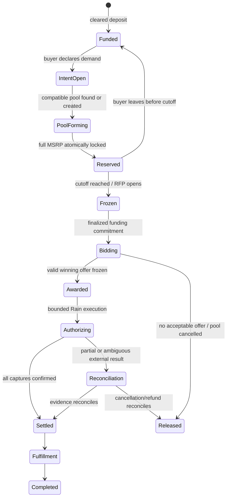
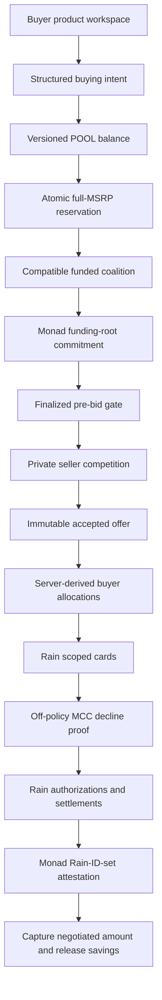

# POOL — comprehensive product, engineering, hackathon, and operations handoff

- **Last materially verified:** 2026-08-08, America/New_York
- **Repository:** [inevident/Pool](https://github.com/inevident/Pool)
- **Default branch:** `main`
- **Application baseline when this document was authored:** `7bcacd5` (`docs: link the product preview`)
- **Primary product route:** `/`
- **Technical proof route:** `/demo`

This is the canonical orientation document for any engineer, product agent, designer, demo operator, or reviewer taking over POOL. Read it before changing the product. It records not only what exists, but why it exists, what is real, what is simulated, what must never be claimed, which failure modes are intentional, and what remains between the current repository and a real public product.

The shorter documents remain useful:

- [`README.md`](./README.md) is the public repository overview and setup guide.
- [`PRODUCT.md`](./PRODUCT.md) is the product promise, buyer journey, trust boundary, and production-gap brief.
- [`DEMO.md`](./DEMO.md) is the shortest judge-demo runbook.
- This file is the comprehensive handoff and should explain enough context to make safe decisions without reconstructing the entire project history.

---

## 0. Read this first

### The one-sentence product

POOL turns patient, fully funded buying intent into collective bargaining power: compatible buyers reserve full MSRP, merchants compete for the aggregate order, POOL captures the winning price, and the difference is released back to buyers as savings.

### The deeper thesis

Most commerce is supply-first. Sellers list products and prices; isolated buyers search the available supply. Agents make demand programmable: persistent, structured, matchable, and financially executable. POOL is infrastructure for a demand-first market in which independent buyer agents can discover compatible demand, form a temporary economic coalition, negotiate with seller agents, transact within private mandates, and dissolve after the order resolves.

The memorable formulation is:

> We did not build AI that shops. We built a market where demand organizes itself.

### The most important product rule

A buyer cannot join a pool merely by clicking “interested.” The account must have at least `MSRP × quantity` available. Joining atomically moves that amount from `available` to `reserved`. Reserved money is unavailable for withdrawal or another commitment. Before the published cutoff, leaving releases the exact reservation. After the pool freezes, funds stay locked until settlement, cancellation, or reconciliation.

This prefunding rule is the bridge between consumer interest and seller-actionable demand.

### What works today

The default website is a functioning, repeat-use **product sandbox**:

- Add local test funds.
- Create structured buying intents.
- Browse seeded product pools.
- Join only with full MSRP coverage.
- Move the exact commitment from available to reserved.
- Reject insufficient funds and duplicate commitments.
- Leave before cutoff and release the exact reservation once.
- Inspect active commitments, balance activity, and future order states.
- Persist versioned workspace state in browser `localStorage`.
- Reset the local sandbox without calling Rain, Monad, a bank, or a merchant.

The separate `/demo` route is a deterministic technical proof of compatible-demand formation, private merchant competition, Rain sandbox execution, and causal Monad Testnet commitments.

### What does not work today

The repository is not a production financial product. It does not currently provide:

- real buyer authentication;
- a durable server-side or double-entry buyer ledger;
- a real bank account, virtual account, stablecoin wallet, deposit, withdrawal, or custody product;
- real KYC/KYB, sanctions, age, fraud, or jurisdiction screening;
- live merchant inventory or binding merchant offers;
- production order routing, fulfillment, shipment, returns, refunds, or disputes;
- production Rain issuance or production buyer identities;
- a mainnet Monad deployment or an independent oracle proving offchain funds;
- a public, unprotected deployment that every judge can currently open.

Do not blur these boundaries. Product credibility depends on being exact about them.

### Current external blockers and warnings

1. **The Vercel preview is protected.** The linked preview may show “You Need Access.” It is not safe to assume a judge can open it.
2. **The Vercel CLI and the browser are not using the same account context.** The CLI was verified as `haharandomaccover13-5904` under scope `yeayea`; the browser account shown by the owner did not have access to the protected deployment.
3. **GitHub Actions is not executing jobs.** The audited workflow run created a job with zero steps because GitHub reported: “The job was not started because your account is locked due to a billing issue.” Local validation is therefore the current source of build evidence until the account lock is resolved.
4. **Treat the Rain credential previously shared in chat or an image as exposed.** Never copy it into this document, a commit, a log, a screenshot, a client bundle, or a ticket. Rotate or re-provision it before any use outside the disposable event sandbox.
5. **No production funds.** This repository is intentionally testnet/sandbox-only. Never add a mainnet-funded private key.

---

## 1. Hackathon context

### Event

POOL was built for the [Raingentic Commerce Hackathon NYC](https://luma.com/encode-2gj9), presented by Encode Club and co-hosted by Rain and Monad Foundation. The organizer listing describes a two-day, in-person, senior-engineer-oriented hackathon in New York on August 8–9, 2026, focused on what becomes possible when intelligent agents can transact through modern financial infrastructure.

The official challenge tracks are:

1. **Best use of Rain** — use Rain payment infrastructure to let an agent transact autonomously.
2. **General track** — build an agent that actually initiates or completes money movement, using Rain, Monad, or other relevant infrastructure.
3. **Monad** — best implementation of Monad for an agentic-commerce use case using Rain.

The listing advertises a Rain-founder dinner and hiring opportunities, plus an optional Monad bounty of a Mac Mini and six months of access to The Studio by Monad Foundation. Treat prize details as event-page state, not a permanent product fact.

The organizer agenda was:

- Saturday: opening remarks, Rain keynote, Rain workshop, Monad workshop, then hacking.
- Sunday: final build time, noon submission deadline, judging, final demos, and prize-giving.

The event explicitly targets experienced engineers and gives direct access to the Rain and Monad teams. That means a polished visual alone is insufficient: judges are likely to probe transaction ordering, safety, idempotency, failure recovery, privacy, and the honesty of integration claims.

### Why POOL fits the challenge

POOL is not a conventional LLM layer attached to a checkout flow. It demonstrates a new market behavior enabled by agents plus programmable financial authority:

1. Independent buyers express different natural-language requirements.
2. Agents normalize those requests into typed intents.
3. Compatibility logic finds shared demand without erasing hard constraints.
4. Buyers fully reserve funds, converting soft interest into credible demand.
5. Seller agents see the aggregate RFP only after the pool freezes.
6. Sellers compete without seeing private buyer ceilings or one another's sealed economics.
7. Deterministic policy chooses an acceptable agreement.
8. Rain receives only bounded execution authority after POOL has cleared the deal.
9. Monad establishes tamper-evident ordering: funded commitment first, offers second, Rain receipt digest last.

Rain is structural because autonomous negotiation has no commercial consequence unless the agent can execute a deal safely. Monad is structural in the competition configuration because it prevents POOL from retroactively claiming that demand was funded before sellers bid.

### Original brief and non-negotiable design intent

The original build brief asked for a memorable, technically credible, product-minded prototype rather than a generic procurement dashboard or “AI shopping” demo. Its core phrase was:

> Autonomous agents discover compatible demand and form temporary economic coalitions.

The brief emphasized:

- buying intents rather than shopping carts;
- compatibility across non-identical requests;
- private buyer maximums and merchant floors;
- merchant competition with real economic consequence;
- deterministic code for money, deadlines, constraints, and authority;
- AI for interpretation, matching judgment, and strategy;
- an explicit blocked transaction or invalid deal;
- real Rain sandbox participation where enabled;
- honest labeling of simulated merchants and fallback evidence;
- a deterministic two-to-three-minute replay;
- a credible financial-terminal aesthetic rather than generic “AI slop” or a crypto explorer;
- technical quality that senior engineers can inspect.

### Mentor conversation and resulting product decisions

The mentor discussion introduced several product-level insights that shaped the repository:

1. **Require full MSRP before participation.** A buyer can join only after depositing at least the item's MSRP. Choosing to participate locks that amount as a necessary expense.
2. **Patient demand is the target behavior.** The intended buyer does not need the product immediately and accepts a waiting period in exchange for a lower price.
3. **Merchants should bid for funded volume.** POOL should tell a merchant, in effect, “45 funded buyers will purchase if your bid wins,” while preventing merchants from seeing competing quotes.
4. **Prefunding solves buyer default at award.** The edge case “the user committed but never wired funds” should be removed before the merchant RFP, not handled after a seller wins.
5. **On-ramp and virtual-account flows are a product extension.** A future flow could issue a virtual account, receive ACH or wire deposits, convert them onchain, and credit the user's POOL ledger. The mentors considered this valuable product thinking but outside the core hackathon scope.
6. **Volume-for-margin is the merchant exchange.** A merchant may give up several percentage points of margin to secure a larger guaranteed order and reduce acquisition uncertainty.
7. **Youth-oriented positioning requires care.** Early conversation mentioned ages 16–26/28, but the current product brief correctly targets adults 18+ because financial participation, custody, identity, and contract rules make minors a separate legal and product problem.

These decisions explain why the default product now begins with account balance and commitment, while the cinematic demo remains a separate technical proof.

### Internal win-readiness assessment

This is an internal estimate, not a guarantee of judging outcome:

| Dimension | Current code/product evidence | Remaining risk |
| --- | --- | --- |
| Concept originality | Strong: demand-first autonomous coalition is memorable | Must be explained within 10 seconds |
| Rain relevance | Strong when live sandbox execution is enabled | A rehearsal-only demo weakens sponsor proof |
| Monad relevance | Strong causal design and Solidity tests | Needs a verified Testnet deployment and explorer evidence for maximum impact |
| Financial reasoning | Strong invariants, integer cents, idempotency, freeze/reconcile behavior | Buyer workspace is still browser-local |
| Product quality | Strong repeat-use sandbox and clear information architecture | No auth, durable backend, real supply, or fulfillment |
| Demo resilience | Strong deterministic replay and honest fallback | Protected hosting and external-account configuration are operational risks |
| Technical inspection | Strong test coverage and explicit trust boundaries | GitHub-hosted CI is currently blocked by billing |

With a publicly accessible deployment, fresh Rain sandbox credentials, a finalized Monad Testnet registry, and two successful end-to-end rehearsals, the project can credibly present as roughly **8.5/10 win-ready**. Without those external proofs, do not claim the same readiness merely because the code paths exist.

### What judges should remember

The ideal “holy-shit” moment is not a chatbot response. It is this sequence:

> Three strangers' agents discover compatible demand, prove full commitment, exclude an incompatible request, make sellers compete, reduce the price, keep every private maximum hidden, block an off-policy payment, execute three bounded transactions, and release the exact savings.

---

## 2. Product definition

### Product promise

POOL gives patient buyers a credible way to ask for a better price together.

> Buyers trade urgency for leverage. Merchants trade margin for a larger, guaranteed order.

The initial consumer wedge is standardized, considered, non-urgent purchases where aggregate volume can change merchant economics: electronics, appliances, furniture, travel gear, home products, and similar goods. The long-term infrastructure opportunity extends to SMB procurement, GPUs/compute, SaaS contracts, office equipment, manufacturing supplies, logistics, cloud commitments, ad inventory, creator purchasing, corporate travel, and other fragmented demand.

### Product principles

1. **Funded demand over waitlists.** An unfunded “join” count is marketing, not purchasing power.
2. **Patience is the buyer's contribution.** The buyer gives POOL time to aggregate and negotiate.
3. **Privacy preserves negotiation.** Buyer ceilings and merchant floors remain private.
4. **Hard constraints stay hard.** Compatibility logic may generalize descriptions, never silently substitute product requirements.
5. **AI interprets; code authorizes.** No model controls arithmetic, reservations, payment amount, cutoff, or settlement.
6. **Failure is a first-class state.** Partial execution freezes the ledger for reconciliation rather than inventing a refund.
7. **Every claim names its evidence.** Local, rehearsal, Rain sandbox, and Monad Testnet states are visibly distinct.
8. **Product first, proof second.** The default experience must feel useful beyond a hackathon presentation.

### Primary personas

#### Patient buyer

- Wants a known product but does not need it today.
- Can reserve the full retail amount.
- Has a private maximum, product constraints, and patience window.
- Wants a transparent lock, leave, failed-pool, settlement, and savings policy.

#### Merchant or seller agent

- Values a funded, time-bounded bulk order over anonymous traffic.
- Has private inventory, quantity tiers, delivery capacity, target margin, and floor.
- Should see normalized public requirements and aggregate quantity, not buyer ceilings or competitors' bids.

#### POOL market operator

- Normalizes demand, enforces compatibility, freezes membership, runs the sealed market, selects a valid offer, executes bounded settlement, and owns reconciliation.
- Must not use discretion to bypass published rules after bids arrive.

#### Demo operator or judge

- Needs deterministic reset, explicit live/rehearsal labels, visible blocked behavior, and enough evidence to distinguish a real sandbox response from a mock.

### Core domain vocabulary

| Term | Meaning |
| --- | --- |
| Buying intent | Structured demand: product, quantity, private price limit, required features, geography/timing, and expiry |
| Available | Cleared balance that may still be withdrawn or committed |
| Reserved | Balance locked behind an active or frozen group-buy commitment |
| Captured/spent | The final negotiated amount consumed at settlement |
| Released savings | Reservation minus captured amount, returned to available balance |
| Pool | A temporary coalition of compatible buying intents |
| Commitment cutoff | Last moment a buyer may join or leave before demand freezes |
| Frozen coalition | Membership, quantity, public terms, and reservations fixed for seller bidding |
| RFP | An anonymized request for the aggregate order sent to eligible merchants |
| Sealed offer | Merchant price and fulfillment terms evaluated privately and committed by hash |
| Reconciliation | Manual/system recovery state when external and internal money states may disagree |
| Scoped card | Rain virtual card with purpose-specific spending bounds |
| Funding root | Hash commitment over the frozen reservation set; not proof of bank funds by itself |

### End-to-end intended lifecycle



Only the early buyer lifecycle is a mutable product experience today. The full market and settlement lifecycle is exercised by deterministic domain code and the isolated `/demo` scenario, not a durable production backend.

### Sony example: the product in plain language

The featured consumer example is a Sony WH-1000XM6 group buy:

1. The listed MSRP is `$449.99`.
2. The buyer adds at least `$449.99` of test funds.
3. They create an intent for one unit with a target price and patience window.
4. Joining moves exactly `$449.99` from available to reserved.
5. The pool aggregates funded units toward a target of 50.
6. Before cutoff, the buyer may leave and restore the full `$449.99`.
7. In a production pool, membership would freeze, merchants would bid, and POOL would capture the winner's price.
8. If the winner were `$379.00`, POOL would capture `$379.00` and release `$70.99`.

The current buyer workspace stops before real bidding and settlement. It must not fabricate an order after a local join.

### Buyer-facing rules that must remain visible

- The eventual production user must be at least 18 and eligible for the payment/custody program.
- Joining reserves full MSRP, not the estimated discounted price.
- Available balance cannot be withdrawn below active reservations.
- Leaving is permitted only before the stated cutoff while a pool is forming.
- A pool may fail to find an acceptable offer; full reservations then release after cancellation reconciles.
- Merchant bids are private during competition.
- Fees, tax, shipping, delivery, return, warranty, and lock terms require explicit production disclosures.
- A partial provider failure does not mean an immediate refund; it enters reconciliation.
- A browser-local sandbox credit is not a bank deposit, stored value, stablecoin, or insured balance.

### Seeded product fixtures

All current product listings and pools are deterministic fixtures, not live merchant inventory.

| Product ID | Product | MSRP | Pool ID | Seed progress | Estimated unit price | Initial cutoff |
| --- | --- | ---: | --- | ---: | ---: | --- |
| `product-sony-wh1000xm6` | Sony WH-1000XM6 | `$449.99` | `pool-sony-xm6-august` | 34 / 50 | `$379.00` | seed + 7 days |
| `product-steam-deck-oled-512` | Steam Deck OLED 512GB | `$549.00` | `pool-steam-deck-oled-august` | 18 / 30 | `$494.00` | seed + 10 days |
| `product-macbook-air-m4-13` | MacBook Air 13-inch M4 | `$999.00` | `pool-macbook-air-campus` | 11 / 25 | `$899.00` | seed + 14 days |
| `product-dyson-airwrap-id` | Dyson Airwrap i.d. | `$599.99` | `pool-dyson-airwrap-fall` | 27 / 40 | `$525.00` | seed + 18 days |

The default owner fixture is `buyer-demo`, displayed as `Alex Morgan`. The workspace ID is `workspace-pool-marketplace`. The schema version is `1`, and the seed version is `2026.08.08`.

### Current routes and their jobs

| Route | Current job | What is interactive |
| --- | --- | --- |
| `/` | Buyer home | Add funds, create intent, view balance, active commitments, suggested pools, activity |
| `/explore` | Discovery | Filter/sort seeded pools, inspect progress and terms, open join flow |
| `/pools/[poolId]` | Pool detail | Review full-MSRP rule, cutoff, progress, join/leave state |
| `/wallet` | Sandbox account | Add test funds, view available/reserved totals, audit activity, reset workspace |
| `/orders` | Commitments and lifecycle | Review active commitments and the disclosed future fulfillment path |
| `/demo` | Rain + Monad technical proof | Run/step/reset market, test intent and merchant APIs, execute live sandbox or labeled rehearsal |

The navigation is responsive and has distinct desktop/mobile structures. Dialogs use semantic `role="dialog"`, `aria-modal`, labels, close controls, and keyboard-friendly form controls.

### Browser persistence

The product workspace is stored under `pool-product-workspace-v1` in `localStorage`.

On load:

1. The UI parses the stored JSON.
2. It checks schema and seed compatibility.
3. It runs `assertProductWorkspaceInvariant`.
4. Invalid or stale state is discarded and re-seeded with the current time.

Every mutation creates a new immutable workspace revision and an append-only activity record. This is useful demo behavior, not durable audit storage: the user can delete or edit browser storage, use another device, or reset the sandbox.

### Exact buyer-workspace input bounds and conveniences

The current UI behavior is more specific than the underlying product thesis:

- Test-fund input accepts `$0.01` through `$100,000.00` and offers `$250`, `$500`, `$1,000`, and `$2,500` presets.
- Structured intent quantity is `1..20`.
- Patience choices are 7, 14, 30, or 60 days.
- The quick composer maps Sony/XM6/headphone/audio terms to Sony, Steam/game to Steam Deck, Mac/laptop/computer to MacBook Air, and Dyson/Airwrap to Dyson.
- Creating an intent never commits money by itself.
- A join uses the most recent open matching intent. If none exists, the UI creates a one-unit default intent using the pool estimate and a 30-day expiry.
- When the account is short, **Add exact shortage** creates only the missing local test credit, then the buyer can confirm the reservation.
- Explore supports text search, the four seeded categories, and sorts for funded demand, potential savings, or cutoff.
- Potential savings are estimates derived from the seeded target; they are not realized or binding savings.
- Modal Escape/backdrop dismissal works and controls are labeled, but the current dialogs do not implement a complete focus trap and focus restoration cycle.

The quick composer is not the OpenAI intent agent. The OpenAI/deterministic agent console lives in `/demo` and is bounded to the fixed monitor SKU.

---

## 3. Exact status: real, simulated, local, and future

Never describe the project using a single word such as “live.” Use the following matrix.

| Capability | Current implementation | Evidence level | Not claimed |
| --- | --- | --- | --- |
| Buyer funds | Browser-local credits, capped by Rain's live `spendingPower` | Local ledger bounded by a real provider ceiling | Real money, custody, bank or crypto balance |
| Buyer reservation | Pure domain transition with exact accounting | Local, tested | Legal escrow or provider hold |
| Product catalog | Four seeded products | Fixture | Live retailer catalog or inventory |
| Product pools | Four seeded pools | Fixture | Real participant or merchant commitments |
| Buying intent UI | Local structured state | Interactive sandbox | Authenticated cross-device mandate |
| Natural-language intent | Optional OpenAI Responses extraction with deterministic fallback | Real API only when configured/unlocked; otherwise local | Model authorization or money movement |
| Demand compatibility | Deterministic typed market fixture | Local, tested | Broad production semantic matching |
| Merchant competition | Three coherent fictional merchants, consumer and B2B | Deterministic simulation | Real retailers or binding bids |
| Funding commitment | Hash/root built locally; finalized on Monad Testnet when configured | Local proof or Testnet evidence, explicitly labeled | Onchain proof that a bank deposit exists |
| Rain execution | Scoped-card issuance, decline, authorizations, settlements when enabled | Real Rain event sandbox records | Production card program or real funds |
| Monad settlement attestation | Digest of real Rain sandbox IDs when configured | Monad Testnet transaction/finalized state | Chain-native settlement or independent Rain oracle |
| Orders/fulfillment | Buyer pools clear and settle on Rain; fulfillment is copy only | Real Rain sandbox capture; fixture beyond it | Real order placement, shipping, returns, disputes |
| Identity | Fictional personas / one Rain team cardholder | Demo fixture | KYC/KYB or distinct verified customers |

Honest language examples:

- Correct: “POOL reserved `$5,748` in its deterministic demo ledger.”
- Incorrect: “Rain held `$5,748` for the buyers.”
- Correct: “Rain sandbox created real transaction records without moving real funds.”
- Incorrect: “The buyers paid real merchants.”
- Correct: “Monad timestamped POOL's commitment claim before seller offers.”
- Incorrect: “Monad proved the bank funds existed.”
- Correct: “The merchants are fictional agents with coherent economics.”
- Incorrect: “Keystone, Northstar, and Signal are live retailers.”

---

## 4. The deterministic technical proof at `/demo`

### Purpose

The product workspace proves that POOL can be used as a product. The demo proves that its market and settlement architecture is more than a collection of screens.

It deliberately uses a fixed B2B monitor scenario rather than the broader consumer catalog. Keeping the evidence fixture fixed makes arithmetic, hashes, policies, and external sandbox calls repeatable.

### Scenario

Three fictional businesses need compatible 27-inch, 4K, USB-C development monitors:

| Buyer | Quantity | MSRP reservation | Negotiated capture | Released savings |
| --- | ---: | ---: | ---: | ---: |
| Harbor Labs | 3 | `$1,437` | `$1,167` | `$270` |
| Patchwork AI | 4 | `$1,916` | `$1,556` | `$360` |
| Kernel Works | 5 | `$2,395` | `$1,945` | `$450` |
| **Total** | **12** | **`$5,748`** | **`$4,668`** | **`$1,080`** |

A fourth intent asks for an ultrawide and is excluded because form factor is a hard incompatibility.

The supported demo SKU is `DISPLAY-27-4K-IPS-USBC`. MSRP is `$479` per unit. The winning price is `$389` per unit. Total savings are `$1,080`, or approximately `18.8%` versus the independent baseline.

### Fictional merchants

`Keystone Office`, `Northstar Systems`, and `Signal Supply Co.` are simulated merchants with coherent inventory, quantity tiers, delivery, warranty, target, and private floor constraints. They are not presented as real companies. Their final fixture offers are `$395`, `$397`, and `$389` per unit respectively; Signal wins with seven-day delivery and a 36-month warranty. Their competition changes actual offer terms in the deterministic market engine; it is not a chatbot transcript.

### Demo stages

| Stage | Visible event | Invariant being proved |
| ---: | --- | --- |
| 0 | Waiting for demand | No market exists before commitment |
| 1 | Harbor reserves `$1,437` | Full MSRP required |
| 2 | Patchwork reserves `$1,916` | Reserved funds become unavailable |
| 3 | Kernel reserves `$2,395` | Different hard constraints can coexist |
| 4 | Ultrawide isolated | Semantic matching cannot erase hard incompatibility |
| 5 | 12 units / `$5,748` freeze | Seller market sees funded demand only |
| 6 | Funding terms committed | Monad ordering is causal when configured |
| 7 | Three merchants receive RFP | No pre-commit bid access |
| 8 | Price compresses | Negotiation has economic consequence |
| 9 | Signal clears at `$389` | Winning terms become fixed |
| 10 | All buyer mandates pass | Deterministic aggregate policy controls award |
| 11 | Rain receives bounded authority | Payment begins only after clearing |
| 12 | Settlement outcome | `$4,668` captured; `$1,080` released |

The demo supports autoplay, manual stepping, reset, a buyer-intent console, and a merchant-bid console. The interactive consoles exercise runtime APIs but do not rewrite the fixed 12-unit Rain evidence run.

### Visible safety proof

The Rain execution path issues cards restricted to electronics MCC `5732`, then deliberately attempts an authorization at MCC `7995`. The run must observe a decline. If Rain unexpectedly authorizes the off-list transaction, POOL reverses the authorization and fails the run with `guardrail_not_applied` rather than continuing.

This is a central judge moment: a bounded agent is defined as much by what it cannot do as by what it can do.

### Reset behavior

- Resetting the buyer product only re-seeds browser state.
- Resetting `/demo` only rewinds UI state and the deterministic timeline.
- Neither reset endpoint triggers a Rain mutation or Monad transaction.
- Rain idempotency keys are stable per UTC run/day; repeated live attempts may return cached provider responses rather than duplicate side effects.

### Honest fallback order

1. **Rain unavailable:** use the visibly labeled `REHEARSAL · SIMULATED` outcome. Never display fabricated provider IDs as Rain receipts.
2. **OpenAI unavailable:** use `deterministic_fallback`; financial policy is unchanged.
3. **Monad unavailable:** public/competition mode remains rehearsal. Local development may use the explicitly labeled Rain-only development path only when Monad is not required.
4. **Network unavailable:** use the fixed evidence replay and contract/domain tests, while naming every simulated boundary.

---

## 5. System architecture

### High-level flow



The first four boxes exist as an interactive local product sandbox. The entire flow exists as a fixed, tested technical proof. A production product would connect them through authenticated, durable services and a reconciled external ledger.

### Runtime stack

- Node.js `22.x` (`22.13.0` in CI configuration).
- Next.js `16.3` App Router and React `19.2.6`.
- TypeScript `5.9`.
- Vinext/Vite/Cloudflare Worker as the default local/deployable build target.
- Native Next build target for Vercel.
- Zod for strict request/provider schema validation.
- Viem for Monad/EVM clients and hashing.
- Solidity `0.8.28`, Hardhat `3`, and Hardhat Ignition.
- Optional OpenAI Responses API for bounded intent extraction.
- Rain event sandbox for scoped cards and transaction simulation.

### Layer boundaries

#### UI layer

`app/_components/product-workspace.tsx` owns the product sandbox UI and local persistence. `app/demo/demo-experience.tsx` owns the cinematic proof. The two should remain conceptually separate: product changes should not silently alter the fixed proof scenario.

#### Product domain

`lib/product/` defines the seeded buyer workspace and four pure actions. It is intentionally independent of React and external providers.

#### Funding domain

`lib/funding/` is the richer transaction-integrity model used by the hero proof. It models deposits, withdrawals, reservations, freeze, leave, settlement, and reconciliation with idempotency.

#### Market domain

`lib/market/` contains product compatibility, coalition discovery, pool state transitions, merchant economics, negotiation, policy evaluation, offer fingerprinting, settlement ledger logic, and outcome metrics.

#### Agent layer

`lib/agent/` uses AI only for typed extraction and deterministic code for decisions. Merchant bid admission is gated by finalized Monad state when configured.

#### Provider adapters

`lib/rain/client.ts` and `lib/monad/` are server-only adapters. Secrets and private keys must never cross into a client component or JSON response.

#### HTTP/security boundary

API routes enforce content type, size, origin/action headers, rate limits, access sessions, no-store responses, and strict Zod schemas before calling domain or provider code.

### The product now settles end to end

The buyer workspace is no longer a dead end. A pool a user actually joined can freeze, run a sealed merchant market, clear, and settle on the Rain sandbox:

- `lib/market/consumer.ts` is the deterministic consumer market: three merchants, private floors, volume tiers, and a policy that awards the cheapest offer beating the pool's published target.
- `POST /api/pool/settle` re-derives MSRP, aggregate demand, the clearing price, and the capture from the **server's own catalog copy**. The browser sends only a pool id, a committed quantity, and an idempotency key.
- `pool/settle` in `lib/product/` captures the deal price, releases the exact difference, and refuses any capture above the reservation.

Verified live on 2026-08-08 against the event sandbox: joining the Sony pool and running the market issued a scoped card for `$377.65`, saw Rain **decline** an off-policy MCC `7995` attempt with `scoped_card_mcc_not_allowed`, settled `$377.65`, and released `$72.34`. Rain's own `GET /issuing/balances` moved `postedCharges` from `466800` to `504565` — exactly the captured amount. Replaying the same `settlementId` returned the cached transaction and did not charge again.

### Remaining seam

Two domain surfaces still exist, and this is now the largest engineering gap:

1. `lib/product/` powers the buyer workspace: deposit, intent, join, leave, settle. Its state is still browser-local.
2. `lib/funding/` plus `lib/market/index.ts` power the fixed monitor proof at `/demo` with the richer freeze/reconciliation model.

They share merchant identities and the same settlement discipline but not one durable aggregate. Do not add a third parallel state machine. Establish one canonical server-side aggregate for buyer balance, intent, membership, pool, RFP, offer, award, settlement, order, and reconciliation; then migrate the product UI and preserve `/demo` as a fixed fallback fixture.

### Next.js-specific contributor rule

`AGENTS.md` warns that this Next.js version contains breaking conventions. Before editing Next routes, configuration, rendering, or framework APIs, read the relevant material under `node_modules/next/dist/docs/`. Do not rely on remembered Next.js behavior.

---

## 6. Domain models and invariants

### `lib/product/`: repeat-use buyer workspace

Public API:

```ts
createSeededProductWorkspace({ now?, workspaceId?, workspaceName?, owner? })
reduceProductWorkspace(state, action)
assertProductWorkspaceInvariant(state)
```

Actions:

| Action | Required fields | Effect |
| --- | --- | --- |
| `sandbox/deposit` | `activityId`, `at`, `buyerId`, `amountCents` | Increases total deposited and available cents |
| `intent/create` | IDs, timestamps, buyer/product, quantity, target, expiry | Creates an open intent and activity entry |
| `pool/join` | IDs, time, pool, intent, buyer | Reserves `MSRP × quantity`, joins intent, increments pool units |
| `pool/leave` | activity/time, membership, buyer | Releases exact reservation before cutoff and decrements pool units |

Key rejection codes include invalid identifiers/timestamps/money/quantity, duplicates, missing entities, buyer or product mismatch, expired/non-open intent, non-forming pool, cutoff passed, insufficient available balance, and inactive membership.

The reducer does not mutate its input. Every successful action increments `revision`, appends one activity event, and preserves the accounting invariant:

```text
total deposited = available + reserved
```

for the current simplified workspace.

The assertion also checks that active memberships sum exactly to `reserved`, referenced products/pools/intents exist and agree, membership ownership is correct, pool funded-unit counts reconcile, activity IDs are unique, activity revisions are monotonic, and the latest activity revision equals the workspace revision. Activity entries and metadata are frozen at creation.

### `lib/funding/`: financial lifecycle proof

Account fields:

- `depositedCents`
- `availableCents`
- `reservedCents`
- `capturedCents`
- `withdrawnCents`

Reservation states:

- `active`
- `frozen`
- `settled`
- `released`
- `reconciliation_required`

Account reconciliation invariant:

```text
deposited = available + reserved + captured + withdrawn
```

Open reservation invariant:

```text
account.reserved = sum(active, frozen, reconciliation_required reservations)
```

Every mutation accepts an operation-specific idempotency key of at most 64 characters. Repeating the same key and fingerprint returns the prior result. Reusing the key for different input throws `IDEMPOTENCY_CONFLICT`.

Important transition behavior:

- Deposits increase deposited and available.
- Withdrawals may consume only available.
- Joining creates one reservation per pool/intent and moves exact MSRP into reserved.
- The same intent cannot back multiple open reservations.
- Freeze is required before settlement.
- Leave is allowed only while active, never after freeze.
- Settlement cannot capture more than reserved.
- Settlement moves the capture to `capturedCents` and the difference back to `availableCents`.
- Ambiguous partial external execution moves a frozen reservation to `reconciliation_required` while retaining the full internal lock.

### `lib/market/`: market state and policy

The market layer models:

- catalog products and hard specifications;
- buyers, public intents, and private mandates;
- merchants, public identities, private pricing, inventory, and quantity tiers;
- compatibility reason codes and excluded intents;
- coalition and pool-state transitions;
- offer versions, expiry, supersession, and status;
- negotiation events and counterprices;
- buyer-by-buyer allocations;
- policy rules and aggregate evaluation;
- immutable deal agreements and fingerprints;
- settlement decision codes and idempotent settlement ledger;
- buyer outcomes and aggregate savings metrics.

Compatibility may accept varied descriptions of the same flat-panel 4K USB-C requirement. It excludes the ultrawide request. Public projections never contain private reservation values.

The accepted offer is versioned and fingerprinted. Settlement checks the expected offer ID and fingerprint, current validity window, exact arithmetic, committed quantity, every buyer ceiling, required product features, delivery terms, seller capability, and payment-rail cap.

### Pool-state intent

The technical market's strict primary progression is:

```text
collecting → matched → committed → market_open → negotiating
→ policy_review → authorized → settling → settled → dissolved
```

Every non-terminal stage can move into `blocked`; illegal jumps throw. The generic product pool type separately names `forming`, `locked`, `bidding`, `ordered`, `completed`, and `cancelled`, but its current reducer only mutates forming pools. Do not directly assign a state in new code without passing the domain transition function.

### AI authority boundary

AI may:

- interpret natural-language buying intent;
- normalize product descriptions;
- suggest compatibility;
- explain a decision;
- support negotiation strategy.

AI may not:

- claim funds exist;
- move or reserve funds;
- choose a browser-supplied settlement amount;
- bypass a hard feature, budget, quantity, expiry, or delivery rule;
- select a merchant outside deterministic policy;
- call Rain or Monad through an unrestricted tool.

The OpenAI path exposes exactly one strict function tool, `submit_purchase_intent`, whose description explicitly says it never authorizes, reserves, or moves money. The response uses `store: false`, a low reasoning effort, a short timeout, bounded output, one forced tool call, and strict schema validation. Any refusal, malformed response, unsafe relabeling, or service error falls back to the deterministic parser.

### Current intent-agent limitations

The live agent endpoint is intentionally bounded to the monitor proof catalog, not the four-product consumer UI. It recognizes 27-inch 4K USB-C monitor requests, quantity up to 50 at extraction, a demo policy quantity bound of 10, price ceiling, deadline, selected features, and timing. Unsupported products or missing price/deadline constraints return clarification rather than joining a pool.

This mismatch is deliberate isolation for the hackathon proof, but a production follow-up must unify the catalog and intent pipeline.

---

## 7. Rain integration

### Official sandbox capability

The official [Rain hackathon quickstart](https://rain-sandbox-trial.mintlify.app/docs/quickstart) states that every call runs in sandbox and moves no real money. The flow supports simulated collateral funding, scoped-card issuance, card authorization, settlement, refunds/reversals, transaction retrieval, and payment routes between fiat and onchain destinations.

The official [scoped-card guide](https://rain-sandbox-trial.mintlify.app/docs/scoped-cards) describes cards bounded by an amount, optional expiry, and an MCC allowlist. Rain applies a documented 1.2× lifetime authorization ceiling over `amountInUSDCents` to accommodate holds. POOL therefore performs its own exact deterministic amount check before Rain and does not interpret the provider buffer as buyer permission to overspend.

The official [idempotency guide](https://rain-sandbox-trial.mintlify.app/reference/idempotency) says mutation keys are at most 64 characters, successful/client-error responses are cached for 24 hours, `5xx` is not cached, and concurrent identical keys may return `429`. The adapter mirrors those rules with stable operation keys and safe retries.

### Provisioned Rain identifiers

The event provides four sensitive values:

- team API key;
- team ID;
- test cardholder/user ID;
- collateral contract ID.

Only their environment-variable names belong in documentation. The actual values must remain in ignored secret storage. Because a key was previously shared through a conversation screenshot, provision a replacement when possible.

### Code path

`lib/rain/client.ts`:

1. Imports `server-only` and validates required configuration.
2. Uses `Api-Key` only on the server.
3. Validates Rain responses with Zod.
4. Applies a 12-second request timeout and at most three attempts.
5. Retries GETs and idempotent mutations only, reusing the same stable key.
6. Retries network errors, `429`, and `5xx` with bounded 250ms/500ms backoff.
7. Reads Rain's `Idempotency-Cached` response header.
8. Creates the encrypted session ID required for scoped-card issuance, then ignores rather than decrypting or using any returned card credentials.
9. Exposes only card ID, last four, transaction ID/status, and cache metadata needed by the UI.
10. Never decrypts, stores, logs, or returns PAN or CVC.

The live `/api/rain/execute` sequence is:

1. Require `RAIN_LIVE_EXECUTION_ENABLED=true`.
2. Require same-origin action header `x-pool-demo-action: execute-sandbox`.
3. Require the protected demo session in production.
4. Apply request size, strict body, stale-scenario, and rapid-repeat checks.
5. Require the Monad gate if configured/required.
6. Verify the fixed market agreement still reconciles.
7. Simulate `$5,000` team collateral funding with a stable idempotency key.
8. Issue three scoped cards under the one provisioned Rain user, one per buyer allocation.
9. Request each card with `amountInUSDCents` equal to its exact intended allocation, electronics MCC `5732`, and short UTC expiry; POOL's own policy remains exact despite Rain's provider-side 1.2× hold buffer.
10. Attempt an MCC `7995` authorization and require a decline.
11. Authorize each valid allocation.
12. If one authorization fails, reverse previously open authorizations before settlement begins.
13. Settle each authorized allocation.
14. Return real Rain sandbox card/transaction metadata and label the shared cardholder limitation.
15. If configured, attest the exact set of Rain transaction IDs on Monad.

### Rain is an execution rail, not the buyer ledger

The `$5,000` simulated collateral funding call is team-level rail setup. It does not credit a POOL buyer balance and does not satisfy the product's full-MSRP deposit rule. The three product/demo reservations exist in POOL's deterministic ledger. Rain begins only after market clearing.

This distinction must remain visible in code, UI, pitch, and documentation.

### Shared sandbox cardholder limitation

The event sandbox supplies one test cardholder/user ID. The three buyer personas therefore receive separate scoped cards under one Rain user. This proves bounded per-allocation execution, not three independently verified customer identities.

### Failure behavior

- Before any settlement: keep all POOL reservations frozen for retry.
- Authorization failure: reverse prior open authorizations when possible.
- Partial settlement: report `partial`, retain internal locks, and require reconciliation.
- Monad attestation failure after successful Rain settlement: Rain remains final; return `attestation_pending` and safely retry only the idempotent attestation.
- Rain failure: never substitute a rehearsal receipt in the same response.

### Future on-ramp / virtual-account design

Rain payment routes make the mentor's future product idea plausible:

1. Create an authenticated buyer and compliant account relationship.
2. Issue a payment route or virtual account for ACH/wire deposits.
3. Route fiat to an approved stablecoin destination or custody account.
4. Ingest provider webhooks and wait for final/cleared state.
5. Credit the POOL double-entry ledger only after reconciliation.
6. Permit reservation only from cleared available balance.

This is not implemented. Never add a fake routing/account number or describe the local “Add funds” button as an on-ramp.

---

## 8. Monad integration

### Why Monad exists in POOL

A decorative transaction hash would make the product weaker. POOL uses Monad to make two claims causally ordered and tamper-evident:

1. A specific aggregate demand/funding commitment existed before sellers could bid.
2. A specific set of Rain settlement IDs resolved the previously registered winning offer.

Monad does not store private buyer ceilings or merchant prices in plaintext. It stores collision-resistant commitments, aggregate unit/reservation data, and timestamps.

### Network posture

- Network: Monad Testnet only.
- Chain ID: `10143`.
- Default RPC: `https://testnet-rpc.monad.xyz`.
- Solidity target: `0.8.28`, EVM `prague`.
- There is intentionally no mainnet network or deploy script.
- Use a fresh, funded, disposable testnet-only operator key.

### Commitment construction

`lib/monad/commitment.ts` domain-separates hashes for:

- public pool terms;
- individual funding leaves;
- funding-root construction;
- sealed merchant offers;
- Rain settlement transaction-ID sets.

The funding root is deterministic and independent of private input ordering. The settlement digest is set-based, rejects duplicate/empty IDs, and is bound to the commitment/winning offer context.

### Solidity registry

`contracts/PoolCommitmentRegistry.sol` stores, for each commitment:

- pool ID hash;
- public terms hash;
- funding root;
- accepted offer hash;
- Rain settlement hash;
- reserved and captured cents;
- committed, bid-close, and settled timestamps;
- unit count.

Public mutation functions:

| Function | Purpose | Key guard |
| --- | --- | --- |
| `commitCoalition` | Freeze aggregate terms and funding root | Operator only; nonzero values; close in `(now, now + 30 days]`; unique commitment |
| `registerMerchantOffer` | Register a sealed offer hash | Commitment exists; unsettled; bid window open; unique nonzero hash |
| `attestRainSettlement` | Bind accepted offer to Rain ID-set digest and captured amount | Offer registered; unsettled; nonzero digest/capture; capture ≤ reservation |
| `getCommitment` | Read commitment | Must exist |
| `isOfferRegistered` | Read offer membership | Pure verification |
| `nominateOperator` / `acceptOperator` | Two-step operator rotation | Current operator nominates; pending operator accepts |

Events:

- `CoalitionCommitted`
- `MerchantOfferRegistered`
- `RainSettlementAttested`
- `OperatorNominated`
- `OperatorTransferred`

### Causal workflow

Competition/live mode follows this order:

1. Build the hero funding commitment from frozen POOL reservations.
2. Submit `commitCoalition`.
3. Wait for finalized state, not merely a transaction submission or latest block.
4. Re-read chain ID, registry bytecode, `operator()`, commitment fields, and timing.
5. Only then construct/evaluate seller offers using server clock plus finalized close time.
6. Hash and register each admitted sealed offer.
7. Reconstruct the identical offer set from finalized state across cold starts.
8. Execute Rain only if finalized state matches today's exact agreement.
9. Hash the complete unique Rain settlement-ID set.
10. Submit `attestRainSettlement` against the registered winner.
11. Wait for finalized attestation or report a retryable pending state.

### Fail-closed configuration

Monad configuration can be:

- `not-configured`: local proof/rehearsal allowed when Monad is not required;
- `partial` or `invalid`: blocked, never silently downgraded;
- `ready`: registry, signer, and RPC syntax present, followed by live chain verification.

Production live Rain requires Monad readiness. `MONAD_LIVE_REQUIRED=true` applies the same gate locally. Wrong chain, missing bytecode, wrong operator, incomplete values, malformed key/address, stale commitment, unfinalized write, or closed bid window prevents the downstream action.

### Finality implementation and production review note

`waitForMonadFinality` waits for a successful transaction receipt, rejects a reverted receipt, then polls the RPC's `finalized` block until it covers the receipt block. The default timeout is 30 seconds with 400ms polling. A submitted or merely proposed transaction is never treated as final.

Current Monad documentation distinguishes `Finalized` consensus ordering from the later `Verified` state-root phase and recommends that systems with significant offchain financial logic evaluate waiting for `Verified`. The hackathon implementation uses `finalized` state consistently and names it accurately. Before any real financial side effect, re-review the current Monad guidance and RPC support and decide whether the gate must advance to state-root verification.

### What the chain does not prove

The contract records POOL's commitments. It cannot independently inspect a bank account, POOL database, or Rain API. Verification requires authorized disclosure of the offchain reservation proofs and Rain receipts, then reconciliation against roots/digests. Low-entropy private values may also be vulnerable to guessing if hashed without sufficient salt/context; keep sensitive economics offchain and design disclosure carefully.

---

## 9. HTTP API surface

All dynamic routes return no-store responses. Mutation routes use strict bodies and bounded request sizes.

| Endpoint | Method | Required body/header | Access and behavior |
| --- | --- | --- | --- |
| `/api/agent/run` | `GET` | none | Reports OpenAI configuration, effective mode, authority boundary, and unlock state |
| `/api/agent/run` | `POST` | JSON `{ intent }`; `x-pool-agent-action: interpret-buyer-intent` | Same-origin when Origin exists; 10/min isolate limit; max 2KB; OpenAI only when unlocked, otherwise deterministic fallback |
| `/api/merchant/bid` | `POST` | Strict merchant, integer price, delivery, warranty, RFP version; `x-pool-agent-action: evaluate-merchant-bid` | 20/min; pins quantity server-side; finalized Monad read/write when configured; local labeled policy fallback only when fully unconfigured and optional |
| `/api/monad/prepare` | `POST` | `{ scenarioVersion: "monitor-pool-v1", confirmation: "prepare-monad-testnet" }`; standard agent action boundary | 3/min; protected live write; commits coalition, then offers, and returns finalized evidence |
| `/api/monad/status` | `GET` | none | Reads finalized proof or explicit local/unavailable state; never invents address/transaction |
| `/api/rain/status` | `GET` | none | Reports configuration, access, Monad gate, and provider connection; may contact Rain only after access boundary permits it |
| `/api/rain/execute` | `POST` | `{ scenarioVersion: "monitor-pool-v1", confirmation: "execute-rain-sandbox" }`; `x-pool-demo-action: execute-sandbox` | Live flag + same origin + protected access + exact scenario + Monad gate; 8-second process-local repeat guard; max 4KB |
| `/api/demo/session` | `POST` | `{ accessCode }`, same Origin | Max 1KB; 5 attempts/min/IP; constant-time comparison; creates four-hour HttpOnly, SameSite Strict cookie |

### Merchant bid schema

Accepted merchant IDs are fixed to `merchant-keystone`, `merchant-northstar`, and `merchant-signal`. Inputs are:

- `unitPriceCents`: integer `1..1,000,000`;
- `deliveryDays`: integer `1..30`;
- `warrantyMonths`: integer `0..120`;
- `rfpVersion`: integer `1..1000`.

The browser cannot submit quantity, total, product, issue time, expiry, or buyer allocations. The server derives them.

### Buyer-intent schema

Input is one trimmed string of `12..600` characters. Structured extraction is bounded to:

- supported monitor or unsupported;
- label;
- quantity `1..50`;
- nullable integer max unit cents;
- nullable deadline `1..365` days;
- allowlisted features;
- flexible/urgent/unspecified timing;
- concise clarification.

The endpoint returns `financialAuthorization: "not_requested"` in every successful interpretation.

---

## 10. Security and transaction-integrity posture

### Secrets

- `.env*` is ignored except `.env.example`.
- Rain API key and IDs are server-only.
- Monad private key is server-only and testnet-only.
- OpenAI API key is server-only.
- The protected demo token must be random and at least 24 characters.
- Never print environment values during preflight; only print ready/missing state.
- Never commit Vercel, Rain, OpenAI, wallet, session, or RPC credentials.
- Never retrieve, decrypt, store, log, or return PAN/CVC for this demo.

### Financial invariants

- Integer cents only; no floating-point money in domain decisions.
- Full `MSRP × quantity` available before join.
- Atomic available-to-reserved transition.
- No duplicate active commitment for one intent/buyer/pool.
- Reserved funds cannot be withdrawn or reused.
- Leave releases exactly once and only before cutoff.
- Freeze precedes seller bidding and settlement.
- Capture cannot exceed reservation.
- Exact `reservation - capture` release.
- Partial external completion freezes for reconciliation.
- Accepted offer ID/version/fingerprint must match settlement.
- Browser never chooses authorization or settlement totals.

### Request boundary

- Strict JSON content type on agent/merchant actions.
- Custom action headers reduce accidental/cross-site invocation.
- Origin checks reject cross-origin mutations.
- Body limits are enforced while streaming, not only via declared length.
- Zod rejects unknown or malformed fields.
- Best-effort isolate-local throttles limit repeated actions.
- Production infrastructure still needs a durable distributed rate limiter and WAF rules.

### Demo access session

Production live Rain or explicitly required Monad actions need `POOL_DEMO_ACCESS_TOKEN`.

- Candidate comparison uses SHA-256 digests and `timingSafeEqual`.
- Session is an HMAC-signed expiry value.
- Lifetime is four hours.
- Cookie is HttpOnly, SameSite Strict, secure on HTTPS, path `/`.
- Local loopback bypass is allowed only outside production and only when no token was supplied.
- A reverse proxy presenting a loopback host in production does not bypass access.

### Browser security headers

Next/Vercel and the Cloudflare worker apply:

- `X-Content-Type-Options: nosniff`
- `X-Frame-Options: DENY`
- `Referrer-Policy: strict-origin-when-cross-origin`
- restrictive `Permissions-Policy`
- `Cross-Origin-Opener-Policy: same-origin`
- `Cross-Origin-Resource-Policy: same-origin`
- HSTS on HTTPS
- CSP limiting scripts, images, fonts, connections, framing, objects, and form actions

The Cloudflare worker generates a per-response nonce and injects it into scripts. The Vercel target uses framework-compatible script policy in `next.config.ts`.

### Known security limitations

- Rate limits are process/isolate-local maps, not durable global limits.
- Product state is untrusted browser state.
- There is no authentication, authorization model, user isolation, or account recovery.
- There is no durable audit log or tamper-resistant product activity store.
- No webhook signature validation exists because production webhooks are not implemented.
- No regulated identity or financial-risk controls exist.
- The demo access code is a shared secret, not user authentication.
- Testnet operator signing uses one environment key, not managed signing/multisig.
- CSP and third-party image behavior should be re-verified after any asset change.

---

## 11. Repository and file map

### Root documents and configuration

| Path | Purpose |
| --- | --- |
| `README.md` | Public product/architecture/setup overview |
| `PRODUCT.md` | Product promise, lifecycle, sandbox truth, launch gaps |
| `DEMO.md` | 2:30 judge narrative, fallback order, judge answers |
| `handoff.md` | This comprehensive source of truth |
| `AGENTS.md` | Mandatory Next.js contributor warning |
| `CLAUDE.md` | Additional repository agent context if applicable |
| `.env.example` | Complete non-secret environment-variable template |
| `.gitignore` | Excludes secrets, builds, deployment state, artifacts, QA output |
| `package.json` | Runtime, dependencies, scripts, Node 22 requirement |
| `package-lock.json` | Reproducible npm dependency graph |
| `tsconfig.json` | TypeScript configuration |
| `eslint.config.mjs` | ESLint/Next rules |
| `next.config.ts` | Native Next build and Vercel security headers |
| `vite.config.ts` | Vinext + Vite + Cloudflare local/deploy configuration |
| `vercel.json` | Forces Next framework and `npm run build:next` |
| `postcss.config.mjs` | CSS/Tailwind processing |
| `hardhat.config.ts` | Solidity compiler, local chain, Monad Testnet-only target |

### Product application

| Path | Purpose |
| --- | --- |
| `app/page.tsx` | Product home route |
| `app/explore/page.tsx` | Pool discovery route |
| `app/wallet/page.tsx` | Sandbox wallet/ledger route |
| `app/orders/page.tsx` | Commitment/order lifecycle route |
| `app/pools/[poolId]/page.tsx` | Dynamic pool detail route |
| `app/_components/product-workspace.tsx` | Entire interactive product workspace, hydration, actions, modals, route views |
| `app/product.module.css` | Product UI styles and responsive behavior |
| `app/demo/page.tsx` | Technical-proof shell |
| `app/demo/demo-experience.tsx` | Fixed market timeline, consoles, Rain/Monad proof UI |
| `app/globals.css` | Global and demo styles |
| `app/layout.tsx` | Root metadata/layout |
| `app/error.tsx` | Global error boundary |
| `app/not-found.tsx` | 404 experience |
| `app/icon.svg` | Application icon |
| `public/og.png` | Social preview image |
| `docs/pool-hero.png` | Repository/product visual artifact |

### API routes

| Path | Purpose |
| --- | --- |
| `app/api/agent/run/route.ts` | Buyer intent status and execution |
| `app/api/merchant/bid/route.ts` | Strict merchant bid evaluation/admission |
| `app/api/monad/prepare/route.ts` | Protected pre-bid commitment preparation |
| `app/api/monad/status/route.ts` | Finalized/local Monad proof status |
| `app/api/rain/status/route.ts` | Rain/access/Monad readiness status |
| `app/api/rain/execute/route.ts` | Protected fixed Rain sandbox settlement |
| `app/api/demo/session/route.ts` | Shared-code-to-HttpOnly-session exchange |

### Domain and integration code

| Path | Purpose |
| --- | --- |
| `lib/product/types.ts` | Product workspace types, actions, domain errors, versions |
| `lib/product/seed.ts` | Four products/pools and default buyer/workspace fixtures |
| `lib/product/reducer.ts` | Pure deposit, intent, join, leave transitions and invariants |
| `lib/product/index.ts` | Stable public product-domain exports |
| `lib/funding/index.ts` | Full accounting lifecycle and hero funding fixture |
| `lib/market/index.ts` | Compatibility, coalition, merchants, negotiation, policy, agreement, settlement, outcomes |
| `lib/agent/index.ts` | OpenAI Responses extraction, deterministic fallback, policy trace |
| `lib/agent/http.ts` | Origin/action/body/rate-limit request boundary |
| `lib/agent/merchant.ts` | Merchant bid schema, offer construction, aggregate policy result |
| `lib/agent/merchant-runtime.ts` | Finalized Monad read → policy → offer write workflow |
| `lib/demo/settlement.ts` | Fixed settlement allocations, MCCs, funding-state response helpers |
| `lib/rain/client.ts` | Server-only Rain schemas, authentication, retries, card/transaction calls |
| `lib/monad/registry.ts` | Testnet chain metadata, ABI, explorer helpers |
| `lib/monad/commitment.ts` | Domain-separated terms, funding, offer, receipt hashes |
| `lib/monad/server.ts` | Configuration, clients, operator verification, finalized writes/reads |
| `lib/monad/workflow.ts` | Hero prepare, verify, and post-Rain attestation orchestration |
| `lib/monad/status.ts` | Honest finalized/local proof status |
| `lib/monad/runtime.ts` | Process-local preparation cache; never the only source of truth |
| `lib/security/demo-access.ts` | Access token/session policy |

### Contract, deployment, and worker

| Path | Purpose |
| --- | --- |
| `contracts/PoolCommitmentRegistry.sol` | Testnet commitment/offer/attestation registry |
| `contracts/README.md` | Contract-specific notes |
| `ignition/modules/PoolCommitmentRegistry.ts` | Hardhat Ignition deployment module |
| `worker/index.ts` | Cloudflare/Vinext request handler, image optimization, security headers/CSP |
| `build/sites-vite-plugin.ts` | Hosting integration build plugin |
| `.openai/hosting.json` | Hosting project/binding metadata; currently no D1 or R2 binding |
| `scripts/demo-preflight.mjs` | Safe readiness check without printing secrets |

### Tests

| Path | Focus | Current test count |
| --- | --- | ---: |
| `tests/product.test.mjs` | Product seed/reducer success and rejection paths | 9 |
| `tests/funding.test.mjs` | Accounting, reservation, idempotency, freeze, settlement, reconciliation | 11 |
| `tests/market.test.mjs` | Compatibility, economics, privacy, negotiation, policy, settlement | 11 |
| `tests/agent-runtime.test.mjs` | OpenAI/fallback authority, injection safety, merchant policy | 9 |
| `tests/merchant-monad-runtime.test.mjs` | Finalized bid gating, offer writes/replays, fail-closed config | 8 |
| `tests/monad.test.mjs` | Commitment ordering, deterministic roots, receipt digest, cold starts | 6 |
| `tests/competition-gate.test.mjs` | Rain/Monad configuration matrix and operator mismatch | 5 |
| `tests/security.test.mjs` | Loopback/production/token/session boundary | 6 |
| `tests/rendered-html.test.mjs` | Product/demo server rendering, routes, headers, starter removal | 5 |
| `tests/next-config.test.mjs` | Vercel/Next security baseline | 1 |
| `test/PoolCommitmentRegistry.ts` | Solidity lifecycle, rejection, timing, operator rotation | 5 |

Total: 71 Node application/domain tests plus 5 Solidity tests.

Generated directories such as `.next`, `dist`, `artifacts`, `cache`, `.wrangler`, `.vercel`, `.playwright-cli`, `tmp`, and local `.env` files are ignored and should not be treated as source.

---

## 12. Environment variables and operating profiles

### Complete environment reference

| Variable | Secret? | Default/example | Required when | Purpose |
| --- | --- | --- | --- | --- |
| `RAIN_API_BASE_URL` | No | `https://api-dev.raincards.xyz/v1` | Rain sandbox | Override Rain base URL; keep sandbox for this repo |
| `RAIN_API_KEY` | Yes | empty | Rain status/execution | Team API authentication |
| `RAIN_TEAM_ID` | Sensitive identifier | empty | Rain connection/list calls | Team scope |
| `RAIN_USER_ID` | Sensitive identifier | empty | Scoped-card issuance | Provisioned sandbox cardholder |
| `RAIN_CONTRACT_ID` | Sensitive identifier | empty | Collateral funding simulation | Provisioned collateral contract |
| `RAIN_MODE` | No | `sandbox` | Documentation/future profile | Currently not read by application code; the base URL and live flag are the effective controls |
| `RAIN_LIVE_EXECUTION_ENABLED` | No | `false` | Explicit live sandbox run | Master mutation switch |
| `POOL_DEMO_ACCESS_TOKEN` | Yes | empty | Production live Rain / required Monad | Shared judge unlock, minimum 24 chars |
| `MONAD_LIVE_REQUIRED` | No | `false` | Competition rehearsal | Makes Monad mandatory locally |
| `MONAD_TESTNET_RPC_URL` | Usually no | `https://testnet-rpc.monad.xyz` | Monad reads/writes | Testnet RPC only |
| `MONAD_REGISTRY_ADDRESS` | No, but operational | empty | Monad reads/writes | Deployed Testnet registry address |
| `MONAD_COMMITMENT_ID` | No, but operational | empty | Optional explicit status target | Expected bytes32 commitment ID |
| `MONAD_PRIVATE_KEY` | **Yes** | empty | Monad writes | Fresh funded Testnet operator key only |
| `OPENAI_API_KEY` | **Yes** | empty | Optional live extraction | Server-only Responses API key |
| `OPENAI_MODEL` | No | `gpt-5.6` | Optional override | Intent interpreter model |

Never put actual values in a Markdown file. Never prefix a client-visible variable with `NEXT_PUBLIC_` for these secrets.

### Profile A: product-only local development

Use no secrets. Keep live flags false.

Expected behavior:

- All buyer product routes work.
- Local product state persists.
- Intent demo uses deterministic fallback.
- Rain status reports rehearsal/unconfigured.
- Monad reports local proof/not configured.
- No external mutation is possible.

### Profile B: local Rain sandbox development

Supply fresh Rain sandbox values and set `RAIN_LIVE_EXECUTION_ENABLED=true`. Leave Monad completely unconfigured and not required only for a clearly labeled local development path.

Expected behavior:

- Loopback permits live action only if no access token was supplied.
- Rain sandbox settlement can run.
- Response explicitly says Monad is not configured and makes no onchain claim.

This profile is a debugging fallback, not the strongest competition story.

### Profile C: competition Rain + Monad Testnet

Supply fresh Rain sandbox values, a deployed registry, its matching testnet operator key, and set:

```dotenv
RAIN_LIVE_EXECUTION_ENABLED=true
MONAD_LIVE_REQUIRED=true
```

For a public/production runtime, also supply a random `POOL_DEMO_ACCESS_TOKEN` of at least 24 characters.

Expected behavior:

- Preflight verifies finalized chain ID, bytecode, and operator match.
- Coalition commitment finalizes before offers.
- Seller bids are gated by finalized demand.
- Rain executes the scoped-card flow.
- Exact Rain ID set is attested on Monad Testnet.

### Profile D: public no-secret rehearsal

No provider secrets and live flags false.

Expected behavior:

- Product is fully interactive locally in the browser.
- `/demo` replays deterministic evidence.
- All receipts are `REHEARSAL · SIMULATED`.
- No unlock prompt should be advertised unless a valid token and live action are actually configured.

### Audited environment snapshot on 2026-08-08

No values were read or printed during this audit; only readiness states were checked.

| Environment | Rain | OpenAI | Monad | Access |
| --- | --- | --- | --- | --- |
| Local ignored `.env.local` | Credentials complete; sandbox execution flag enabled | No key; deterministic fallback | Completely unconfigured; optional local proof | Non-production loopback bypass because no token is configured |
| Protected Vercel preview | No Rain variables; rehearsal only | No key; deterministic fallback | No registry/key; local proof only | No app unlock required because no live action is enabled; Vercel team protection still blocks page access |

The local Rain state means a sandbox run is technically enabled, not that the exposed credential is safe to keep using. Rotate it before the next public demonstration. The hosted no-secret state is an intentional safe rehearsal profile, not an integration outage.

---

## 13. Local setup and commands

### Fresh clone

```bash
git clone https://github.com/inevident/Pool.git
cd Pool
npm ci
cp .env.example .env.local
npm run dev
```

Requirements:

- Node.js 22.13 or newer in the 22.x line.
- npm matching the lockfile environment.
- No secret is required for normal product development.

The audited workstation used Node `22.23.2` and npm `10.9.8`; CI pins Node `22.13.0`. `package-lock.json` is lockfile version 3, so use `npm ci` for reproducible clean installs.

Open `http://localhost:3000`.

### Scripts

| Command | What it does |
| --- | --- |
| `npm run dev` | Starts Vinext/Vite/Cloudflare-compatible local development |
| `npm run build` | Builds the Vinext deployable target |
| `npm run start` | Starts the built Vinext target |
| `npm run build:next` | Builds native Next target used by Vercel |
| `npm run lint` | Runs ESLint across source, excluding build outputs |
| `npm test` | Vinext build, 71 Node tests, then Solidity tests |
| `npm run test:contracts` | Runs 5 Hardhat contract tests |
| `npm run monad:compile` | Compiles the registry |
| `npm run monad:deploy:testnet` | Deploys with Ignition to Monad Testnet using ignored `.env.local` |
| `npm run demo:preflight` | Reports safe integration readiness without values |

### Testnet deployment

1. Create a new wallet solely for Monad Testnet.
2. Fund it with testnet gas.
3. Put the private key in ignored `.env.local` as `MONAD_PRIVATE_KEY`.
4. Run `npm run monad:compile` and `npm run test:contracts`.
5. Run `npm run monad:deploy:testnet`.
6. Copy only the emitted registry address to `MONAD_REGISTRY_ADDRESS`.
7. Run `npm run demo:preflight`.
8. Confirm the configured signer matches finalized `operator()`.
9. Record explorer links for the pitch, but never the private key.

Hardhat deliberately exposes no Monad mainnet target.

---

## 14. Validation evidence and expectations

### Required local gate before push or demo

```bash
npm run lint
npm run build:next
npm test
npm audit --omit=dev --audit-level=high
git diff --check
```

The last application baseline was locally reported green for:

- 71 Node application/domain tests;
- 5 Solidity tests;
- ESLint;
- Vinext build;
- native Next build;
- zero high-severity production dependency audit findings;
- desktop and mobile browser walkthroughs;
- zero production console errors during the verified walkthrough.

Re-run rather than trusting this snapshot after any dependency or behavior change.

### What the suites specifically protect

- Full-MSRP reservation and one-cent-short rejection.
- Immutable revisions and duplicate-action rejection.
- Exact leave release and hard cutoff boundary.
- Account/reservation reconciliation.
- Stable idempotent retries and conflict rejection.
- Frozen reservation behavior on partial provider failure.
- Semantic compatibility plus hard ultrawide exclusion.
- Private mandate and merchant floor non-disclosure.
- Coherent seller tiers reaching `$389`.
- Stale/tampered/over-budget offer rejection.
- OpenAI strict-tool authority boundary and safe fallback.
- Finalized Monad commitment before offer construction.
- Cold-start reconstruction instead of trusting process memory.
- Set-based Rain receipt hashing.
- Partial/malformed/wrong-operator configuration failure.
- Production access/session semantics.
- Product and demo server rendering on every route.
- Security headers in both Next and deployment targets.
- Solidity authorization, bid-window, settlement, duplicate, and rotation guards.

### GitHub Actions caveat

`.github/workflows/ci.yml` is correctly configured to run checkout, Node 22.13, `npm ci`, lint, Next build, all tests, and a high-severity production audit. The audited baseline run for application commit `7bcacd5`, [GitHub Actions run 31278405482](https://github.com/inevident/Pool/actions/runs/31278405482), did not start any steps because the GitHub account was locked due to a billing issue. New pushes may create newer run IDs with the same account-level failure until that lock is resolved.

Do not interpret the red check as a code-test failure. Do not interpret it as success either. Resolve account billing, rerun CI, and require a green hosted check before external collaboration or production release.

---

## 15. Deployment and account ownership

### GitHub

- Repository: `https://github.com/inevident/Pool`
- Visibility: public.
- Default branch: `main`.
- Origin remote is configured.
- The user explicitly authorized pushing to this repository during the build.
- Preserve unrelated user changes and never force-reset the branch.

Recent application baseline commits, newest first:

| Commit | Purpose |
| --- | --- |
| `7bcacd5` | Link product preview |
| `9efa1b5` | Turn POOL into a repeat-use product |
| `9fffcae` | Position POOL honestly as a product sandbox |
| `a42f21b` | Add pure product workspace domain |
| `972c19b` | Make clean Vercel builds deterministic |
| `f710a2e` | Harden POOL for judging |
| `f6dc3b0` | Require Monad readiness for production settlement |
| `d7197a1` | Derive Monad offers after finalized commitment |
| `11b89f8` | Gate merchant bids with Monad finality |
| `5c512f6` | Add protected judge demo access |
| `98ac152` | Verify Monad proof across cold starts |
| `3f9ae7d` | Anchor funded pools on Monad |

### Vercel

Configured preview URL:

`https://pool-agentic-market-preview-20260808-ldktkkf37-yeayea.vercel.app`

Technical proof URL:

`https://pool-agentic-market-preview-20260808-ldktkkf37-yeayea.vercel.app/demo`

Operational facts verified on 2026-08-08:

- Vercel CLI account: `haharandomaccover13-5904`.
- Vercel scope/team in the deployment URL and prior operation: `yeayea`.
- Vercel project: `pool-agentic-market-preview-20260808` (`prj_vYnFrr9rC5If88NHJJZ8TKGfAkoz`).
- The active deployment is a `READY` Preview target, not a successful current Production target.
- The deployment is protected and asks non-team viewers to request access.
- The protected response advertises `x-robots-tag: noindex`.
- The owner's currently open browser account was not authorized for that team/deployment.
- The preview has no configured environment variables, so it intentionally runs product sandbox + deterministic rehearsal only.
- The repository has no persistent `.vercel/project.json`; verify/link the project explicitly before a future deploy.
- Vercel project settings reported Node `24.x` even though `package.json` and CI require Node `22.x`; align this to prevent runtime drift.
- `vercel.json` selects the Next.js framework and `npm run build:next`.

Before sharing with judges:

1. Determine the intended Vercel owner/team.
2. Sign the CLI into that exact account or transfer/link the project.
3. Disable deployment protection for the public demo or create a deliberately public production deployment.
4. Keep all live financial actions separately protected by the application session; public page access must not imply public mutation authority.
5. Open the link in a private/incognito browser with no Vercel session.
6. Verify `/`, `/explore`, `/wallet`, `/orders`, one pool detail, and `/demo`.
7. Verify mobile width and no console errors.
8. Align the Vercel runtime with Node 22.x and confirm both native Next and Vinext builds still pass.

### Cloudflare/Vinext

The default `dev`, `build`, and `start` scripts target Vinext/Vite with Cloudflare Worker compatibility. The worker adds response security headers and nonce-based CSP. `.openai/hosting.json` currently declares no D1 or R2 resource. There is no durable product data even if deployed through this target.

Do not assume that a successful Vercel build validates Worker behavior, or vice versa; run both build targets after cross-runtime changes.

### Environment ownership

Do not move secret values between Vercel, local shell, GitHub, and another host by pasting them into chat. Use each platform's encrypted environment settings. Document only variable names and which profile they enable.

---

## 16. Demo operator runbook

### One hour before judging

1. Confirm the public link works in incognito.
2. Rotate/re-provision any credential ever exposed in conversation or screenshots.
3. Run the full local validation gate.
4. Run `npm run demo:preflight` with the intended environment.
5. Confirm Rain says configured/connected and live execution enabled only if intended.
6. Confirm Monad registry, chain `10143`, bytecode, signer/operator, and finalized state.
7. Execute one complete live sandbox rehearsal.
8. Wait or account for Rain's 24-hour idempotency cache and scoped-card limits.
9. Execute a reset and a second rehearsal to prove replay behavior.
10. Keep one local product tab, one `/demo` tab, one public no-secret fallback tab, and explorer evidence ready.
11. Close any terminal, environment editor, wallet key view, or screenshot containing credentials.

### Two-minute-thirty-second narrative

#### 0:00 — Problem

“Agents shop one buyer at a time. POOL lets patient buyers organize into prefunded demand, then makes merchants compete for the whole order.”

Show `$5,748` reserved and say that no buyer can join without full MSRP coverage.

#### 0:25 — Bounded buyer agent

Run the natural-language intent. Point to typed constraints and the trace. Say: “AI translates fuzzy intent. Deterministic policy controls catalog, budget, delivery, funding, and payment. The model has no payment tool.”

#### 0:45 — Launch market

Launch the prefunded market. Let the incompatible ultrawide request visibly fail compatibility. Freeze 12 units before merchants appear.

#### 1:10 — Monad causal proof

Point to the commitment rail. If an explorer link exists, show it. Say: “POOL committed the funded terms before sellers could bid. Prices stay private behind hashes. The chain timestamps our claim; it does not inspect the bank.”

If the UI says local proof, say exactly that no testnet transaction is being claimed.

#### 1:35 — Merchant competition

Submit `$389`, seven-day delivery. Show server-pinned quantity and private-policy clearing. Explain that sellers never see buyer maximums or competing floors.

#### 1:55 — Rain execution

Click **Settle in sandbox**. Point out:

- three scoped cards;
- electronics MCC restriction;
- forced MCC `7995` decline;
- three valid authorizations and settlements;
- provider transaction IDs;
- one shared sandbox cardholder limitation.

#### 2:20 — Close

“POOL captured `$4,668`, released `$1,080`, and required zero human negotiation. We did not build AI that shops. We built a market where demand organizes itself.”

### Judge answers

**Why full MSRP?**

It converts interest into credible demand and removes the buyer-funding default after a merchant wins.

**Why Rain?**

Rain gives the already-cleared deal purpose-specific card authority: amount, MCC, expiry, and provider-enforced authorization behavior.

**Why Monad?**

It makes “funded before bidding” and “these Rain IDs resolved this winning offer” ordered and tamper-evident without exposing private economics.

**What does AI control?**

Interpretation and potentially matching/strategy. Deterministic code alone controls constraints, accounting, offer validity, amount, authorization, and settlement.

**What is simulated?**

The buyer deposit ledger, product catalog, buyers, merchants, offers, and fulfillment. Rain creates real sandbox records when enabled. Monad is onchain only when verified Testnet evidence is shown.

**What happens if one buyer payment fails?**

The design prefunds before bidding. During external execution, open authorizations are reversed where possible; partial settlement freezes the internal reservation for reconciliation and does not claim an immediate release.

**Why would a merchant discount?**

The merchant exchanges unit margin for funded volume, lower acquisition uncertainty, one time-bounded order, and predictable fulfillment economics.

**What is the moat?**

Demand density, repeated buyer mandates, merchant participation, transaction outcomes, negotiation data, and market liquidity can reinforce one another.

---

## 17. Known product and engineering gaps

### P0: demo-critical external gaps

- Public deployment is blocked by Vercel protection/account mismatch.
- Rain key needs rotation/re-provisioning because it was shared in a conversation image.
- Fresh Rain connectivity and a complete live run must be reverified.
- Monad Testnet registry/operator/explorer evidence must be deployed and verified if the competition path is used.
- Hosted GitHub CI needs billing/account repair.
- A final incognito/mobile/judge-network rehearsal is required.

### Product gaps

- Product UI and monitor proof still use separate catalogs and state models, though both now settle through Rain.
- No general natural-language intent creation for the four consumer products.
- No server-side pool creation or matching; the settle route re-derives from the seed rather than a database.
- No real merchant onboarding, console, or sealed-bid exchange.
- No automatic cutoff scheduler or durable pool lifecycle.
- Orders page communicates future states but does not own a real order.
- No notifications, watchlists, referrals, or repeat-purchase identity.
- No fees, tax, shipping, returns, or warranty calculation.
- No accessibility audit beyond semantic implementation and browser review.
- Seed product images depend on remote sources and should be licensed/localized for production.

### Current UI and maintainability debt

- `app/_components/product-workspace.tsx` is approximately 1,900 lines and owns every product view, modal, persistence concern, and interaction.
- `app/demo/demo-experience.tsx` is approximately 1,340 lines and owns the complete proof UI.
- The greeting and the post-cutoff leave affordance were both fixed on 2026-08-08.
- Reset replaces local activity, so “append-only” applies only within the current workspace instance and is not a tamper-proof audit history.
- Product records contain remote image URLs, while browser CSP permits only same-origin/data/blob images. The current UI uses local category glyphs; any future remote image rendering requires an explicit asset, `next/image`, and CSP decision for both deployment targets.
- Dialogs need a full focus trap, focus restoration, and formal accessibility review.
- Product/demo component decomposition should preserve domain isolation rather than moving financial rules into smaller UI files.

### Financial/backend gaps

- No authenticated double-entry ledger.
- No pending/cleared deposit distinction.
- No external account or withdrawal flow.
- No durable idempotency store, locks, serializable transaction, or concurrency control.
- No provider webhook ingestion, signature verification, reconciliation job, or statement matching.
- No ledger administration or four-eyes exception workflow.
- No durable queue for retries and outbox/inbox delivery.
- No disaster recovery or data retention policy.

### Merchant/fulfillment gaps

- No real merchant identity or authorization to bind inventory/price.
- No catalog normalization, SKU/variant mapping, geography, inventory hold, tax, or shipping quote.
- No order split, purchase order, merchant-of-record decision, tracking, returns, refund, warranty, or dispute system.
- No protection against counterfeit, substitution, concentration, or inventory evaporation.

### Identity, risk, legal, and operations gaps

- No KYC/KYB, sanctions, fraud, AML, age, or jurisdiction eligibility.
- No terms for commitment, cutoff, failure, cancellation, refund, or delivery.
- No money-transmission, custody, consumer-protection, privacy, tax, or marketing analysis.
- No customer support, escalation, complaints, or human financial-exception process.
- No incident response, key rotation, access review, or audit program.

### Blockchain gaps

- No third-party disclosure/verification portal for roots and receipts.
- Single operator key, no managed signer/multisig/separation of duties.
- No external contract audit or long-running Testnet soak.
- No monitor/alert for stuck writes or finality timeouts.
- Current code waits for `Finalized`, not Monad's later `Verified` state-root phase; review this before real offchain financial execution.
- Commitment privacy needs a production salt/disclosure model.

---

## 18. Prioritized roadmap

### Phase 0: win the hackathon / make the proof undeniable

#### 0.1 Public access

Acceptance criteria:

- Anyone can open the product URL in incognito without a Vercel account.
- Live mutation remains protected by POOL's own access session.
- All six public routes render at desktop and mobile widths.

#### 0.2 Fresh Rain live proof

Acceptance criteria:

- Fresh, non-exposed sandbox credential.
- Preflight green without displaying values.
- MCC `7995` visibly declined.
- Three MCC `5732` authorizations settle.
- UI shows provider IDs and shared-cardholder disclosure.
- A repeat uses idempotent/cached evidence without duplicate effects.

#### 0.3 Monad Testnet proof

Acceptance criteria:

- Registry deployed on chain `10143` from a disposable key.
- Finalized bytecode and operator match.
- Funding commitment transaction available in explorer.
- Offers registered only after finalized commitment.
- Rain ID-set attestation finalizes against registered winner.
- UI links to the exact evidence and does not overclaim what it proves.

#### 0.4 Hosted verification

Acceptance criteria:

- GitHub billing/account issue resolved.
- CI completes every step and is green at the presented commit.
- Production dependency audit has no high-severity finding.

#### 0.5 Presentation rehearsal

Acceptance criteria:

- Two successful timed runs under 2:30.
- One deliberate fallback run with honest labels.
- Presenter can answer every trust-boundary question without reading notes.

### Phase 1: closed adult-user pilot

1. Choose jurisdiction, legal structure, custody/ledger partner, and merchant-of-record model.
2. Implement authentication, verified contact, recovery, and participant eligibility.
3. Build a transactional double-entry ledger with immutable journal entries.
4. Integrate cleared deposits and withdrawals through an approved payment/on-ramp program.
5. Ingest signed provider webhooks and reconcile independently of request outcomes.
6. Move intents, pools, memberships, activity, and orders to a durable database.
7. Add serializable fund reservation and unique constraints against double commitment.
8. Build a durable pool cutoff/freeze workflow with idempotent jobs.
9. Onboard a narrow set of real merchants for one standardized category.
10. Implement sealed RFP, inventory validation, award, purchase order, and fulfillment tracking.
11. Define cancellation, failed-pool, refund, return, warranty, dispute, and exception states.
12. Add an internal reconciliation/operations console and alerts.

Pilot acceptance criteria should include exact ledger reconciliation under concurrency and injected provider failures, not just happy-path conversion.

### Phase 2: product-market expansion

- General semantic catalog and variant matching.
- Buyer watchlists and persistent autonomous mandates.
- Merchant self-service onboarding and private bidding agents.
- Category-specific market mechanisms and tier curves.
- Geographic pool formation and shipping optimization.
- Transparent fee model and realized-savings reporting.
- Repeat-use retention loops and demand-density bootstrapping.
- Selective auditable disclosure for onchain commitments.
- Managed signing, contract audit, and role-separated operations.

### Phase 3: demand-market infrastructure

- API for third-party buyer agents to publish bounded intent.
- Merchant-agent protocol for inventory and sealed terms.
- Demand liquidity across B2B and consumer verticals.
- Reputation based on funded follow-through and fulfillment outcomes.
- Market-design experimentation with strong fairness and privacy controls.
- Standardized attestations linking private offchain evidence to public ordering.

---

## 19. Decisions that should not be casually reversed

1. **Product default, demo secondary.** `/` is a repeat-use buyer product; `/demo` is isolated proof.
2. **Full MSRP reservation.** Do not weaken it to a waitlist count without redefining merchant credibility.
3. **Integer cents.** Never introduce float-based financial state.
4. **AI has no money tool.** Interpretation and authority remain separated.
5. **Merchant economics are private.** Do not expose floors or buyer ceilings in traces or API responses.
6. **Monad is causal or absent.** Do not add decorative hashes or claim a transaction that did not finalize.
7. **Rain is execution, not custody.** Do not label sandbox collateral as buyer deposit.
8. **Partial failure freezes.** Do not optimistically release funds before reconciliation.
9. **Provider failures stay visible.** Do not replace failed live output with mock receipts.
10. **Fictional merchants are named as fictional.** Do not imply retailer partnerships.
11. **No mainnet key or target.** The current repository is event sandbox/Testnet only.
12. **Reset is side-effect free.** Keep replay controls independent from provider mutations.

### Explicit non-goals

Do not turn POOL into:

- an expense tracker;
- a generic budgeting or procurement dashboard;
- a coupon finder or comparison site;
- an Amazon clone;
- a shopping chatbot;
- a crypto wallet or block explorer;
- a simple human-coordinated group-buy form;
- a generic multi-agent animation;
- a “find the cheapest price” bot.

The defining behavior is autonomous discovery and temporary coordination of compatible, funded demand.

---

## 20. Troubleshooting

### “You Need Access” on Vercel

Cause: deployment protection/team access, not the POOL demo token.

Fix:

1. Run `npx vercel whoami`.
2. Confirm the intended team scope.
3. Link/transfer the project or switch Vercel account.
4. Disable public deployment protection for the presentation deployment.
5. Retest in incognito.

Do not tell users to enter `POOL_DEMO_ACCESS_TOKEN` into Vercel's access screen; they are different layers.

### GitHub Actions fails instantly with zero steps

Cause: GitHub account locked due billing, verified through the check annotation.

Fix: resolve the account/billing lock, then rerun all jobs. Local green output cannot change the hosted status.

### Rain status says rehearsal/unconfigured

Check that all four Rain identifiers are present in ignored server environment and the API base is the event sandbox. Do not print the values. Run `npm run demo:preflight`.

### Rain configured but live execution disabled

Set `RAIN_LIVE_EXECUTION_ENABLED=true` only for an intentional sandbox run after preflight.

### Live action says access locked

- Local: remove an invalid/partial demo token or enter the configured code to mint a session.
- Production: configure a valid token of at least 24 characters and use `/api/demo/session` through the UI.
- Do not add a loopback bypass in production.

### Monad says partial/invalid

Supply a complete Testnet address and valid 32-byte testnet private key, or remove all optional values for a labeled local-proof environment. Partial configuration intentionally blocks fallback.

### Monad wrong operator / missing bytecode / wrong chain

Verify the registry address on chain `10143`, finalized bytecode, and `operator()`. The configured private key must control that operator. Do not bypass the check.

### Bid rejected before market opens

The RFP must be frozen/finalized first. Run the commitment preparation at the appropriate demo stage. A stale `rfpVersion`, closed window, private-policy failure, or missing protected access also blocks admission.

### Intent uses deterministic fallback

This is expected without an unlocked server-side OpenAI key or when the model path times out/refuses/fails validation. The endpoint remains functional and must label its mode.

### Product state looks stale or corrupt

Use **Reset product sandbox** or remove only `pool-product-workspace-v1` from local storage. Never delete broad browser/profile directories. Invalid schema state should also self-reset.

### Rain run partially settles

Do not rerun with new arbitrary idempotency keys. Preserve transaction IDs, keep reservations in reconciliation, inspect Rain records, and retry only the defined idempotent continuation/attestation.

### Build behavior differs between Vercel and local

Run both `npm run build` and `npm run build:next`. Read the relevant Next 16 docs before framework changes. Check that server-only modules did not enter client components and that Cloudflare/Node runtime APIs remain compatible.

---

## 21. Contributor and agent operating rules

Before changing code:

1. Read this handoff, `README.md`, `PRODUCT.md`, and `DEMO.md`.
2. Read `AGENTS.md` and the relevant Next documentation for any framework work.
3. Inspect `git status`; preserve existing user changes.
4. Never inspect or print `.env.local` unless the owner explicitly requests a safe, value-free diagnostic—and even then prefer presence checks.
5. Decide whether the requested change affects product sandbox, fixed proof, or both.
6. Update domain behavior before UI copy that claims it.
7. Add tests for success, rejection, retry, and partial-failure paths.
8. Keep live, Testnet, sandbox, rehearsal, and local labels exact.

Before committing:

1. Run the validation gate proportional to the change.
2. Run `git diff --check`.
3. Search the diff for API keys, private keys, bearer tokens, card data, unexpected IDs, and `.env` content.
4. Confirm no generated artifacts or QA logs are staged.
5. Make a focused commit with a clear message.
6. Push only the intended branch/commit.

When implementing money behavior:

- start from an explicit state transition;
- accept integer cents only;
- define idempotency and conflict semantics;
- define concurrency/uniqueness behavior;
- define external timeout and ambiguous-result behavior;
- keep internal reservation locked until evidence reconciles;
- never let browser input select a final settlement amount;
- add a failure-path test before declaring completion.

When implementing AI behavior:

- provide a strict structured-output schema;
- treat user text as untrusted data, not instructions;
- expose no unrestricted financial/provider tool;
- revalidate model output deterministically;
- preserve hard catalog and policy gates;
- supply a bounded fallback;
- report model/fallback mode honestly.

---

## 22. Product metrics and evaluation

Do not optimize for demo clicks alone. A real pilot should measure:

- declared intent → fully funded commitment conversion;
- time from first commitment to threshold;
- funded units per pool;
- commitment retention through cutoff;
- valid merchant participation and offers per frozen pool;
- public baseline vs realized price, fees, tax, and net savings;
- pool resolution and cancellation rate;
- fulfillment, on-time delivery, return, refund, and dispute rates;
- repeat commitment and second-purchase time;
- ledger reconciliation exceptions and time to resolution;
- external provider error/retry/ambiguity rate;
- percent of AI interpretations requiring correction;
- category-specific supply concentration and counterfeit risk.

The key north-star candidate is not “pools joined.” It is **successfully fulfilled funded demand with reconciled net buyer savings**.

---

## 23. Pitch variants

### Ten seconds

“POOL lets patient buyers fully commit, combines their demand, makes merchants compete for the order, and uses bounded agents to execute the winning deal.”

### Thirty seconds

“Buying power is fragmented. POOL turns independent purchase intent into funded coalitions. Buyers reserve full MSRP, agents match compatible requirements, sellers bid privately for the aggregate order, and deterministic policy selects a deal within every mandate. Rain gives the agent scoped payment authority; Monad proves the pool was committed before bidding and binds the eventual Rain receipt set to the winner.”

### Product framing

“Instead of buy now, choose what you want, what you will pay, and how long you can wait. POOL uses your patience as bargaining power.”

### Infrastructure framing

“Supply is already machine-readable. POOL makes demand persistent, programmable, and financially executable.”

### Rain framing

“Negotiation is theater unless the agent can safely execute. Rain turns a cleared agreement into bounded card authority.”

### Monad framing

“Seller competition is credible only if demand cannot be rewritten after bids arrive. Monad timestamps the funding commitment first and the Rain settlement digest last.”

---

## 24. Official references

### Event

- [Raingentic Commerce Hackathon NYC](https://luma.com/encode-2gj9)

### Rain hackathon sandbox

- [Documentation index](https://rain-sandbox-trial.mintlify.site/llms.txt)
- [Quickstart](https://rain-sandbox-trial.mintlify.app/docs/quickstart)
- [Scoped cards](https://rain-sandbox-trial.mintlify.app/docs/scoped-cards)
- [Authentication](https://rain-sandbox-trial.mintlify.app/reference/authenticating-with-the-api)
- [Idempotency](https://rain-sandbox-trial.mintlify.app/reference/idempotency)
- [Simulating transactions](https://rain-sandbox-trial.mintlify.app/docs/simulating-transactions/overview)
- [Card authorizations](https://rain-sandbox-trial.mintlify.app/docs/simulating-transactions/card-authorizations)
- [Settlement](https://rain-sandbox-trial.mintlify.app/docs/simulating-transactions/settlement)
- [Authorization reversals](https://rain-sandbox-trial.mintlify.app/docs/simulating-transactions/authorization-reversals)
- [Payment routes](https://rain-sandbox-trial.mintlify.app/docs/payment-routes)

### Monad

- [Monad documentation](https://docs.monad.xyz/)
- [Monad Testnet network information](https://docs.monad.xyz/developer-essentials/testnet)
- [Deployment summary](https://docs.monad.xyz/developer-essentials/summary)
- [Hardhat deployment guide](https://docs.monad.xyz/guides/deploy-smart-contract/hardhat)
- [Wallet/finality guidance](https://docs.monad.xyz/developer-essentials/wallet-developers)
- [Agentic payments resources](https://docs.monad.xyz/tooling-and-infra/agentic-payments)

When repository assumptions conflict with current official documentation or observed sandbox behavior, official docs and actual provider responses win. Update the code, tests, and this handoff together.

---

## 25. Final takeover checklist

An incoming owner should be able to answer “yes” to all of these before claiming full control:

- [ ] I can explain POOL in one sentence without calling it a shopping chatbot.
- [ ] I understand why full MSRP is reserved and when it releases.
- [ ] I can distinguish product sandbox state from the fixed technical proof.
- [ ] I know exactly which merchants, buyers, funds, orders, and receipts are simulated.
- [ ] I understand that Rain is the execution rail, not the POOL buyer ledger.
- [ ] I understand what Monad proves and what it cannot prove.
- [ ] I know the account and reservation invariants.
- [ ] I know why partial external failure enters reconciliation.
- [ ] I know the AI/model authority boundary.
- [ ] I can run the app and all validation commands locally.
- [ ] I can reset product and demo state without external side effects.
- [ ] I have not copied any secret from chat, screenshots, or local env into source.
- [ ] I have resolved or explicitly accepted the Vercel protection risk.
- [ ] I have resolved or explicitly accepted the GitHub Actions billing block.
- [ ] I can run a fresh Rain sandbox proof with rotated credentials.
- [ ] I can verify the Monad registry, operator, finality, and explorer evidence.
- [ ] I can deliver the complete judge story in under 2:30.
- [ ] I can demonstrate an invalid payment being blocked.
- [ ] I can explain every fallback without overstating it.
- [ ] I know the P0 path and will not bury it under lower-priority features.

If any answer is “no,” keep the corresponding claim out of the pitch until the evidence exists.

---

## 26. Glossary

- **Agentic commerce** — commerce in which software agents can interpret intent, negotiate, and take bounded transaction actions.
- **Available balance** — cleared ledger value not committed to an active reservation.
- **Buyer ceiling / hard max** — private maximum unit or total amount a buyer permits.
- **Capture** — final amount consumed after an authorization/order resolves.
- **Coalition** — temporary collection of compatible, funded buying intents.
- **Commitment** — a binding product reservation or its cryptographic representation, depending on context.
- **Cutoff** — deadline after which membership and reservations freeze for bidding.
- **Deterministic policy** — ordinary typed code that produces the same authorization decision from the same validated state.
- **Funding root** — cryptographic root over private reservation records; a commitment to POOL's evidence, not independent custody proof.
- **Idempotency** — repeated execution of the same operation/key produces one side effect and the same result.
- **MCC** — merchant category code used by card networks and Rain scoping.
- **Merchant floor** — private lowest acceptable seller price under its economics.
- **Monad finality** — the finalized chain state POOL waits for before downstream actions.
- **MSRP** — manufacturer suggested retail price; used as the maximum reservation baseline in the current model.
- **On-ramp** — conversion/movement from fiat payment rails into an onchain or stablecoin destination.
- **POOL ledger** — the internal source of truth for available/reserved/captured/released money; currently only a local deterministic model.
- **Rain sandbox** — provider environment that creates real sandbox records but moves no real funds.
- **Reconciliation** — process of resolving disagreement or ambiguity between internal and external transaction state.
- **Released savings** — reservation minus final capture, restored to available balance.
- **Reservation** — full-MSRP balance made unavailable for other uses while a buyer is committed.
- **RFP** — request for proposal presented to merchants for a frozen aggregate order.
- **Scoped card** — virtual card bounded for purpose-specific agent spending.
- **Sealed offer** — merchant offer whose private terms are evaluated offchain and represented publicly by a hash.
- **Testnet** — blockchain network using valueless test assets for development, not production settlement.
- **Virtual account** — provider-issued routing destination for fiat transfers; discussed as a future POOL on-ramp, not implemented.

---

## 27. Closing statement

POOL's strongest asset is the coherence between its product rule and its technical architecture:

- Full prefunding turns intent into credible demand.
- Aggregation turns patience into leverage.
- Private competition turns leverage into a lower price.
- Deterministic policy keeps every mandate intact.
- Rain turns an accepted deal into bounded execution.
- Monad prevents the competition story from being rewritten after the fact.
- Exact accounting turns the difference into auditable buyer savings.

Protect that chain of reasoning. Every new feature should make it clearer, safer, more real, or easier to repeat.
